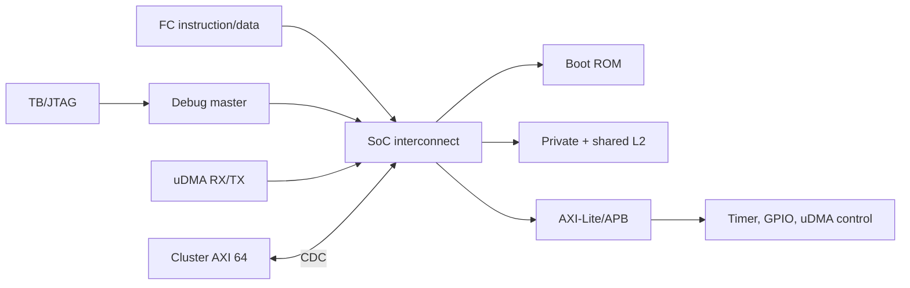

# 02 — Kiến trúc hệ thống

## Ranh giới SoC

`pulp` nối pad frame/safe domain, SoC domain và cluster domain ([top](../../../rtl/pulp/pulp.sv#L517), [SoC](../../../rtl/pulp/pulp.sv#L971), [cluster](../../../rtl/pulp/pulp.sv#L1156)). SoC chứa FC, L2 private/shared, ROM, interconnect, APB peripherals, uDMA, debug và clock/reset generator ([pulp_soc](../../../.bender/git/checkouts/pulp_soc-c519334bd3ac5582/rtl/pulp_soc/pulp_soc.sv)). Cluster chứa 8 PE, TCDM, instruction cache, MCHAN DMA, event unit và tùy cấu hình HWPE ([wrapper](../../../rtl/pulp/cluster_domain.sv#L209)).

## Hành vi hệ thống

| Use case | Initiator → target | Completion thấy được | Điều kiện còn thiếu |
|---|---|---|---|
| Boot JTAG | TB/debug → L2; FC → ROM/L2 | fetch PC và chương trình chạy | waveform checkout hiện tại |
| Timer | FC → APB timer → ITC | IRQ/handler/clear | demo hiện chỉ đọc count |
| UART TX | FC cấu hình uDMA; uDMA TX đọc L2 | event ID qua FIFO IRQ 26 | đo pad serial và overflow |
| Cluster DMA | MCHAN cluster → L2 qua AXI/CDC | B/R và buffer hợp lệ | coherency/ordering toàn chuỗi |

Không thấy bằng chứng cho secure boot, lifecycle controller, power switch/isolation vật lý hay QoS contract trong cấu hình này; xem [ranh giới bảo vệ](soc_07_security_boundaries.md) và [power](soc_05_clock_reset_power_domains.md). Các khẳng định hiệu năng phải nêu clock, traffic và trạng thái gate; chưa có latency bound toàn SoC. [Bản đồ cũ](../master_analysis/architecture/pulp_architecture_and_source_map.md) bổ sung ngữ cảnh IP.
