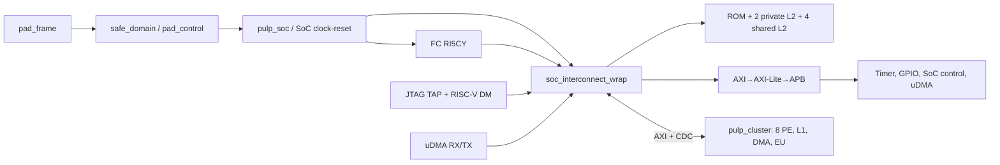

# SoC 01 — Khối và kết nối hiệu lực

[Top pad/safe](../../../rtl/pulp/pulp.sv#L517), [SoC instance](../../../rtl/pulp/pulp.sv#L971), [cluster instance](../../../rtl/pulp/pulp.sv#L1156) và [SoC wrapper](../../../.bender/git/checkouts/pulp_soc-c519334bd3ac5582/rtl/pulp_soc/soc_interconnect_wrap.sv#L148) xác nhận cạnh chính. SoC wrapper gán master ports 0–4 lần lượt FC data, FC instruction, uDMA TX, uDMA RX, debug; ports 5–8 là bốn output của bridge AXI cluster 64→TCDM 32 ([source](../../../.bender/git/checkouts/pulp_soc-c519334bd3ac5582/rtl/pulp_soc/soc_interconnect_wrap.sv#L152)). HWPE SoC nếu bật dùng cổng interleaved-only riêng, nhưng cấu hình runner đặt `USE_HWPE=0`.

SoC→cluster AXI 32 bit mang FC/control; cluster→SoC AXI 64 bit mang DMA/cache/refill/external access. Đây là **hai master direction**, không phải một bus hai chiều đổi vai trò theo dữ liệu ([domain trace](../master_analysis/architecture/deep_dive_05_domain_transactions.md#1-hai-giao-diện-axi-rtl)). Pad UART đi qua safe domain/pad frame; GPIO PADOUT readback không chứng minh pad input loopback ([safe domain](../master_analysis/architecture/deep_dive_01_platform_safe_domain.md)). Cây này là static connectivity, cần hierarchy sau elaboration để đóng biến thể generate.
