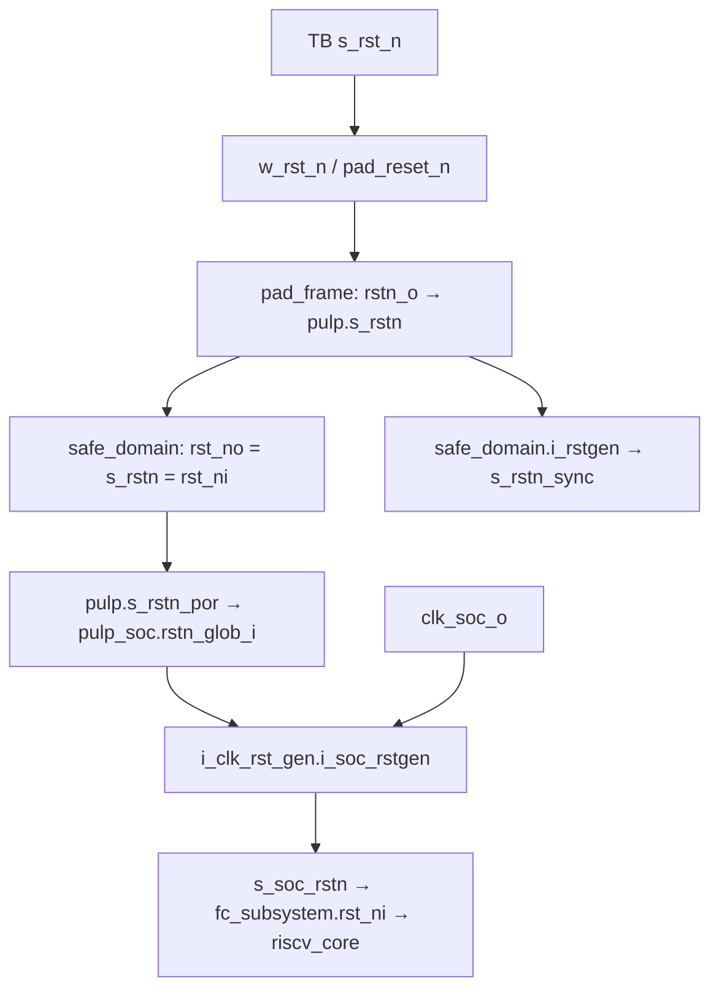

# Chuyên sâu 04 — Reset từ testbench đến lệnh đầu tiên của FC

Đối tượng: RTL Questa, core FC loại 0, nạp `full_system` bằng JTAG.
Đọc [cấu hình và quy ước bằng chứng](deep_dive_00_effective_configuration.md) trước.
**[RTL] Lệnh đầu sau reset ở `0x1A000080`; `0x1C008080` là điểm resume ứng dụng
sau khi JTAG halt/nạp L2, không phải reset vector.**

## 1. Vai trò và ranh giới

[TB](../../../../rtl/tb/tb_pulp.sv#L785) tạo reset/reference clock và đóng vai host JTAG.
Safe domain chuyển tiếp reset/pad; SoC tạo clock/reset nội bộ và FC; ROM cung cấp
mã boot; runtime đưa ứng dụng từ `_start` tới `main()`.

“Fetch đầu tiên” cần request địa chỉ được grant và instruction response.
Để khẳng định **thực thi**, cần thêm instruction hợp lệ đi qua pipeline hoặc
trace thực thi; chỉ thấy PC hay `busy=1` chưa đủ.

## 2. Cấu trúc và chuỗi reset [RTL]



Nhánh `s_rstn_sync` trong safe domain **không nối vào `rst_no`**. Đây là đính chính
cho mô tả cũ “reset tới SoC đã đồng bộ theo reference clock”. Nguồn:
[safe_domain:494–527](../../../../rtl/pulp/safe_domain.sv#L494),
[SoC clock/reset](../../../../.bender/git/checkouts/pulp_soc-c519334bd3ac5582/rtl/pulp_soc/soc_clk_rst_gen.sv#L247).

Ở nhánh non-FPGA, `rstgen → rstgen_bypass` của dependency `common_cells` dùng
**4 flip-flop** mặc định: assert bất đồng bộ, nhả sau bốn cạnh lên của clock được
cấp vào synchronizer khi test mode bằng 0. Đây là số cạnh tại **SoC reset
generator**, không phải cam kết FC chạy sau bốn cạnh reference. Clock FLL, pha
clock, cập nhật fetch-enable và pipeline còn nằm phía sau. Đường dẫn dependency
chính xác được lưu trong [source audit](../../../../report/domain_analysis_20260910/source_audit.json).

TB chọn driver nội bộ khi OpenOCD/external driver tắt. Trước nhả hard reset, TB
reset TAP, test bypass/IDCODE, ghi JTAG confreg. Với `STIM_FROM=JTAG`, confreg là
`9'h002`; bit 8 bằng 0 chọn FLL ở clock mux. Trong TB hiện tại, `USE_FLL` chỉ
đổi dòng `$display` (hai nhánh “Using/Not using FLL”), không đổi wiring hay
confreg. Không dùng riêng generic này làm bằng chứng FLL đã bị bypass.
`s_trstn` reset TAP khác với `s_rst_n` reset hệ thống.

## 3. Điều kiện fetch và giao dịch lệnh đầu [RTL]

### 3.1. Từ reset đến địa chỉ boot

Trong [apb_soc_ctrl](../../../../.bender/git/checkouts/pulp_soc-c519334bd3ac5582/rtl/components/apb_soc_ctrl.sv#L167),
reset đặt `r_bootaddr=0x1A000080`, `r_fetchen=0`. Top truyền
`fc_fetch_en_valid_i=1`, `fc_fetch_en_i=1`; sau nhả reset, logic tuần tự cập nhật
`r_fetchen` lên 1. Cổng ghi APB cũng có thể tác động register này; mô tả trên áp
dụng trình tự boot khi chưa có ghi cạnh tranh.

```text
apb_soc_ctrl.r_bootaddr → s_fc_bootaddr → fc_subsystem.boot_addr_i
apb_soc_ctrl.r_fetchen  → s_fc_fetchen  → fc_subsystem.fetch_en_i
fetch_en_int = fetch_en_i & fetch_en_eu
```

[FC subsystem](../../../../.bender/git/checkouts/pulp_soc-c519334bd3ac5582/rtl/fc/fc_subsystem.sv#L85)
instantiate `apb_interrupt_cntrl`, nơi `fetch_en_o=1`, `core_clock_en_o=1` được
buộc hằng. Không có FSM event unit trì hoãn fetch đầu ở đây.
`CORE_TYPE=0` chọn `FC_CORE.lFC_CORE:riscv_core`.

### 3.2. FSM core và đường instruction

[Controller](../../../../.bender/git/checkouts/cv32e40p-0a3884e05ea5a482/rtl/riscv_controller.sv#L300):

| State | Hành vi liên quan boot |
|---|---|
| `RESET` | `instr_req_o=0`; chờ `fetch_enable_i=1` |
| `BOOT_SET` | bật request, `pc_set_o=1`, chọn `PC_BOOT` |
| `FIRST_FETCH` | chờ điều kiện pipeline để chuyển sang `DECODE` |
| `DECODE` | xử lý instruction; có các đường branch/exception/debug khác |

`riscv_core` truyền `boot_addr_i[31:1]` vào IF;
[IF stage](../../../../.bender/git/checkouts/cv32e40p-0a3884e05ea5a482/rtl/riscv_if_stage.sv#L153)
ghép lại `{boot_addr_i,1'b0}`. Không cộng thêm `0x80` lần nữa trong nhánh core này.

```text
core_instr_req/addr
→ fc_subsystem.l2_instr_master (read: wen=1)
→ pulp_soc.s_lint_fc_instr_bus
→ i_soc_interconnect_wrap.master_ports[1]
→ soc_interconnect.gen_l2_demux[1]
→ contiguous crossbar, slave 2 (ROM)
→ boot_rom_i.mem_slave → generic_rom
→ r_rdata/r_valid trở lại FC → IF → ID → thực thi
```

Nguồn decode: [soc_interconnect_wrap](../../../../.bender/git/checkouts/pulp_soc-c519334bd3ac5582/rtl/pulp_soc/soc_interconnect_wrap.sv#L90).
Tên `l2_instr_master` không có nghĩa mọi request đều tới SRAM L2; địa chỉ ROM
được demux sang ROM. FC không phải đi AXI/APB để lấy lệnh ROM.

[boot_rom](../../../../.bender/git/checkouts/pulp_soc-c519334bd3ac5582/rtl/pulp_soc/boot_rom.sv#L31)
gán `gnt=req`, đăng ký `r_valid=req` ở cạnh clock. `generic_rom` đăng ký địa chỉ
khi `CEN=0`, rồi xuất word tương ứng. Độ trễ **tại cổng ROM** là một chu kỳ;
không suy ra tổng độ trễ từ TB đến decode là một chu kỳ.

### 3.3. Lệnh cụ thể

`ROM_ADDR_WIDTH=13` tương ứng **8 KiB ROM thực**, mặc dù cửa sổ decode ROM rộng
256 KiB. `generic_rom` dùng `$readmemb("./boot/boot_code.cde", MEM)` tương đối với
working directory của simulator. Với [ROM trong repo](../../../../sim/boot/boot_code.cde),
word index `0x80/4=32` là **`0x4EC0006F`**:

```text
PC = 0x1A000080
jal x0, +0x4EC
PC đích = 0x1A00056C
```

**[RTL + dữ liệu ROM, đã đối chiếu tĩnh]** Đây là lệnh dự kiến thực thi đầu tiên
nếu dùng đúng ROM này và không bị debug/exception chen trước. Hash ROM nằm trong
source audit. Không gán timestamp mới cho kết luận này.

## 4. Góc nhìn phần mềm: ROM → JTAG resume → main [RTL, SW]

### 4.1. Trình tự JTAG của TB

| Bước | Thao tác | Bằng chứng/điều kiện |
|---|---|---|
| 1 | đọc `+ENTRY_POINT`, stimuli; đặt `bootsel=2'b01` | mặc định entry `0x1C008080` |
| 2 | test TAP, ghi confreg rồi nhả reset | FC có thể thực thi ROM trước halt |
| 3 | PULP TAP ghi/đọc `0xABBAABBA` tại entry | chỉ test một địa chỉ L2, chưa phải image verification |
| 4 | init DMI, `dmactive=1`, chọn FC hart | `hartsel={6'd31,1'b0,4'd0}=0x3E0=992` |
| 5 | `halt_harts()`, abstract command ghi CSR DPC | DPC nhận entry ứng dụng |
| 6 | `load_L2()` | mặc định `USE_PULP_BUS_ACCESS=1` dùng PULP TAP; bằng 0 dùng debug system bus |
| 7 | init lại DMI, `resume_harts()` | return từ debug bằng đường DPC/`PC_DRET` |
| 8 | poll `0x1A1040A0` | bit 31 done; bits 30:0 exit code |

Nguồn: [tb_pulp:840–1006](../../../../rtl/tb/tb_pulp.sv#L840).
Comment TB nói “bootsel is low” không khớp assignment `2'b01`; dùng assignment
làm bằng chứng. Tương tự comment dependency ghi hart ID 996 không khớp phép ghép
bit cho FC core 0: giá trị tính được là 992.

`boot_l2_i=0` ở wrapper không chặn cơ chế này: debugger ghi **DPC**, không đổi
reset vector thành địa chỉ L2. Ghi DPC mà chưa nạp stimuli chưa đủ điều kiện resume.

### 4.2. Từ entry ứng dụng tới `main()`

[Linker](../../../../pulp-runtime/kernel/chips/pulp/link.ld) dùng `ENTRY(_start)`;
[crt0.S](../../../../pulp-runtime/kernel/crt0.S) đặt `_start` ở offset `0x80` của section
vectors và nhảy `pos_init_entry`. Cần đối chiếu ELF khi đổi linker/image vì TB
và runner vẫn đặt entry bằng hằng số.

```text
_start → pos_init_entry
→ đọc mhartid, phân biệt FC và PE
→ FC clear BSS, thiết lập stack
→ pos_init_start → main(0, 0)
→ pos_init_stop → exit
```

PE rẽ sang `pe_start`, dùng stack theo core ID và `cluster_entry_stub`, không
clear BSS lại như FC. Đây là lý do cùng `_start` có thể phục vụ hai miền xử lý.
Stdout mặc định của simulation đi qua `tb_fs_handler` nối vào
`soc_peripherals_i.s_stdout_bus`; dòng `printf` chưa chứng minh UART TX ra pad.

### 4.3. Standalone và FPGA

`LOAD_L2=STANDALONE` chọn bootsel SPI `00` hoặc HyperFlash `10`, cần model flash
và image tương ứng. ROM/phần mềm boot thực hiện đường nạp; **đây không phải
backdoor preload trực tiếp vào L2**, cũng không bảo đảm nhanh hơn JTAG.
Luồng flash chưa được tái lập trong đợt phân tích này.

FPGA dùng wrapper board, `fpga_clk_gen`, `fpga_bootrom`; các nhánh reset sync ở
safe/SoC bị bypass theo `PULP_FPGA_EMUL`. Không chuyển nguyên kết luận “4 cạnh
SoC” của RTL sang board nếu chưa lần cả reset clock wizard/wrapper.

## 5. Thời gian, stall và phân biệt các mốc

**[SIM cũ: 2026-09-06, waveform]**
[Báo cáo lưu](../../../../report/waveform_20260906/00_README.md) ghi reset nhả tại
51,801 ns, FC busy tại khoảng 53,379.4 ns, ứng dụng bắt đầu khoảng 12.844 ms,
cluster fetch khoảng 16.944 ms. Bộ tín hiệu cũ không đủ chứng minh toàn bộ
instruction handshake. Busy không đồng nghĩa retire instruction.

Các khoảng thời gian có thể tăng vì FLL/clock, tranh chấp đường instruction,
debug halt/resume và lượng stimuli nạp. “70% thời gian là JTAG” chỉ mô tả lượt
cũ, không phải tỷ lệ cố định của hệ thống.

## 6. Kiểm chứng bài reset → instruction [CẦN ĐO]

Lưu những nhóm sau với hierarchy prefix `tb_pulp.i_dut`:

| Nhóm | Tín hiệu cần quan sát | Tiêu chí |
|---|---|---|
| TB/pad/safe | TB `s_rst_n`, `w_rst_n`; DUT `s_rstn`, `s_rstn_por`, `safe_domain_i.s_rstn_sync` | reset xuất safe đi thẳng, không chờ sync reference |
| SoC | `s_soc_clk`, `s_soc_rstn` dưới `soc_domain_i.pulp_soc_i` | sync reset nhả sau 4 cạnh clock khi đầu vào đã nhả |
| FC | `boot_addr_i`, `fetch_en_int`, `core_instr_req/gnt/addr/rvalid/rdata` | request đầu `0x1A000080`, response `0x4EC0006F` |
| Pipeline | `FC_CORE.lFC_CORE.if_stage_i`, `id_stage_i.controller_i` | boot FSM; instruction hợp lệ được thực thi, PC đích `0x1A00056C` |
| Debug/application | debug request, DPC, resume, instruction trace | resume tới entry ELF, tiếp đến `pos_init_entry` và `main` |
| Kết thúc | stdout bus, SoC core status, TB `exit_status` | done và exit đúng; UART cần test riêng |

Lệnh đầy đủ tái lập demo là `cd sw/full_system` rồi `./run_sim.sh`; môi trường
chuẩn bị theo [RUNBOOK](../simulation/RUNBOOK.md). File [wave_capture.do](../../../../sw/full_system/wave_capture.do)
hiện mới thu biên domain, **cần thêm tín hiệu bảng trên** để nghiệm thu first
instruction; không coi waveform cũ là đã phủ checklist mới.

Phép thử âm: ngăn fetch hoặc giữ reset phải không xuất hiện instruction hợp lệ;
đổi DPC sai phải bị kiểm tra entry phát hiện; timeout phải phân biệt với PASS.
Nếu không nhận ROM word, kiểm tra trước đường dẫn `boot/boot_code.cde` và
request/grant/response, rồi mới kết luận core hỏng.
