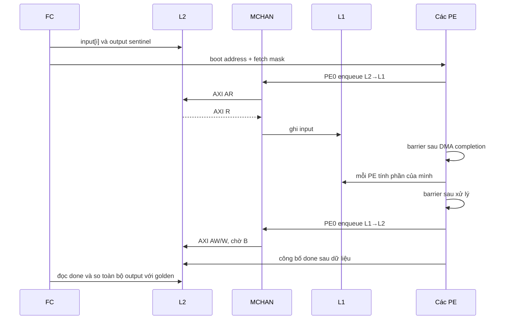

# Chuyên sâu 05 — Giao dịch xuyên domain và lộ trình kiểm chứng

Áp dụng [cấu hình hiệu lực và nhãn bằng chứng](deep_dive_00_effective_configuration.md).
Tách giao dịch dữ liệu khỏi event/control để tìm đúng nguyên nhân hệ thống treo.

## 1. Hai giao diện AXI [RTL]

| Giao diện | Bên phát request | Hoạt động tiêu biểu |
|---|---|---|
| SoC→cluster, data 32 bit | FC/debug qua SoC interconnect | ghi boot address/fetch mask, truy cập L1/peripheral |
| Cluster→SoC, data 64 bit | DMA, cache refill, core external access | đọc/ghi L2 |

DMA L2→L1 phát **AR từ cluster**, nhận R từ SoC. DMA L1→L2 phát **AW/W từ
cluster**, nhận B từ SoC. Chúng cùng dùng giao diện thứ hai; chiều chuyển dữ
liệu không quyết định bên nào là AXI master.

Mỗi giao diện có `axi_cdc_src/axi_cdc_dst`; mỗi channel AW/W/AR/B/R dùng nửa
FIFO `cdc_fifo_gray_src/dst`. Với `LOG_DEPTH=3`, có 8 slot và pointer 4 bit.
Pointer truyền qua miền clock dùng mã Gray; không lấy hiệu hai pointer Gray
làm occupancy. Payload được giữ trong storage nguồn, pointer được đồng bộ để
bên đích biết slot hợp lệ, không đồng bộ từng bit payload bằng flip-flop riêng.
Nguồn: [AXI source CDC](../../../../.bender/git/checkouts/axi-d42e23417b564294/src/axi_cdc_src.sv),
[pulp_cluster CDC](../../../../.bender/git/checkouts/pulp_cluster-48721e3ce381c984/rtl/pulp_cluster.sv#L1408).

AW và W là kênh độc lập; thấy address tới đích chưa chứng minh write hoàn thành.
Phải lần tới B response, hoặc R response/last của read. FIFO đầy tạo backpressure;
không mặc định có độ trễ cố định giữa hai domain chạy khác clock.

## 2. Event, reset và clock gating [RTL]

Event FIFO SoC→cluster chuyển mã event 8 bit, sâu 8. Các đường edge propagator
valid/ack cho DMA là handshake riêng ngoài AXI. Trong `pulp.sv`, SoC nhận
`dma_pe_irq_valid_i=0`, `pf_evt_valid_i=0`; không dựa các đường bị buộc hằng này
để chờ hoàn thành. Đường DMA event valid/ack vẫn nối.
Trong dependency hiện tại, phần phát perf event còn bị comment; output khai báo
không đồng nghĩa có producer hoạt động.

`pulp_cluster.axi_slave_cdc_i` dùng clock input `clk_i`, còn phần logic xử lý dùng
`clk_cluster` sau gate. `u_clustercg` quan sát internal busy, core busy,
`incoming_req` và event đã sync; khi không có việc, shift register 4 bit mới
cho gate đóng theo enable. Đây là cơ chế để giao dịch/event tới có thể đánh
thức logic. Nguồn: [cluster_clock_gate](../../../../.bender/git/checkouts/pulp_cluster-48721e3ce381c984/rtl/cluster_clock_gate.sv).

Reset có thể xóa pointer/state FIFO. Phân tích source này không chứng minh an
toàn khi reset một domain giữa outstanding transaction. **[CẦN ĐO]** Làm thử
reset/gating khi idle trước; với transaction đang chờ, cần chỉ rõ contract
abort/drain/retry rồi mới đặt tiêu chí. Functional RTL simulation không thay
thế kiểm tra CDC/timing constraint khi đưa lên FPGA/ASIC.

## 3. Lần theo demo đang có [RTL, SW]

| Bước | Hàm/trạng thái SW | Register/bus/hardware | Xác nhận |
|---|---|---|---|
| FC kiểm dữ liệu | `phase1_fc_l2()` | FC data master đọc `demo_l2_src` ở L2 | checksum bằng golden |
| FC offload | `phase3_cluster_poweron() → bench_cluster_forward() → cluster_start()` | FLL/cache config, remote boot `0x10200040+4*p`, fetch `0x10200008` qua S→C | PE instruction hoạt động; sentinel sau chạy |
| PE chạy cùng nhau | `phase4_barrier()`, `phase5_tcdm()` | PE↔HCI↔L1, EU barrier/mutex | ID, nội dung và error aggregation |
| DMA vào | PE0 `plp_dma_extToL1()` | MCHAN command; C→S AR/R; HCI ghi scratch | counter idle, dữ liệu theo lượt round-trip |
| DMA ra | PE0 `plp_dma_l1ToExt()` | HCI đọc scratch; C→S AW/W/B | counter idle, từng word L2_dst khớp L2_src |
| Trả về FC | `cluster_entry_stub()` | core 0 ghi `cluster_retval`, `cluster_running=0` trong memory | FC `cluster_wait()` hết polling |
| Kết thúc TB | FC `main → exit` | SoC core status `0x1A1040A0`; debug system bus poll | done bit, exit code và watchdog |

Nguồn SW: [full_system.c](../../../../sw/full_system/full_system.c),
[cluster.c](../../../../pulp-runtime/kernel/cluster.c), [startup](../../../../pulp-runtime/kernel/crt0.S).
Tên phase có chữ PMU không chứng minh có power sequencing vật lý; full_system
đang chứng minh khởi chạy bằng clock/config/register và code thực thi.

## 4. Bài tính toán xuyên suốt cần bổ sung [CẦN ĐO]

Demo hiện kiểm PE/TCDM **trước** phase DMA; phase DMA chỉ sao chép round-trip.
Để kiểm đúng chuỗi “FC chuẩn bị → DMA vào → PE xử lý → DMA ra → FC xác nhận”,
thiết kế một phase riêng với dữ liệu/golden rõ ràng:

Dùng phép toán số nguyên unsigned có kết quả xác định, ví dụ
`output[i]=input[i]*3u+7u`, chia chỉ số `i=core_id; i<N; i+=num_pe`.
FC phải tự tính golden và so toàn bộ buffer; mask barrier khớp PE tham gia.
Công bố done sau DMA completion và thứ tự memory theo HAL/core đang dùng;
`volatile` đơn lẻ không phải bằng chứng đủ về ordering giữa các master.
Thu waveform bus để xác nhận bước cuối không chạy trước B response.

Phép thử âm: sửa một word của PE khác 0, rút ngắn lượt DMA về, và bỏ một PE khỏi
barrier. Hai lỗi nội dung phải FAIL; lỗi thiếu PE phải timeout rõ ràng. Mỗi
transfer có timeout hữu hạn; guard words quanh buffer phát hiện ghi quá vùng.

## 5. Thứ tự thực hiện và tiêu chí nghiệm thu

| Thứ tự | Bài | Trạng thái ngày 2026-09-10 / tiêu chí |
|---|---|---|
| 1 | chốt cấu hình | đã đối chiếu tĩnh; lưu compile list/HEAD/hash |
| 2 | reset→FC instruction đầu | bài 04 đã lần RTL và ROM; còn cần capture mới để gắn SIM |
| 3 | safe GPIO/UART | loopback PADIN và byte UART thực; không dùng PADOUT làm bằng chứng pad |
| 4 | FC/boot/L2/timer | từng bank và timer ISR, phân biệt direct IRQ với FIFO |
| 5 | cluster cơ bản | 1/2/4/8 PE, mask/stack/barrier và tổng lỗi |
| 6 | DMA/event/CDC | bài tính toán bảng trên, transaction/response và wakeup |
| 7 | uDMA/HWPE/FPU | buffer thật; cấu hình hiệu lực và payload đúng |
| 8 | hiệu năng | đo sau khi đúng chức năng; bank conflict/cache/DMA/printf được tách |

Phạm vi lần cập nhật này là phân tích implementation và sửa tài liệu. Các
phép thử mới trong bảng là công việc nghiệm thu tiếp theo, chưa được thêm vào
`full_system` hoặc chạy simulator. [Log cũ](../../../../report/full_system_20260906/)
được giữ để so sánh, không dùng thay kết quả mới.
