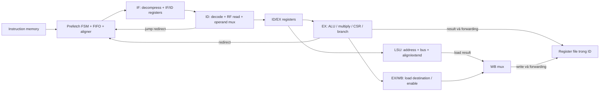

# Microarchitecture 01 — FC pipeline, prefetch và hazard

Thực hiện M0/M1 của [kế hoạch](micro_00_plan_phan_tich_pulp.md), ngày 2026-09-13.
Phân tích source thực của workspace; bảng chu kỳ là **[SUY RA]**, chưa có mô
phỏng pipeline tích hợp mới. Phép thử LSU độc lập được ghi riêng ở bài kế tiếp.

## 1. Cấu hình hiệu lực: có PMP, register file dùng latch

[fc_subsystem](../../../../.bender/git/checkouts/pulp_soc-c519334bd3ac5582/rtl/fc/fc_subsystem.sv#L120)
chọn `FC_CORE.lFC_CORE:riscv_core` khi CORE_TYPE_FC=0. Không dùng microarchitecture
của nhánh Ibex hoặc một bản CV32E40P mới hơn để suy hành vi checkout này.

| Tham số/nhánh | Giá trị và hệ quả |
|---|---|
| PULP_CLUSTER | 0: nhánh FC, không dùng chế độ cluster load-event để sleep barrier |
| PULP_SECURE | 1; core default USE_PMP=1, N_PMP_ENTRIES=16: **PMP được instantiate** |
| INSTR_RDATA_WIDTH | default 32: chọn `prefetch_32`, không chọn prefetch L0 128 bit |
| FPU / FP_DIVSQRT | theo USE_FPU, bật trong cấu hình nền; bài này xét integer/memory, không có FP instruction đang chạy |
| SHARED_FP / SHARED_FP_DIVSQRT | 0 / 2 từ FC wrapper; không coi FPU là đường shared của cluster |
| USE_ZFINX / Zfinx | pulp_soc default 1, truyền xuống FC/core: FP dùng integer register file trong cấu hình này |
| Register file | compile chọn `riscv_register_file_latch.sv`, không phải bản FF cùng module name |

Nguồn quyết định: [core parameters](../../../../.bender/git/checkouts/cv32e40p-0a3884e05ea5a482/rtl/riscv_core.sv#L38)
và [compile list](../../../../sim/compile.tcl#L528). FPU/Zfinx làm thay đổi bank RF;
không suy số register vật lý chỉ từ ADDR_WIDTH=6. Với Zfinx=1 đang dùng,
NUM_TOT_WORDS=32, integer x0 buộc 0; không mô tả FC này là có thêm 32 FP register
riêng chỉ vì FPU=1. Nhánh Zfinx=0 là cấu hình khác.

PMP nằm giữa IF/LSU và cổng ngoài. Trong
[riscv_pmp](../../../../.bender/git/checkouts/cv32e40p-0a3884e05ea5a482/rtl/riscv_pmp.sv#L642),
nhánh machine mode pass request/grant trực tiếp; nhánh kiểm quyền có thể chặn
request và tạo lỗi nội bộ. Các bảng bus dưới đây giả định PMP cho phép truy cập.
Lỗi này khác `r_opc` từ interconnect: FC wrapper không nối cờ lỗi bus vào core
loại 0. Không từ đó kết luận core hoàn toàn không có đường access-fault.

## 2. Pipeline bốn giai đoạn chức năng, hai đường ghi register



Đây là IF–ID–EX–WB về chức năng. Source không có một `riscv_wb_stage` độc lập;
WB mux và EX/WB registers nằm trong
[riscv_ex_stage](../../../../.bender/git/checkouts/cv32e40p-0a3884e05ea5a482/rtl/riscv_ex_stage.sv#L193).
Không mô tả thành pipeline IF–ID–EX–MEM–WB năm stage chỉ vì load truy cập memory.

| State cần theo dõi | Nằm ở đâu | Khi nào đổi |
|---|---|---|
| Fetch FSM, instr_addr_q | prefetch buffer | state mỗi clock; address khi addr_valid |
| addr_Q/rdata_Q/valid_Q | fetch FIFO | push/consume/clear; hiểu cả đường bypass |
| instr_valid_id, instruction, PC, compressed flag | IF/ID | nhận khi if_valid; clear valid khi clear_instr_valid và không nhận mới |
| operands, enables, rd, load type, split flag | ID/EX | id_valid, hoặc nhánh đặc biệt misaligned/multicycle |
| regfile_waddr_lsu, regfile_we_lsu | EX/WB trong EX | ex_valid; clear enable khi WB ready mà không có EX mới |
| LSU CS, metadata, rdata_q | LSU | grant/response; xem bài LSU |

**Cách đọc:** tìm nơi register được khai báo rồi tìm assignment trong always_ff;
không suy stage chỉ bằng hậu tố `_ex`/`_wb` của tín hiệu.

## 3. IF: bốn word buffer không có nghĩa bốn request outstanding

[riscv_prefetch_buffer](../../../../.bender/git/checkouts/cv32e40p-0a3884e05ea5a482/rtl/riscv_prefetch_buffer.sv)
giữ một địa chỉ request hiện tại và có các state sau, xét luồng thông thường
không hardware loop:

| State | Request/response và chuyển state |
|---|---|
| IDLE | Nếu req và FIFO cho phép, phát fetch; grant→WAIT_RVALID, chưa grant→WAIT_GNT |
| WAIT_GNT | Giữ request; grant→WAIT_RVALID; có redirect thì có thể thay target trước grant |
| WAIT_RVALID | Chưa response thì chưa phát request kế; response đến có thể đồng thời phát request mới |
| WAIT_ABORTED | Chờ response của fetch cũ đã grant, bỏ dữ liệu đó; response tới mới phát fetch target |
| WAIT_JUMP | PMP fetch error; chờ redirect để tiếp tục |

Vì không phát fetch mới trước response cũ, luồng bình thường có tối đa **một
request đã grant còn chờ response**, nhưng có thể nối tiếp một request mỗi
chu kỳ nếu response latency một chu kỳ và downstream luôn grant.

[riscv_fetch_fifo](../../../../.bender/git/checkouts/cv32e40p-0a3884e05ea5a482/rtl/riscv_fetch_fifo.sv#L57)
có DEPTH=4 với address/data/valid theo entry. `in_ready_o=~valid_Q[DEPTH-2]`,
tức nhìn entry 2 để dự phòng chỗ cho response đang trên đường về; không đợi
đủ cả bốn entry mới dừng prefetch. Không thể thay bằng một FIFO thuần với ready
`!full` mà bỏ qua việc request và data response ở hai thời điểm khác nhau.

FIFO có bypass: khi entry 0 chưa valid, input response có thể cấp trực tiếp
output. Vì vậy response→IF/ID không nhất thiết phải qua thêm một chu kỳ lưu FIFO.
Storage tính theo **word**, còn consumer nhận instruction 16 hoặc 32 bit:

- Instruction compressed ở halfword thấp: tăng PC thêm 2, vẫn giữ word hiện tại.
- Instruction 32 bit bắt đầu ở halfword cao: ghép hai nửa từ hai word; valid
  phụ thuộc có word tiếp theo, không chỉ head entry valid.
- Sau aligner, `riscv_compressed_decoder` mở rộng instruction trước IF/ID.

Đây là prefetch/align buffer, không có tag lookup/refill như một instruction
cache. `perf_imiss_o=(~fetch_valid)|branch_req` trong IF cũng không phải bằng
chứng đang đo miss của một cache FC.

## 4. ID: ba cổng đọc, forwarding trước ID/EX và register file thực

[ID register wrapper](../../../../.bender/git/checkouts/cv32e40p-0a3884e05ea5a482/rtl/riscv_id_stage.sv#L965)
nối ba read port A/B/C; các extension/post-increment có thể dùng operand C.
Write port A nhận WB/load, port B nhận EX/ALU. Operand đi qua forwarding mux
rồi mux chọn immediate/PC/register trước khi được latch trong ID/EX.

[Controller forwarding](../../../../.bender/git/checkouts/cv32e40p-0a3884e05ea5a482/rtl/riscv_controller.sv#L1035)
đặt mặc định RF, sau đó WB, sau đó EX: **EX thắng WB** nếu cả hai match. Nhánh
misaligned sau đó có thể override operand A, nhánh multicycle override operand C.
Match còn cần source thực sự được dùng và register khác x0.

Ví dụ `add x5,x1,x2; add x6,x5,x3`: khi lệnh thứ nhất ở EX, lệnh thứ hai ở ID
có thể nhận `regfile_alu_wdata_fw` qua SEL_FW_EX, không cần chờ vòng ghi rồi đọc RF.
Điều này loại dependency bubble trong điều kiện các unit/downstream đều ready;
không bảo đảm mọi cặp instruction đều chạy một instruction mỗi cycle.

[Register file latch](../../../../.bender/git/checkouts/cv32e40p-0a3884e05ea5a482/rtl/riscv_register_file_latch.sv)
có combinational read, sample write data bằng FF ở clock được gate, rồi cập
nhật storage bằng latch theo từng word. Dù comment nói transparent-low, điều
kiện trong always_latch là `mem_clocks[k]==1`; cần đọc logic thực cùng clock
gate. Nếu hai port ghi cùng word, lựa chọn `waddr_onehot_b_q` ưu tiên port B.
Reset không đặt toàn bộ integer/FP register về 0: x0 được buộc 0, các register
còn lại phải được khởi tạo trước khi dùng.

## 5. Ready/valid: viết phương trình trước khi vẽ chu kỳ

Nguồn: [EX](../../../../.bender/git/checkouts/cv32e40p-0a3884e05ea5a482/rtl/riscv_ex_stage.sv#L550),
[ID](../../../../.bender/git/checkouts/cv32e40p-0a3884e05ea5a482/rtl/riscv_id_stage.sv#L1621),
[IF](../../../../.bender/git/checkouts/cv32e40p-0a3884e05ea5a482/rtl/riscv_if_stage.sv#L366).

```text
wb_ready = lsu_ready_wb                 (binding tại riscv_core)
ex_ready = (!apu_stall & alu_ready & mult_ready & lsu_ready_ex
            & wb_ready & !wb_contention & fpu_ready) | branch_in_ex
ex_valid = (apu_valid | alu_en | mult_en | csr_access | lsu_en)
            & alu_ready & mult_ready & lsu_ready_ex & wb_ready
id_ready = !misaligned_stall & !jr_stall & !load_stall
            & !apu_stall & !csr_apu_stall & ex_ready
id_valid = !halt_id & id_ready
if_valid = !halt_if & valid & id_ready
clear_instr_valid = id_ready | halt_id | branch_taken_ex
```

`id_valid` ở đây không phải một FIFO valid giữ nguyên độc lập với ready;
instruction presence và vô hiệu hóa side effect còn do controller/decoder.
Khi không decoding hoặc có hazard/illegal instruction, decoder mask write/data
request enables. Không đọc phương trình id_valid riêng rồi kết luận có instruction
thật được issue ở mọi cycle nó bằng 1.

Nếu EX ready mà ID không có lệnh đi tiếp, ID/EX xóa các write/data enables để
đưa bubble. Nếu EX chưa ready, giữ state; riêng CSR có nhánh xóa write enable
để tránh ghi lại CSR result không còn là giá trị cũ cần trả.

Một khác biệt cần giữ trong mô hình: `branch_in_ex` có thể làm ex_ready=1 dù
WB chưa ready, nhưng không tự làm ex_valid=1. Không thay hai tín hiệu bằng một
bit “EX chạy” duy nhất.

## 6. Hazard load-use, WAW và jalr

[Controller stall logic](../../../../.bender/git/checkouts/cv32e40p-0a3884e05ea5a482/rtl/riscv_controller.sv#L986)
không chỉ so register source. Đặt:

```text
pending_load = (data_req_ex & regfile_we_ex) | (!wb_ready & regfile_we_wb)
match = EX destination trùng source A/B/C đang được dùng
        | (is_decoding & ID_ALU_write & EX_destination == ID_ALU_destination)
load_stall = pending_load & match
```

Vế destination cuối bảo vệ trường hợp write-after-write của đường load và
đường ALU ghi sớm. Giữ nguyên tên comparator của RTL khi phân tích; không tự
thay `reg_d_ex_*` bằng WB comparator vì thấy một phần predicate nhắc tới WB.
Ngoài hazard riêng, WB chưa ready còn chặn toàn đường EX thông qua ex_ready.

Với `lw x5,0(x1); add x6,x5,x3`, dependent add bị giữ ở ID khi load còn ở EX.
Khi load đã sang WB và response tới, forwarding SEL_FW_WB đưa kết quả đã align/
extend vào operand ID, rồi lệnh add tiến sang EX. Bảng chi tiết ở bài nối SoC.

JALR khác ALU: jump target trong ID lấy **raw regfile_data_ra_id + immediate**,
không lấy operand A đã forward. Controller stall nếu source JALR đang trùng
đích ghi WB, load EX hoặc ALU forwarding EX. Vì vậy không dùng latency của
`add→add` để dự đoán `add→jalr`.

## 7. Redirect/flush và giới hạn của contract trước grant

JAL/JALR chọn PC_JUMP từ ID; conditional branch dùng decision và target từ EX.
IF nhận pc_set thì hạ valid, yêu cầu branch và clear fetch FIFO. Nếu request
cũ đã grant nhưng chưa response, prefetch vào WAIT_ABORTED để nhận rồi bỏ
response cũ; không hủy transaction bên trong SRAM/interconnect.

Đặc biệt, WAIT_GNT có thể đổi địa chỉ theo branch trước grant. Vì vậy phát biểu
“mọi master luôn giữ mọi payload khi req&&!gnt” không mô tả đầy đủ instruction
port của core này. Với L2 combinational decode, đích cuối được nhận tại grant;
với bridge có nhận một phần transaction trước grant hoặc giao thức yêu cầu
payload stable, phải kiểm riêng tính tương thích. Bài này không khẳng định
fetch từ MMIO/AXI là đường sử dụng đã được xác nhận.

Hardware-loop không phải branch thông thường: nó có hai bộ start/end/counter,
priority slot, bit decrement đi cùng instruction và mask khi nhận IRQ. State,
điều kiện jump/decrement và tương tác redirect đã được đóng ở
[M9 — FC control plane](micro_09_fc_control_plane.md). Các tổ hợp
loop/compressed/redirect/IRQ còn lại là ca waveform L4, không còn là khoảng
trống phân tích module L3.

## 8. Write enable không phải retirement event

`regfile_we_lsu` giữ khi WB chưa ready; WB mux đưa enable này tới RF mà không
AND trực tiếp với data_rvalid. LSU trả rdata_q khi chưa có response. Vì vậy
write port có thể hoạt động trong thời gian chờ với dữ liệu chưa phải kết quả
load cuối; completion hợp lệ phải xét response/WB-ready cùng state pipeline.
Đường ALU cũng không phải một commit queue chung cho mọi loại instruction.

Không đếm `regfile_we_wb` mỗi cycle thành số load đã hoàn tất, hoặc dùng nó
làm trigger đọc kết quả trước response. Hazard/ready control là phần bảo vệ
việc tiêu thụ operand; muốn chứng minh toàn bộ tính đúng kiến trúc cần trace
instruction và scoreboard, không chỉ quan sát register write enable.

## 9. Clock/reset và cách xác nhận tiếp

[Core clock logic](../../../../.bender/git/checkouts/cv32e40p-0a3884e05ea5a482/rtl/riscv_core.sv#L420)
dùng clock SoC đầu vào và gate nội bộ. Với FC, enable gate lấy IRQ, debug_req
hoặc core_busy; core_busy gộp IF/controller/LSU/APU. Đây là clock gated cùng
nguồn, không phải CDC giữa stage pipeline và L2. Khi đang chờ memory, LSU busy
tham gia giữ core hoạt động; reset giữa transaction vẫn cần phép thử riêng.

Để xác nhận pipeline: theo instruction/PC IF-ID, operands/enables ID-EX,
load_stall/jr_stall, ex_ready/ex_valid, lsu_ready_ex/wb, hai RF write port và
forwarding selector. Các case tối thiểu: add→add, lw→add, lw→ghi cùng rd,
add/lw→jalr, branch khi fetch đang chờ response, FIFO bị đầy do ID stall.

**Kết quả M1:** đã có cấu trúc/state/handshake và hazard cho đường integer-memory;
control/trap/hardware-loop được bổ sung ở M9. Chưa xác nhận cycle penalty bằng
chạy core. Tiếp tục ở [LSU](micro_02_fc_lsu.md),
[FC nối SoC](micro_03_fc_soc_interconnect.md) và
[FC control plane](micro_09_fc_control_plane.md).
