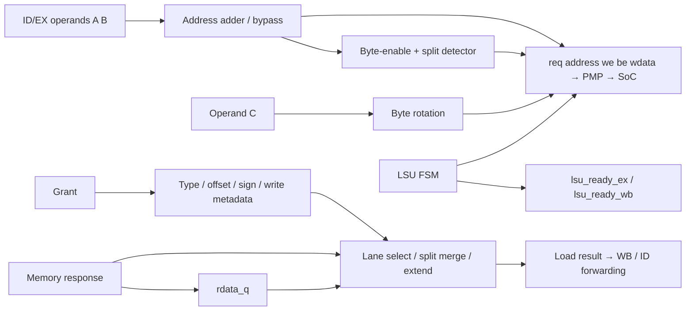

# Microarchitecture 02 — FC LSU: datapath, bốn state và split access

Thực hiện M2 của [kế hoạch](micro_00_plan_phan_tich_pulp.md). Nguồn chính là
[riscv_load_store_unit.sv](../../../../.bender/git/checkouts/cv32e40p-0a3884e05ea5a482/rtl/riscv_load_store_unit.sv).
Bài phân biệt **[RTL]**, **[SUY RA]** và **[SIM LSU 2026-09-13]**. Phép mô phỏng
độc lập LSU không bao gồm ID/EX, PMP, crossbar hay SRAM thực.

## 1. Lần instruction tới datapath của LSU

Từ [decoder LOAD/STORE](../../../../.bender/git/checkouts/cv32e40p-0a3884e05ea5a482/rtl/riscv_decoder.sv#L387):

| Lệnh | Điều khiển và operand |
|---|---|
| lw/lh/lb/lhu/lbu | data_req=1, regfile_mem_we=1; base rs1 + immediate I; type và sign-extension theo encoding |
| sw/sh/sb | data_req=1, data_we=1; base rs1 + immediate S; write data rs2 qua mux OP_C_REGB_OR_FWD |
| post-increment extension | địa chỉ memory có thể lấy operand A trước increment, đồng thời ALU cập nhật base register |

Sau ID/EX, `riscv_core` nối operand A/B tới LSU để tính address, operand C làm
write data. Không nói LSU lấy address từ output ALU: **LSU có phép cộng riêng**:

```text
data_addr_int = addr_useincr_ex ? operand_a_ex + operand_b_ex : operand_a_ex
data_addr_o   = data_addr_int
data_we_o     = data_we_ex
```

ALU cũng tính địa chỉ phục vụ forwarding/post-increment/split sequence; hai
đường dùng cùng operands nhưng wiring là hai đường logic riêng.



## 2. State inventory: metadata giữ cho response cũ

| Register | Nội dung | Enable cập nhật |
|---|---|---|
| CS | IDLE / WAIT_RVALID / WAIT_RVALID_EX_STALL / IDLE_EX_STALL | mỗi cạnh clock |
| data_type_q | word/half/byte của transaction đã grant | data_gnt_i |
| rdata_offset_q | hai bit thấp của địa chỉ gốc | data_gnt_i |
| data_sign_ext_q | chế độ zero/sign/ones extension | data_gnt_i |
| data_we_q | response thuộc read hay write | data_gnt_i |
| rdata_q | first word của split load hoặc kết quả load hoàn chỉnh được giữ | data_rvalid_i && !data_we_q |

Address/write-data request chưa được copy vào queue riêng trong LSU; chúng còn
phụ thuộc ID/EX. Chính ready/control giữ state upstream khi request chưa grant.
Sau grant, metadata response đã latch nên upstream có thể chứa instruction mới.

Khi response cũ và grant mới cùng cycle, combinational response dùng metadata
**q cũ**; metadata mới chỉ có hiệu lực sau cạnh. Đây là lý do byte load vẫn
sign-extend đúng ngay cả khi request đang trên bus đã đổi sang word store.

## 3. FSM và hai loại ready

Đặt Q=`data_req_ex_i`, G=`data_gnt_i`, R=`data_rvalid_i`, V=`ex_valid_i`.
Bảng sau giả định không có PMP error; defaults ready_ex=ready_wb=1.

| State / điều kiện | req ngoài | ready_ex / ready_wb | State sau cạnh |
|---|---|---|---|
| IDLE, !Q | 0 | 1 / 1 | IDLE |
| IDLE, Q, !G | Q | 0 / 1 | IDLE |
| IDLE, Q, G | Q | 1 / 1 | V ? WAIT_RVALID : WAIT_RVALID_EX_STALL |
| WAIT_RVALID, !R | 0 | 1 / 0 | WAIT_RVALID |
| WAIT_RVALID, R, !Q | 0 | 1 / 1 | IDLE |
| WAIT_RVALID, R, Q, !G | Q | 0 / 1 | IDLE, chờ grant cho request mới |
| WAIT_RVALID, R, Q, G | Q | 1 / 1 | V ? WAIT_RVALID : WAIT_RVALID_EX_STALL |
| WAIT_RVALID_EX_STALL, !R, !V | 0 | 1 / 1 | giữ |
| WAIT_RVALID_EX_STALL, !R, V | 0 | 1 / 1 | WAIT_RVALID |
| WAIT_RVALID_EX_STALL, R, !V | 0 | 1 / 1 | IDLE_EX_STALL, rdata đã được giữ |
| WAIT_RVALID_EX_STALL, R, V | 0 | 1 / 1 | IDLE |
| IDLE_EX_STALL | 0 | 1 / 1 | V ? IDLE : giữ |

`ready_ex=1` không tự chứng minh request hoàn tất: khi WAIT_RVALID chưa R,
ready_ex vẫn 1 nhưng ready_wb=0 làm ex_valid/ex_ready bị chặn qua phương trình
pipeline. `ready_wb=1` cũng không phải một response pulse độc lập trong mọi
state; phải biết transaction còn nằm ở EX hay đã chuyển sang WB.

Hai state EX_STALL tránh phát lặp transaction đã grant khi instruction chưa
rời EX vì điều kiện khác. Nếu response đến trước khi EX được giải phóng,
`rdata_q` giữ kết quả và IDLE_EX_STALL tiếp tục chặn request trùng.

**Store cũng dùng WAIT_RVALID.** Không có nhánh “write grant xong là bỏ qua
response” và không có store buffer tách riêng để CPU tự do vượt mọi store.
Một memory request đã grant chờ response tại một thời điểm; response cũ và
request mới có thể gặp nhau trong cùng cycle. Một split instruction cần hai
transaction như vậy.

PMP error có thể nhả ready_ex dù chưa G, để controller xử lý lỗi; metadata
không được latch như một memory request thành công. Không mô tả nhánh error
bằng bảng latency của SRAM và không trộn nó với r_opc không được nối từ bus.

## 4. Byte-enable, rotation và sign extension

Type `00`=word, `01`=halfword, `10/11`=byte. Với một lượt truy cập không split:

| Size / offset | BE |
|---|---|
| word, offset 0 | 1111 |
| half, offset 0 / 1 / 2 | 0011 / 0110 / 1100 |
| byte, offset 0 / 1 / 2 / 3 | 0001 / 0010 / 0100 / 1000 |

LSU không xóa hai bit thấp trên data_addr_o. SRAM wrapper mới cắt byte bits
khi chọn row. Offset vẫn cần để tạo BE và chọn lane response.

`wdata_offset = address[1:0] - data_reg_offset_ex[1:0]` theo phép toán 2 bit;
word write-data quay trái 0/8/16/24 bit theo offset. Với store RV32 thông thường,
register offset bằng 0. Ví dụ SB giá trị 0x80 tại offset 1 đưa byte 0x80 lên
lane [15:8], BE=0010. Byte khác trên bus không có nghĩa được ghi nếu BE=0.

Read response chọn lane bằng offset **đã latch**. Sign-extension code 00 thêm
zero, 10 thêm toàn bit 1 (còn dùng cho FP NaN boxing), các code còn lại lặp sign
bit. Với integer LB/LH, decoder chọn sign; LBU/LHU chọn zero. Ví dụ byte 0x80:
LB→0xFFFFFF80, LBU→0x00000080.

`data_rdata_ex_o = data_rvalid_i ? data_rdata_ext : rdata_q`; khi response không
còn trên bus, kết quả vẫn có thể được giữ. Khi R=1 cho store, read-data output
không được dùng làm kết quả kiến trúc của store.

## 5. Split access là phối hợp LSU và ID/EX

Detector báo split khi word offset!=0 hoặc halfword offset=3. Halfword offset=1
không vượt word nên chỉ cần một memory access trong RTL này. Không thay detector
bằng luật “mọi address không chia hết cho size đều trap”.

Trình tự, xét word tại A với offset 1:

1. LSU phát beat 1, BE=1110, data_misaligned_o=1.
2. Controller giữ ID bằng misaligned_stall. Forwarding operand A chọn kết quả
   EX; decoder chọn immediate PCINCR=4 và phép cộng địa chỉ cho beat kế tiếp.
3. Khi ex_ready, nhánh đặc biệt ID/EX chỉ cập nhật operands cần thiết và đặt
   data_misaligned_ex=1; type/destination/store-data vẫn thuộc cùng instruction.
4. Beat 2 dùng A+4, vẫn có offset 1 trên bus; SRAM hiểu word kế tiếp vì cắt [1:0].
   data_misaligned_ex làm BE beat 2=0001 và ngăn detector báo split lặp.
5. Load giữ word đầu raw trong rdata_q; response word thứ hai được ghép/extend.

Nguồn nối ngoài LSU: [decoder split override](../../../../.bender/git/checkouts/cv32e40p-0a3884e05ea5a482/rtl/riscv_decoder.sv#L2441),
[ID/EX partial update](../../../../.bender/git/checkouts/cv32e40p-0a3884e05ea5a482/rtl/riscv_id_stage.sv#L1475),
[controller forwarding](../../../../.bender/git/checkouts/cv32e40p-0a3884e05ea5a482/rtl/riscv_controller.sv#L1065).
Địa chỉ beat 2 không được một counter độc lập trong LSU tự sinh.

### Ví dụ load hai word

Memory word tại 0x1C010014 là 0x44332211, word kế là 0x88776655.
`lw` tại 0x1C010015 cần bytes 22,33,44,55:

```text
beat 1: bus A=0x1C010015, memory word 0x1C010014, giữ 0x44332211
beat 2: bus A=0x1C010019, memory word 0x1C010018, nhận 0x88776655
result = {second[7:0], first[31:8]} = 0x55443322
```

Shared L2 đổi từ bank 1 sang bank 2; split có thể chịu contention khác nhau ở
hai lượt. Split qua ranh giới memory/peripheral còn có semantics khác; không
coi hai lượt là một truy cập atomic.

### Ví dụ store hai word

Ghi 0x11223344 tại A offset 1, register-offset=0:

| Beat | WDATA sau rotation | BE | Bytes được ghi |
|---|---|---|---|
| A | 0x22334411 | 1110 | lane 1=44, 2=33, 3=22 |
| A+4 | 0x22334411 | 0001 | lane 0=11 |

Nếu word cũ đều 0xAAAAAAAA, kết quả memory mong đợi lần lượt 0x223344AA và
0xAAAAAA11. Đây là **[SUY RA]** từ BE/SRAM; test độc lập hiện chỉ kiểm payload
hai beat, chưa có memory model kiểm readback và chưa kiểm tính atomic.

## 6. Bằng chứng mô phỏng độc lập đã chạy

**[SIM LSU 2026-09-13]** Dùng chính file RTL LSU, Icarus Verilog 12.0;
[testbench](../../../../report/microarchitecture_20260913/tb_fc_lsu.sv) PASS 20 checks:

- Reset idle; giữ request khi grant chậm; ready_ex nhả tại grant.
- WB chờ response; signed byte cũ trả đúng trong cycle grant word-store mới.
- Store cần response để nhả WB.
- Request đã grant không phát lặp khi EX stall; response được giữ qua stall.
- Split word load ghép thành 0x55443322; split store rotation/BE đúng hai beat.

Chạy lại:

```bash
bash report/microarchitecture_20260913/run_lsu.sh
```

Script tạo build/VCD dưới `/tmp`, không sửa dependency. Define VERILATOR chỉ
loại block SVA cuối file LSU vì Icarus chưa hỗ trợ các assertion đó; các check
procedural của testbench vẫn bật. Compile log có thông báo sensitivity-list
cho constant select trong always_comb; không có compile error. Log và waveform
đã lưu trong [report](../../../../report/microarchitecture_20260913/README.md).

Testbench tự lái ex_valid và operands/flag beat 2. Nó xác nhận **LSU phản ứng
đúng với các kích thích đã chọn**, không chứng minh pipeline tự sinh split
sequence đúng, không kiểm SRAM/arbiter/CDC, PMP fault hay mọi data type/offset.

## 7. Cách áp dụng phương pháp và việc còn cần đo

Đọc một LSU khác theo thứ tự: acceptance → nơi latch metadata → FSM chống
duplicate → alignment/extension → response retention → ready về pipeline.
Sau đó kiểm store và split riêng, không chỉ load aligned.

Phép thử tiếp ở mức tích hợp cần instruction thật, load/store scoreboard,
same/different-bank contention, unsigned/halfword các offset, delayed response
trong cả hai beat và PMP deny. Đo completion bằng đúng transaction/state,
không đếm RF write-enable hay LSU ready riêng lẻ. Tiếp tục nối đường này tại
[FC → SoC interconnect](micro_03_fc_soc_interconnect.md).
