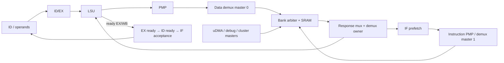

# Microarchitecture 03 — Nối FC pipeline/LSU với SoC interconnect

Thực hiện M3 của [kế hoạch](micro_00_plan_phan_tich_pulp.md). Bài nối
[pipeline](micro_01_fc_pipeline.md), [LSU](micro_02_fc_lsu.md) với
[phân tích decode/xbar đã có](../soc_rtl/soc_01_fc_memory_rtl.md), tập trung state giữ
transaction và đường stall ngược lên core. Các chu kỳ tích hợp là **[SUY RA]**;
phép mô phỏng mới chỉ bao phủ LSU độc lập, không phải toàn chuỗi này.

## 1. Sổ kết nối từ stage tới memory

| Producer/consumer | Net hoặc instance tiếp theo | Biến đổi |
|---|---|---|
| IF prefetch | instruction PMP → core_instr_* → l2_instr_master | instruction read, wen=1, BE=1111 |
| ID/EX → LSU | data_req_pmp/data_addr_pmp → data PMP → core_data_* | tính address/BE/write rotation trong LSU |
| core data → l2_data_master | fc_subsystem wiring | wen=~data_we; grant/response đi ngược trực tiếp |
| FC data → interconnect | tcdm_fc_data_addr_remapped → master_ports[0] | prefix 0x000 đổi sang 0x1C0 |
| FC instruction → interconnect | master_ports[1] | không remap như data |
| demux mỗi master | port 1 contiguous; port 2 interleaved; default 0 AXI | lưu active_slave_q cho response |
| memory crossbar | arbiter mỗi bank, addr_dec_resp_mux mỗi input | pack payload, latch bank selector, valid từ grant |
| SRAM wrapper | tc_sram | trừ base, cắt byte/bank bits, we=~wen |

Nguồn: [core LSU binding](../../../../.bender/git/checkouts/cv32e40p-0a3884e05ea5a482/rtl/riscv_core.sv#L893),
[FC ports](../../../../.bender/git/checkouts/pulp_soc-c519334bd3ac5582/rtl/fc/fc_subsystem.sv#L95),
[interconnect map/remap](../../../../.bender/git/checkouts/pulp_soc-c519334bd3ac5582/rtl/pulp_soc/soc_interconnect_wrap.sv#L94).



PMP áp dụng trước remap FC data. Vì vậy khi phân tích quyền trên alias phải xét
địa chỉ core đưa vào PMP, không tự dùng địa chỉ đã đổi prefix ở interconnect.
Bài này giả định PMP cho phép, reset đã nhả, clock core/SoC đang hoạt động.

## 2. Ba nơi nhớ transaction, ba vai trò khác nhau

| State | Nó trả lời câu hỏi gì? |
|---|---|
| LSU metadata/type/offset và EX/WB load destination | Dữ liệu trả thuộc size/lane nào và cần ghi register nào? |
| tcdm_demux.active_slave_q | Response thuộc nhánh contiguous/shared/AXI nào? |
| addr_dec_resp_mux.bank_sel_q và vld_q | Response thuộc bank nào, có hợp lệ trong cycle này không? |

Đây không phải ba queue làm tăng outstanding lên ba. Chúng mô tả cùng
transaction ở các tầng khác nhau. Đường data thông thường của FC vẫn chỉ có
một request đã grant còn chờ response. Trong cycle response, cả LSU và demux
có thể phát request mới; downstream có nhận ngay được hay không là câu hỏi riêng.

Xbar memory dùng `RespLat=1`, `WriteRespOn=1`, tự tạo vld từ grant. Slave r_valid
không điều khiển latency đó. Bank SRAM grant=req tại endpoint; FC grant còn
phụ thuộc thắng arbiter. Không được tiêm memory response delay phía sau xbar
mà giữ nguyên fixed-latency valid rồi gọi đó là một mô hình wait-state hợp lệ.

## 3. Một load-use đi trọn pipeline → L2 → pipeline

Ví dụ assembly để phân tích, **không phải disassembly đã lấy từ ELF demo**:

```asm
lw  x5, 0(x1)
add x6, x5, x3
```

Giả định x1=0x1C010014 (shared bank 1, row 1), buffer đã được cấp phát/khởi tạo;
instruction có sẵn ở IF, không IRQ/debug/branch/FPU contention, SRAM latency 1.
C0 là khoảng mà load đang ở ID; E1 là cạnh cuối C0.

| Khoảng | ID/EX/WB | LSU/interconnect | Tại cạnh cuối |
|---|---|---|---|
| C0 | lw ở ID, EX sẵn sàng | chưa phát data request của lw | E1 latch load vào ID/EX |
| C1 | lw ở EX, add ở ID; load_stall=1 | req load, thắng bank→gnt=1; LSU ready_ex=1 | E2 nhận memory request, latch response metadata/rd; ID giữ add, EX nhận bubble |
| C2 | load ở WB, add vẫn ở ID trước cạnh | memory response; ready_wb=1; SEL_FW_WB cấp kết quả load vào operand add | E3 ghi kết quả load cuối và latch add vào EX |
| C3 | add ở EX | ALU tính x5+x3, write port EX | E4 ghi x6 |

Đây là một dependency bubble ở EX trong mô hình thuận lợi. Không phải tuyên
bố mọi load-use luôn tốn đúng một cycle: grant chậm, response chậm hoặc instruction
fetch thiếu dữ liệu sẽ kéo dài; forwarding không tự làm memory trả sớm hơn.

Tại C2, input add lấy data_rdata_ext qua WB-forwarding, không cần chờ đọc lại
RF ở cycle sau. RF write-enable trong lúc chờ không phải completion như đã
giải thích ở bài pipeline.

## 4. Grant chậm khác response chậm ở vị trí giữ pipeline

### A. Bank đang phục vụ master khác

```text
FC req=1, FC gnt=0
→ LSU IDLE giữ ready_ex=0
→ ex_ready/ex_valid=0 (xét lệnh memory thông thường)
→ id_ready=0 → IF không nhận instruction vào ID
```

ID/EX giữ operands/type/store-data; demux chưa ở trạng thái nhận request đó.
Instruction prefetch có thể tiếp tục một thời gian nhờ FIFO còn chỗ, nên IF
stall ở ranh giới pipeline không đồng nghĩa instr_req lập tức bằng 0.

### B. Request đã grant nhưng response còn chậm

```text
LSU WAIT_RVALID, R=0
→ ready_wb=0, dù ready_ex mặc định=1
→ ex_ready/ex_valid=0 qua wb_ready
→ id_ready=0
```

Load/store đã chuyển sang WB; lệnh độc lập kế tiếp có thể đã được latch ở EX
trong cycle grant trước đó, rồi phải chờ WB. Không suy CPU có thể tiếp tục
issue không giới hạn chỉ vì instruction sau không phụ thuộc register load.

Response chậm là tình huống tự nhiên trên AXI/APB; tại L2 fixed-latency, phần
delay do contention chủ yếu nằm ở **trước grant**, không nằm ở sau grant.

## 5. Store → load và back-to-back

Ví dụ `sw x5,0(x1); lw x6,0(x1)` với address aligned, cùng giả định không stall:

| Khoảng | Hành vi |
|---|---|
| C0 | store ở EX: req/gnt; cuối cycle SRAM ghi theo BE, LSU vào WAIT_RVALID; load có thể vào EX |
| C1 | store response valid; LSU/demux đồng thời phát và grant load; cuối cycle nhận load |
| C2 | load response chứa word đã store nếu không có master khác sửa; WB nhận kết quả |

Store response không chở giá trị cần ghi RF; nó giải phóng state completion.
Chọn same address ở đây kiểm thứ tự truy cập SRAM, không chứng minh coherence
toàn hệ thống, atomic read-modify-write hay ordering giữa mọi master.

Split load/store tại offset 1 dùng hai bank kế nhau trong shared L2. First-beat
grant chưa đủ kết luận instruction hoàn tất; chỉ sau second response mới có
toàn dữ liệu/side effect. Nếu master khác xen giữa hai beat, không có bảo đảm
atomic từ LSU này.

## 6. Thay đích L2 bằng APB: cùng LSU, đường hoàn tất khác

Ví dụ FC store START_HI tại 0x1A10B01C:

```text
LSU → PMP → master 0 → demux default
→ lint_2_axi → AXI xbar → AXI-Lite → APB Setup/Access → timer
→ B response → lint_2_axi r_valid → demux → LSU/WB
```

[lint_2_axi](../../../../.bender/git/checkouts/l2_tcdm_hybrid_interco-f03a86a7ac111e77/RTL/lint_2_axi.sv)
chỉ grant TCDM write khi cả AW và W đã được nhận; chúng có thể được nhận khác
cycle. Sau grant, WRITE_WAIT chờ BVALID. Khi B về mới nhả LSU WB.

Nếu AW đã nhận nhưng W chưa nhận, ID/EX/LSU phải giữ payload đến khi FC grant.
Đây là lý do contract của data port cần được xét ở cả bridge, không chỉ SRAM.

Bridge trong WRITE_WAIT/READ_WAIT không phát request mới ở chính cycle response;
nó chuyển IDLE ở cạnh kế tiếp. Vì vậy khả năng back-to-back của LSU và demux
không tự biến thành throughput back-to-back trên APB. Phân tích từng tầng để
biết nơi tạo bubble, không gán một latency cho mọi địa chỉ.

APB node miss trong cửa sổ peripheral có thể giữ PREADY=0 vô hạn: bridge chờ B/R,
LSU WB chờ và pipeline mất tiến triển. Không coi đó là “load chậm vài cycle” hay
tự động access-fault. Chi tiết register/error ở [bài APB](../soc_rtl/soc_02_timer_irq_rtl.md).

## 7. Tranh chấp instruction/data và giới hạn throughput

FC instruction/data là hai master độc lập. Khi cùng nhắm một bank, arbiter
chỉ grant một request mỗi cạnh; khác bank có thể grant song song. Prefetch
FIFO có thể che một phần fetch delay, còn data delay thường tác động trực tiếp
tới EX/WB. Code/data ở private banks khác nhau giúp tránh một loại tranh chấp,
nhưng private không cấm uDMA/debug/cluster truy cập.

Các upper bound dưới đây là **[SUY RA: no-stall, clock đang chạy]**:

| Tài nguyên | Giới hạn lý tưởng | Điều kiện có thể làm thấp hơn |
|---|---|---|
| Một bank L2 | 1 word request/cycle | arbitration và master không phát liên tục |
| Bốn shared banks | tổng 4 word request/cycle nếu đủ master phân bố bank | cùng bank, ít outstanding, pipeline dependency |
| FC data LSU | tối đa 1 request/cycle khi response cũ và grant mới nối tiếp | split instruction cần 2 request, WB/EX stall |
| FC instruction fetch | tối đa 1 word request/cycle trong nhánh 32 bit | FIFO ready, redirect, bank grant |
| Issue integer thông thường | không hơn 1 instruction/cycle ở pipeline này | load-use, jalr, multicycle, fetch starvation |

Word/cycle không đồng nghĩa instruction/cycle khi có compressed instruction;
cũng không đồng nghĩa useful-byte/cycle cho byte load hoặc split access. Không
nhân clock danh nghĩa với upper bound rồi gọi là bandwidth đo được.

## 8. Ma trận kiểm chứng tích hợp và tín hiệu cần thu

| Case | Dự đoán cần kiểm | Quan sát quyết định |
|---|---|---|
| lw→add | giữ dependent ở ID, rồi WB-forward đúng | PC/rd, load_stall, mux selector, operands, R |
| sw→lw same address | store trước read, data readback đúng | BE/WE, grant hai lượt, SRAM data và WB result |
| FC + uDMA cùng bank | chỉ một grant mỗi bank/cycle, FC stall trước grant | requests, arbiter grant vector, ready_ex |
| Khác bank | có cycle phục vụ song song nếu requests đồng thời | bank grants, không chỉ tổng thời gian chương trình |
| APB delayed response | WB bị giữ tới B/R | AW/W/AR/B/R, bridge state, ready_wb |
| Split load/store | hai beat đúng address/BE, kết quả sau beat 2 | split flag ID/EX, rdata_q, bank/row, result |
| Branch khi fetch pending | bỏ response đường cũ, target tới ID đúng | prefetch CS/address/FIFO valid, pc_set, PC_ID |

Tín hiệu bắt đầu tìm dưới `fc_subsystem_i.FC_CORE.lFC_CORE`: `if_stage_i`,
`id_stage_i`, `ex_stage_i`, `load_store_unit_i`, các net `lsu_ready_ex/wb`,
`ex_ready/ex_valid`. Tại SoC tìm `s_lint_fc_data_bus/s_lint_fc_instr_bus`, demux
master 0/1, bank grant và memory row. Prefix hierarchy đầy đủ phụ thuộc TB/top;
xác nhận từ elaboration trước khi viết lệnh add wave.

Scoreboard phải phân biệt address logical/physical sau alias, request accepted,
response của request nào và instruction completion. Thêm watchdog cho mọi
case wait; kiểm data đúng trước khi so sánh hiệu năng.

**Kết quả M3:** đã nối control/data/response từ core tới L2/APB và trở lại, có
ba mô hình chu kỳ và ma trận phép thử. [Report LSU](../../../../report/microarchitecture_20260913/README.md)
xác nhận một phần FSM/data formatting; timing/contention toàn core–SoC vẫn là
việc của mốc kiểm chứng tích hợp M8.

## Nối sang các phần đã triển khai tiếp

[M4 uDMA/event](micro_04_soc_udma_event.md) bổ sung hai master uDMA và completion;
[M5 cluster](micro_05_cluster_memory_dma_eu.md) nối cache/DMA vào SoC AXI path.
[M8](micro_08_validation.md) đã kiểm primitive xbar 4×4: 16 accepted requests /
16 response đúng, cùng bank cần 4 lượt cho 4 request, khác bank phục vụ trong
1 lượt. Test dùng target fixture một chu kỳ, chưa instantiate FC hoặc toàn SoC.
