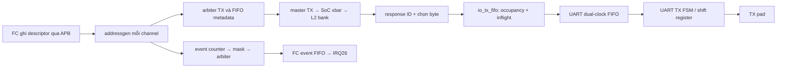

# M4 — SoC uDMA, peripheral và event: credit, queue và completion

Ngày: 2026-09-13. Tiếp tục [plan microarchitecture](micro_00_plan_phan_tich_pulp.md).

## 1. Cách đi từ kiến trúc xuống microarchitecture

Câu hỏi dẫn đường: **một byte UART TX đang thuộc quyền quản lý của khối nào,
và khi khối sau chậm thì khối trước ngừng ở đâu?** Sau đường FC → L2 ở M3,
thêm hai master uDMA TX/RX cùng tranh chấp L2. Chọn UART làm giao dịch cụ thể;
không suy rằng mọi peripheral uDMA đều có cùng FIFO hoặc clock.

Phương pháp ở đây là **lần giao dịch kết hợp kế toán tài nguyên**: lập inventory
register/FIFO, ghi cạnh acceptance, rồi đếm dữ liệu đã được hứa trả về nhưng
chưa nằm trong FIFO. Đọc cả `always_ff` ghi valid, không dừng tại biểu thức stall.
Ký hiệu [RTL] là đọc được trong code, [SUY RA] cần các giả định đã nêu,
[SIM mới] chỉ các test trong report lần này.



## 2. State inventory và điều kiện cập nhật

| Khối | State cần theo dõi | Acceptance / tiến triển |
|---|---|---|
| Addressgen [S1] | current address, bytes counter, enable, pending config, event | `r_en && int_ch_grant_i && int_not_stall_i` |
| TX channels [S2] | FIFO metadata, `r_resp`, `r_resp_dly`, `r_valid`, `r_data`, TX_IDLE/TX_NON_ALIGNED | channel được chọn **và** FIFO metadata còn chỗ; phía L2 có req/gnt riêng |
| Peripheral TX FIFO [S3–S4] | occupancy, read/write pointer, `r_inflight` | reserve: req/gnt; push: valid_i/ready_o; pop: valid_o/ready_i |
| RX channels [S5] | dữ liệu/size/destination đã chốt, output FIFO, RX_IDLE/RX_NON_ALIGNED | chỉ nhận khi những output FIFO cần dùng còn chỗ |
| Event queue [S6] | counter hai bit | event tăng, ack giảm; đồng thời giữ nguyên |

TX metadata chứa destination, channel ID, datasize và address. Nó giữ ngữ cảnh
request để response về đúng channel dù arbiter đã chọn channel khác. Địa chỉ
đi L2 được căn word, offset còn dùng để chọn byte; channel tuyến tính thông
thường dùng destination L2 và prefix `0x1C`. Với transfer vượt word, FSM thêm
beat và ghép dữ liệu; không suy mỗi sample luôn bằng một L2 request.

## 3. Vì sao chỉ nhìn FIFO full là chưa đủ?

[RTL:S3] Đặt `D=BUFFER_DEPTH`, `Q=s_elements`, `I=r_inflight`:

```text
free = D - Q
stop_req = (free == I)
req_o = ready_o && !stop_req
reserve = req_o && gnt_i
push = valid_i && ready_o
pop = valid_o && ready_i
I_next = I + reserve - push
Q_next = Q + push - pop
```

[SUY RA] Với reset sạch, không clear giữa chừng, mỗi reserve có đúng một
response, không có response tự phát và producer tuân thủ handshake:
`0 <= Q + I <= D`. Số chỗ còn hứa cấp được là `D-Q-I`.
Khi response tới, một đơn vị chuyển từ I sang Q, không chiếm thêm tổng credit.
Consumer pop mới giải phóng credit. Đây là lý do FIFO có thể chặn **request**
khi FIFO dữ liệu vẫn trống.

Ví dụ D=2, consumer chưa nhận byte nào, không có reserve/push đồng thời:

| Sau cạnh | Hành động | Q | I | Có thể phát thêm request? |
|---|---|---:|---:|---|
| E0 | reset | 0 | 0 | Có |
| E1 | reserve byte A | 0 | 1 | Có |
| E2 | reserve byte B | 0 | 2 | Không |
| E3 | response A | 1 | 1 | Không |
| E4 | response B | 2 | 0 | Không |
| E5 | consumer pop A | 1 | 0 | Có |

[SIM mới] `tb_control.sv` checks 1–9 kiểm chính chuỗi này, thêm response trễ,
consumer stall kéo dài và thứ tự A/B. Test instantiate `io_tx_fifo` thật với
width 8, depth 2; producer/consumer là stimulus, không có UART FSM hay SoC xbar.

### Hiệu chỉnh kết luận trước đây về response TX

[RTL:S2] `r_resp` là **ID nhị phân** rộng `LOG_N_CHANNELS`, nhưng biểu thức
` s_stall = |(~s_ch_ready & r_resp) & r_valid ` dùng nó trong phép AND như một
mask. ID 0 cho kết quả stall=0 bất kể ready của channel 0. Hơn nữa,
`r_valid <= l2_rvalid_i & ~s_is_na` cập nhật mỗi clock; code không tự giữ valid
đến một downstream handshake bất kỳ.

Vì vậy không thể kết luận “response luôn được giữ tới khi consumer nhận” chỉ
từ `s_stall`. Đường UART TX cần xét credit của `io_tx_fifo` cùng toàn bộ wiring.
Đây là **điểm cần kiểm tra ở TX channels**, chưa phải kết quả mô phỏng chứng
minh UART mất byte. Test credit không instantiate `udma_tx_channels` và không
xác nhận biểu thức stall đó đúng. Bài [SoC uDMA trước đây](../soc_rtl/soc_03_udma_debug_cluster_rtl.md)
được sửa để bỏ kết luận quá mức này.

Một chi tiết reset khác: `clr_i` clear FIFO dữ liệu nhưng không clear
`r_inflight` trong S3. Không tái dùng contract POR cho clear khi còn request;
UART integration hiện nối clear của TX FIFO này bằng 0.

## 4. RX: backpressure nằm trước bộ nhớ

[RTL:S5] RX giữ sample với address, datasize, destination và số byte; output
FIFO tách tốc độ nhận peripheral khỏi tốc độ grant L2. Trong các mode cần cả
L2 và stream, `s_sample_indata` là AND readiness của hai đường tương ứng.
Khi L2 không grant, output FIFO giữ đầu hàng; khi FIFO đầy, RX giảm khả năng
nhận đầu vào. Peripheral có tiếp tục nhận tín hiệu vật lý được hay không còn
phụ thuộc FIFO/overrun của peripheral, không do xbar đảm bảo.

L2 write dùng word address và byte-enable; halfword tại offset 3 hoặc word
không aligned có thể cần hai request. `RX_NON_ALIGNED` giữ phần còn lại;
chỉ pop sample khi nhánh điều khiển đã hoàn tất các grant cần thiết.
RX interface không có input `l2_rvalid_i`: mốc tiến triển bộ nhớ của đường này
là grant write theo contract đích TCDM, không phải một B response của AXI.

## 5. Completion phải được đặt tên theo đúng chặng

| Mốc | Nó chứng minh gì? | Chưa chứng minh gì? |
|---|---|---|
| FC store config hoàn tất | peripheral register đã nhận lệnh | dữ liệu đã được DMA chuyển |
| Addressgen phát event | phần transfer theo bookkeeping của addressgen đã tiến hết | L2 response TX cuối đã vào UART FIFO |
| Response cuối push TX FIFO | byte cuối đã vào buffer SoC | đã qua CDC / shift ra TX pin |
| UART TX FSM hoàn tất frame cuối | serial engine kết thúc frame theo state/baud | thiết bị ngoài đã xử lý nội dung |

[S1] Event gắn với grant + not-stall khi counter đến phần cuối. Vì request đã
vào queue có thể chưa được L2 phục vụ, đo TX event → byte cuối trên pad thành
hai timestamp riêng. Giữ lifetime buffer theo contract driver/response thực;
không lấy event enqueue làm bằng chứng đủ để overwrite buffer.

## 6. Event không phải một dây IRQ trực tiếp

[RTL:S6–S7] Mỗi source có counter hai bit 0..3; `QUEUE_SIZE=2` không phải FIFO
hai entry tổng quát. Event được mask theo destination rồi arbitrate; ack của
source phụ thuộc các destination được mở. FC có FIFO event riêng, IRQ26 báo
FIFO có việc. Timer IRQ10/11 trực tiếp là đường khác; xem
[timer/IRQ](../soc_rtl/soc_02_timer_irq_rtl.md) về đọc ID và pop.

```text
event && !ack && count<3 : count++
!event && ack && count>0 : count--
event && ack            : count giữ nguyên
err = event && (count==3)
```

[SIM mới] Counter chứa ba event; khi full và event+ack cùng chu kỳ vẫn báo
`err`, count giữ 3; ba ack tiếp theo làm cạn queue. Error không tự đồng nghĩa
“chắc chắn mất một event” trong trường hợp event/ack đồng thời.

[SUY RA] Destination mở mask nhưng không drain có thể gây head-of-line stall
và cuối cùng làm counter source full. Với multicast, cần scoreboard mỗi
(source, destination), đặc biệt khi chỉ một destination ready: test counter
đơn lẻ chưa xác nhận không lặp/mất delivery ở toàn bộ event generator.

## 7. Áp dụng cách làm này sang source khác

Bắt đầu bằng một sample có ID, lập bảng `reserve/push/pop`, tìm mọi nơi ghi
occupancy/valid, rồi chứng minh số request outstanding có chỗ trả về. Sau đó
thêm đường event và ghi chính xác event phụ thuộc request, response hay
consumer completion. Nếu một tín hiệu mang ID, kiểm xem code sử dụng nó như
binary index hay one-hot trước khi suy luận arbitration/backpressure.

M4 đã đi vào state và contract của đường UART/uDMA/event. Topology, FSM,
data/event map và completion semantics của SPI/I2C/SDIO/I2S/camera/filter/Hyper
được đóng ở [M10 — uDMA peripherals](micro_10_udma_peripherals.md). Các phép
thử protocol/pad tích hợp còn lại nằm ở [M8](micro_08_validation.md).

## Bản đồ bằng chứng RTL

Các mã S bên dưới trỏ vào checkout hiện tại; hash và trạng thái dependency nằm trong
[report kiểm chứng](../../../../report/microarchitecture_20260913_remaining/README.md).

| Mã | Source / điểm bắt đầu đọc | Nội dung cần đối chiếu |
|---|---|---|
| S1 | [udma_ch_addrgen.sv](../../../../.bender/git/checkouts/udma_core-25b62500cd51a5c6/rtl/core/udma_ch_addrgen.sv#L21) | address counter, pending, event |
| S2 | [udma_tx_channels.sv](../../../../.bender/git/checkouts/udma_core-25b62500cd51a5c6/rtl/core/udma_tx_channels.sv#L22) | metadata FIFO, binary response ID, stall, response register |
| S3 | [io_tx_fifo.sv](../../../../.bender/git/checkouts/udma_core-25b62500cd51a5c6/rtl/common/io_tx_fifo.sv#L21) | credit và inflight |
| S4 | [io_generic_fifo.sv](../../../../.bender/git/checkouts/udma_core-25b62500cd51a5c6/rtl/common/io_generic_fifo.sv#L22) | occupancy, pointers, push/pop |
| S5 | [udma_rx_channels.sv](../../../../.bender/git/checkouts/udma_core-25b62500cd51a5c6/rtl/core/udma_rx_channels.sv#L22) | RX output queues, byte enable, split |
| S6 | [soc_event_queue.sv](../../../../.bender/git/checkouts/pulp_soc-c519334bd3ac5582/rtl/pulp_soc/soc_event_queue.sv#L12) | event counter và full+ack |
| S7 | [soc_event_generator.sv](../../../../.bender/git/checkouts/pulp_soc-c519334bd3ac5582/rtl/pulp_soc/soc_event_generator.sv#L48) | mask, arbiter, destination ready |
