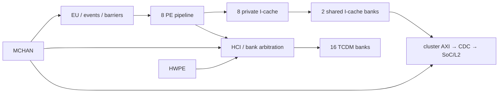

# M5 — Cluster: PE, instruction cache, TCDM, DMA và event unit

Ngày: 2026-09-13. Tiếp tục [plan microarchitecture](micro_00_plan_phan_tich_pulp.md).

## 1. Chia theo domain để định vị, nối theo giao dịch để giải thích

Không đọc lại toàn bộ pipeline tám lần. Tái dùng [FC pipeline](micro_01_fc_pipeline.md)
và [LSU](micro_02_fc_lsu.md), lập bảng khác biệt integration, rồi lần ba đường:
PE fetch → cache → L2; PE load/store → TCDM; DMA L2 ↔ TCDM → completion → EU.
Như vậy mới phân biệt được thiếu instruction, tranh chấp data và chờ đồng bộ.

| Thuộc tính | FC | Cluster trong checkout này |
|---|---|---|
| Số core | 1 | 8 PE |
| Core integer | RI5CY `riscv_core`, IF/ID/EX/WB | Cùng họ implementation; không phải tám FC độc lập |
| Secure/PMP | PULP_SECURE=1, USE_PMP theo cấu hình FC | core_region truyền PULP_SECURE=0 |
| FP register namespace | USE_ZFINX=1 ở FC integration | Không override Zfinx trong core_region; core default 0, dùng FPR khi FPU bật |
| Instruction memory | prefetch → SoC path | prefetch → private cache → shared instruction cache → AXI |
| Data memory gần core | L2 phía SoC | L1 TCDM 64 KiB, 16 bank |
| FPU | local FPNEW khi bật | 4 FPNEW + 1 shared div/sqrt, xem M6 |
| Chờ sự kiện | FC IRQ/controller/WFI | EU per-core, barrier và gating đường cluster |

[RTL:S1–S2] Phải phân biệt `PULP_CLUSTER` compile/core configuration với tên
module bọc. Những mô tả dưới đây dùng cấu hình đã chốt ở M0; đổi generate hoặc
file compile thì phải đánh giá lại đường đi.



## 2. Instruction cache: dung lượng không cho biết miss penalty

[RTL:S1,S3–S6] Private cache mỗi PE 512 B, 4 way; shared cache **tổng** 4 KiB,
2 bank, mỗi bank 2 KiB và 4 way. Top chia `SH_CACHE_SIZE/SH_NB_BANKS` trước khi
instantiate bank. Không nhân nhầm 4 KiB với số bank.

Private fetch phía PE 32 bit ở cấu hình này, refill 128 bit. Trong
`pri_icache.sv`, số row tính theo `REFILL_DATA_WIDTH`, không theo comment
`CACHE_LINE` ở wrapper:

```text
private line bytes = CACHE_LINE * REFILL_DATA_WIDTH / 8 = 16
way bytes = 512 / 4 = 128
rows per way = 128 / 16 = 8
set bits = address[6:4]; word selector = address[3:2]
shared bank selector = address[4] (2 banks, 16-byte refill granularity)
```

Reduced tag dùng biểu thức dựa vào `L2_SIZE`; cần xét phạm vi code address nếu
đổi memory map. Không diễn giải cache này như cache tag full-address có thể
đặt code ở mọi alias. Không có bằng chứng ở các đường đang xét cho data-cache
coherence hoặc tự invalidate instruction khi DMA ghi code.

### State và pipeline của private cache

| State/nhóm [S4] | Datapath/control đáng chú ý |
|---|---|
| IDLE_ENABLED | grant fetch, phát đọc tag/data, chốt address |
| TAG_LOOKUP hit | valid response, chọn way và word; có thể nhận fetch tiếp |
| TAG_LOOKUP miss | giữ `fetch_addr_Q`, chọn way trống hoặc LFSR victim; phát refill |
| WAIT_REFILL_GNT | giữ refill request/address đến grant |
| WAIT_REFILL_DONE | đợi refill valid; ghi tag valid/data, trả instruction |
| DISABLED/BYPASS_* | đi đường bypass refill, không tính là cache hit |
| FLUSH_* | invalidate cache/set; chặn tiến triển fetch theo state |
| PRE_* / WAIT_PREFETCH / CONFLICT_REFILL | FSM prefetch riêng và xử lý trùng/conflict |

Điểm cần đọc kỹ: trong TAG_LOOKUP, `fetch_gnt_o=fetch_req_i` được đặt trước
nhánh hit/miss; nhánh miss tắt `enable_pipe` nhưng không có phép gán hạ grant
ngay tại đó. Vì thế không thể viết một contract tổng quát “miss thì grant=0
ngay” từ tên state. Phải nối với outstanding của core/prefetch và register
capture; các WAIT state sau đó mặc định không grant fetch mới.

[SUY RA] Với cache đã enable, hit, không flush và không contention: fetch được
nhận tại E1, tag/data Q tạo kết quả trong C1. Đây là mô hình hit một bước
register theo điều kiện đó, không phải mọi instruction đều CPI=1.
Miss penalty gồm: phát hiện miss + đợi shared bank + shared hit hoặc AXI refill
+ ghi private line + core tiếp tục. Mỗi phần có handshake, không phải một
hằng số suy từ số tầng cache.

### Shared cache quản lý request đang chờ

[S5] Shared controller có FIFO metadata depth 4: fetch ID, word offset,
tag/index/way. `RefillTracker_4` đối chiếu các refill đang chờ; các state
REQUEST_A_REFILL, SERVE_REFILL và nhóm CRITICAL xử lý tương tác lookup/refill.
Pending output lấy từ valid của FIFO refill/alignment, phục vụ disable/drain.
Không rút gọn thành “chỉ có một miss outstanding” từ một FSM duy nhất.

[S6] AXI response deserializer có FIFO đầu vào, state IDLE/COLLECT_BURST,
burst counter và output repeater. Với refill 128 bit và AXI 64 bit, cần ghép
hai phần dữ liệu; backpressure có thể nằm ở cả FIFO input lẫn output. Hai beat
không có nghĩa luôn hai clock từ AR đến instruction: còn AR grant, CDC,
L2 arbitration và khoảng trống giữa R beats.

## 3. TCDM: bank mapping là điểm bắt đầu phân tích throughput

[RTL:S1,S7] L1 TCDM 64 KiB = 16 bank × 4 KiB, word 32 bit. Với offset byte
trong vùng TCDM thông thường:

```text
bank = (offset >> 2) & 0xf       // A[5:2]
row  = offset >> 6
lane = offset & 3
```

Ví dụ `base + 4*core_id` cho 8 PE đi tám bank; `base + 64*core_id` cùng bank.
Phải tính địa chỉ load/store thực, gồm stride và alignment, thay vì kết luận
“tám core nên nhanh gấp tám”. Stack riêng 4 KiB có thể lặp bank mapping giữa
PE nếu mọi PE truy cập cùng offset của stack cùng lúc.

HCI có đường logarithmic cho PE/DMA/external và đường HWPE riêng, sau đó
`hci_shallow_interconnect` chọn giữa hai nhóm theo control. Vì vậy không gán
chính sách round-robin đồng nhất của SoC xbar cho toàn bộ HCI cluster.
Nút thắt có thể là cùng bank, ưu tiên giữa nhóm, hoặc HWPE cần nhiều lane.

[SUY RA] Một bank single-port chỉ nhận tối đa một request trong một cạnh
phục vụ. Với tám PE cùng bank, cần ít nhất tám lượt grant, chưa kể DMA/HWPE.
Với tám bank độc lập, mapping cho phép parallelism nhưng phải kiểm port,
arbiter và readiness thực trước khi gán bandwidth.

[SIM mới] Test xbar 4×4 ở M8 xác nhận primitive dùng ở SoC: 4 request khác
bank nhận trong 1 chu kỳ, cùng bank cần 4. **Test này không instantiate HCI
cluster**, nên nó minh họa giới hạn bank và kiểm primitive, không xác nhận
throughput của tám PE.

## 4. MCHAN: parser lệnh, queue, datapath và hai sổ completion

[RTL:S1,S8–S12] Integration có 10 control ports, 16 transfer slots, global
transfer queue depth 16, cấu hình 8 outstanding bursts và burst length 256 B.
Các số này thuộc những tài nguyên khác nhau: 16 slots không có nghĩa 16 AXI
bursts luôn cùng chạy. Descriptor bị tách thành burst/command con theo độ dài,
alignment và chế độ 2D.

Control port là **giao thức stateful**. Read để allocate ID; write command
rồi TCDM address, external address, thêm count/stride nếu 2D. `ctrl_fsm` đi
CMD → TCDM → EXT → các state 2D tương ứng, với nhóm *_GRANTED và BUSY để xử lý
phản hồi/queue space. Không hoán đổi các write như một tập register độc lập.

Datapath L2→TCDM: external read command → AXI AR/R → RX buffers/packing →
TCDM write ports. Chiều TCDM→L2: TCDM reads → TX buffers → AXI AW/W → B.
Mỗi chặng giữ ID/metadata để burst completion trả về đúng transfer slot.

`sync_unit` trong code có tên module **`synch_unit`**. Mỗi SID giữ hai counter:

```text
accepted command count k:   tcdm_pending += k; ext_pending += k
matching TCDM completion:  tcdm_pending -= 1
matching EXT completion:   ext_pending -= 1
pending = (max(tcdm_pending, ext_pending) != 0)
term = !pending && pending_delayed
status = pending || pending_delayed
```

Code tạo `s_trans_cells_nb=max(counter)<<4`. Không lấy nó làm số byte thật còn
lại của mọi transfer; dùng counter/command unit đúng nơi nó được sinh.
Nhánh enqueue và completion đồng thời xử lý cộng/trừ cùng cạnh, tránh báo done
khi vừa có thêm work cùng SID.

[S11] EXT TX sinh synch từ B valid; tại interface này B ready luôn 1. Nó
không lấy WLAST làm mốc hoàn tất external write. [S12] EXT RX chỉ synch ở beat
cuối có valid và các grant downstream cần thiết. Counter TCDM vẫn cần về 0.
Việc counter cạn là bookkeeping completion; không tự chứng minh AXI BRESP/RRESP
không báo lỗi hoặc nội dung dữ liệu chính xác.

[SIM mới] `tb_dma_synch.sv` PASS 12 checks: command chưa grant không tiến;
SID khác không retire; TCDM xong trước vẫn busy; EXT xong trước vẫn busy;
completion cuối tạo pulse; busy có tail một chu kỳ; enqueue/retire đồng thời
không làm mất work mới. Đây là test RTL `synch_unit`, chưa có AXI engine,
TCDM RAM hay kiểm copy data.

## 5. EU và barrier: chờ điều kiện, không cần busy-loop trên từng PE

[S13] Mỗi `event_unit_core` có event buffer, event mask, IRQ mask và state
ACTIVE/SLEEP/IRQ_WHILE_SLEEP. Buffer giữ event; mask event quyết định wake,
mask IRQ quyết định IRQ. Cả hai mask của EU dùng bit 1 để enable. Read wait /
wait-clear là thao tác có side effect: logic có thể giữ grant và dừng clock
core cho tới khi điều kiện wake thỏa; debug/IRQ khi sleep có nhánh riêng.
Không đồng nhất EU wait với FC WFI hoặc ISR timer.

[S14] Barrier lưu `trigger_mask`, `target_mask`, `trigger_status`:

```text
arrivals = OR(core triggers, demux write triggers, peripheral write triggers)
matched = (trigger_mask != 0) && (trigger_status == trigger_mask)
events  = matched ? target_mask : 0
if matched: status_next = 0
else:       status_next = status | arrivals
```

Đây là bitmap, không phải counter số lần gọi. Trigger lặp lại một PE không
bù cho PE còn thiếu. So sánh là equality toàn bitmap: input có thêm bit ngoài
mask có thể ngăn match. Clear có ưu tiên khi matched; trigger mới đúng cạnh
clear không được OR giữ lại bởi khối này. Protocol caller phải tránh chồng
hai vòng barrier theo cách đó; không tự suy queue nhiều thế hệ barrier.

[SIM mới] Barrier 4-core thật nhận mask 0xf, target 0xa; 3 arrivals chưa release,
lặp arrival không đổi trạng thái, core cuối phát target đúng, rồi clear.
Test riêng mask 0x3 với arrival 0x7 xác nhận không match. Chưa kiểm tám PE thực
chạy instruction EU wait hoặc chiến lược barrier trong runtime.

## 6. Một hoạt động hoàn chỉnh để ghép các phần

1. FC chuẩn bị input L2, cấu hình/khởi động cluster qua SoC→AXI→CDC.
2. PE fetch code: private hit, hoặc shared/AXI refill. Đặt timestamp riêng cho
   fetch stall, không gộp vào load latency TCDM.
3. Một PE submit MCHAN L2→TCDM. Đợi completion đúng SID và cả hai counter.
4. PE barrier trước khi dùng input; mask đúng tập PE tham gia.
5. PE tính toán trên TCDM; ghi lại mapping bank và xung grant. FPU/HWPE ở M6.
6. Barrier sau compute rồi DMA TCDM→L2; đợi completion external write, trả
   kết quả cho FC theo protocol runtime.

Đây là **workload kiểm chứng đề xuất**, không phải mô tả giả định rằng
`full_system.c` hiện thực đúng cả sáu bước. Demo hiện có phép tính và DMA
roundtrip riêng; cần sửa workload riêng hoặc dùng test mới để chứng minh
compute tiêu thụ dữ liệu vừa DMA vào.

## Bản đồ bằng chứng RTL

Các mã S bên dưới trỏ vào checkout hiện tại; hash và trạng thái dependency nằm trong
[report kiểm chứng](../../../../report/microarchitecture_20260913_remaining/README.md).

| Mã | Source / điểm bắt đầu đọc | Nội dung cần đối chiếu |
|---|---|---|
| S1 | [pulp_cluster.sv](../../../../.bender/git/checkouts/pulp_cluster-48721e3ce381c984/rtl/pulp_cluster.sv#L29) | parameter, cache, DMA, FPU, HCI integration |
| S2 | [core_region.sv](../../../../.bender/git/checkouts/pulp_cluster-48721e3ce381c984/rtl/core_region.sv#L30) | core overrides và interfaces |
| S3 | [pri_icache.sv](../../../../.bender/git/checkouts/hier-icache-fa9462fd6a0f0398/RTL/L1_CACHE/pri_icache.sv#L95) | private geometry, tag/index |
| S4 | [pri_icache_controller.sv](../../../../.bender/git/checkouts/hier-icache-fa9462fd6a0f0398/RTL/L1_CACHE/pri_icache_controller.sv#L202) | FSM fetch/refill/prefetch |
| S5 | [share_icache_controller.sv](../../../../.bender/git/checkouts/hier-icache-fa9462fd6a0f0398/RTL/L1.5_CACHE/share_icache_controller.sv#L18) | pending metadata, tracker, refill FSM |
| S6 | [AXI4_REFILL_Resp_Deserializer.sv](../../../../.bender/git/checkouts/hier-icache-fa9462fd6a0f0398/RTL/L1.5_CACHE/AXI4_REFILL_Resp_Deserializer.sv#L17) | AXI beat assembly và FIFOs |
| S7 | [hci_interconnect.sv](../../../../.bender/git/checkouts/hci-fdec9f801a620ca3/rtl/hci_interconnect.sv#L21) | PE/DMA/external, HWPE và shallow arbitration |
| S8 | [dmac_wrap.sv](../../../../.bender/git/checkouts/pulp_cluster-48721e3ce381c984/rtl/dmac_wrap.sv#L19) | DMA queue/port/transfer parameters |
| S9 | [ctrl_fsm.sv](../../../../.bender/git/checkouts/mchan-1903412f92cb4b0c/rtl/ctrl_unit/ctrl_fsm.sv#L15) | stateful command port |
| S10 | [synch_unit.sv](../../../../.bender/git/checkouts/mchan-1903412f92cb4b0c/rtl/ctrl_unit/synch_unit.sv#L15) | per-SID two counters và termination |
| S11 | [ext_tx_if.sv](../../../../.bender/git/checkouts/mchan-1903412f92cb4b0c/rtl/ext_unit/ext_tx_if.sv#L304) | B completion |
| S12 | [ext_rx_if.sv](../../../../.bender/git/checkouts/mchan-1903412f92cb4b0c/rtl/ext_unit/ext_rx_if.sv#L13) | last accepted R beat completion |
| S13 | [event_unit_core.sv](../../../../.bender/git/checkouts/event_unit_flex-385402acb0ace331/rtl/event_unit_core.sv#L11) | buffer, mask, sleep và wake |
| S14 | [hw_barrier_unit.sv](../../../../.bender/git/checkouts/event_unit_flex-385402acb0ace331/rtl/hw_barrier_unit.sv#L58) | barrier match, target, clear priority |
| S15 | [icache_hier_top.sv](../../../../.bender/git/checkouts/hier-icache-fa9462fd6a0f0398/RTL/TOP/icache_hier_top.sv#L29) | chia dung lượng shared cache và bank selector |
