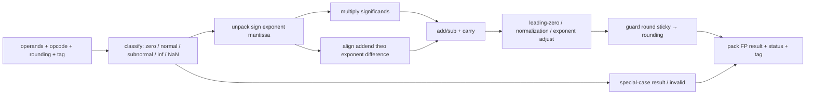
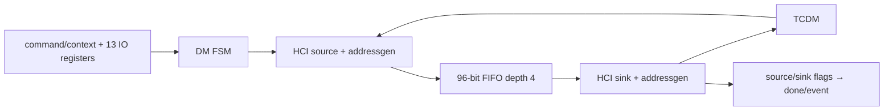

# M6 — FPU và HWPE: dispatch, datapath, arbitration và writeback

Ngày: 2026-09-13. Tiếp tục [plan microarchitecture](micro_00_plan_phan_tich_pulp.md).

## 1. Tách ba cơ chế có contract khác nhau

Một instruction FP của FC, một instruction FP của PE và một job HWPE không
cùng cách issue/completion. Phương pháp phân tích: **đi từ nơi sở hữu work
đến nơi nhận kết quả**, kiểm state/tag/dependency ở mỗi ranh giới; sau đó mới
đọc phép tính bên trong datapath.

| Đường | Producer / state chờ | Datapath đích | Consumer kết quả |
|---|---|---|---|
| FC FP | decode/EX + APU dispatcher | local FPNEW | RF writeback/fflags |
| PE FP | core APU dispatcher, shared interconnect | 4 FPNEW; div/sqrt chung 1 unit | response route về core, RF writeback |
| HWPE job | APB/TCDM peripheral command/context | datamover streamer → FIFO engine → streamer | TCDM output + job event |

[RTL:S1–S4] FC có Zfinx=1 trong integration hiện tại; cluster core không
override default Zfinx=0. Vì vậy dependency/write-address namespace của FP
khác nhau dù cùng dùng dispatcher. Không suy từ compiler flag rằng hai core
có cùng register file configuration.

## 2. APU dispatcher là scoreboard nhỏ, không phải reorder buffer

[S1] State chính gồm `addr_inflight/valid_inflight`,
`addr_waiting/valid_waiting` và latency class đã chốt. Khi có request mới
được nhận, request cũ chưa trả chuyển sang waiting; waiting là request cũ hơn.
Tối đa hai destination đang theo dõi, nhưng không có nghĩa mọi loại FP đều
được issue hai outstanding.

```text
full = valid_inflight && valid_waiting
active = valid_inflight || valid_waiting
type_stall = enable && active &&
             (lat_new==1 || (lat_new==2 && lat_saved==3) || lat_new==3)
req = enable && !(full || type_stall)
accepted = req && gnt
nack_stall = req && !gnt
stall = full || type_stall || nack_stall
```

Dùng biểu thức RTL này thay vì chỉ diễn giải comment “latency mới >= cũ”.
`lat_saved` cập nhật khi `valid_req`, không chỉ khi request được grant.
Full không bypass theo response cùng chu kỳ trong biểu thức `stall_full`;
đây là một chỗ có thể có bubble cần đo nếu cố duy trì hai pending liên tục.

| Khi response valid | Destination chọn [S1] |
|---|---|
| Có waiting | addr_waiting, cũ nhất |
| Không waiting, có inflight | addr_inflight |
| Không có pending, có request cùng chu kỳ | addr_req, đường return trực tiếp |

Dispatcher so sánh ba read source và hai write destination với request đang
issue và hai pending; loại dependency của entry đang trả kết quả cùng chu kỳ.
Đây là bookkeeping theo thứ tự trả phù hợp contract latency. Không có ROB để
tự sửa kết quả FP trả sai thứ tự. `apu_master_ready_o=1` nên response không
đợi một queue consumer ready tùy ý tại cổng này.

[SIM mới] Checks APU trong `tb_control.sv` kiểm nack, hai request latency class
2, full chặn request thứ ba, RAW dependency, destination rd5 rồi rd6, drain
và class 3 chặn class 2. **Class 2 là stimulus để kiểm dispatcher tổng quát;
không phải latency FP32 mặc định của checkout này.** Không có floating-point
arithmetic hoặc RF thật trong bench này.

## 3. Cấu hình latency phải lần từ constant tới decoder tới unit

[RTL:S2–S4] `riscv_defines.sv` đang đặt FP32=1, các format FP64/FP16/FP8 và
vector FP tắt; C_LAT_FP32=0, C_LAT_CONV=0, C_LAT_NONCOMP=0;
C_LAT_DIVSQRT=1. `C_LAT_*` là **số pipeline registers cấu hình cho FPNEW**,
không phải latency instruction đo từ IF đến commit.

Decoder ánh xạ C_LAT<2 thành class C_LAT+1, còn lại class 3; div/sqrt luôn
class 3. Do đó FP32 thông thường đang dùng class 1, không được phép mặc định
mô tả một FPU “pipeline ba chu kỳ”. Trong các nhánh NONCOMP/CONV, code còn tham
chiếu `C_LAT_FP32+1` khi tạo class: các constant hiện cùng bằng 0 nên khớp;
đổi độc lập constant cần audit lại decoder lẫn datapath.

FC EX local FPNEW và shared wrapper dùng features/implementation từ các
constant này. Shared wrapper gắn `flush_i=0`, `out_ready_i=1`; tag theo ID đi
kèm operands/flags qua unit. Với PipeRegs=0, có đường tính và valid tổ hợp,
không có lý do tự thêm một register cho mỗi wrapper. Timing vật lý có thể dài;
không suy Fmax hoặc throughput hệ thống từ “0 register”.

## 4. FPNEW FMA thực sự làm gì?

[S5] Đọc datapath thành các biến đổi nối tiếp, rồi đặt register theo cấu hình:



Opcode ADD/MUL/FMA điều chỉnh operands/sign trước datapath dùng chung; MUL
chọn addend zero thích hợp, ADD dùng multiplier operand tương ứng. Exponent
product cộng exponent hai operand và trừ bias, có điều chỉnh subnormal/zero;
exponent difference quyết định dịch addend và chọn exponent tạm.

Product significand và addend đã align đi vào phép cộng/trừ rộng; normalization
xác định vị trí bit đầu và hiệu chỉnh exponent. Rounding lấy discarded bits
để quyết định increment theo rounding mode; kết quả/status có nhánh xử lý
special case. FMA giữ thông tin trung gian rộng trước lần round cuối; không
mô hình như instruction multiply đã round rồi instruction add đã round.

Register valid/ready của pipeline phải đi cùng payload, tag, status và rounding
mode. Khi NumPipeRegs=0, các bước logic trên không đồng nghĩa nhiều stage clock.
Cần test số học riêng cho NaN/Inf/subnormal/overflow/underflow/rounding; các
check dispatcher hiện không xác nhận IEEE-754 numerical correctness.

## 5. Cluster shared FPU: arbitration và owner của response

[RTL:S6–S8] Cluster instantiate NB_CORES=8, NB_FPNEW=4, NB_APUS=1,
FPNEW_INTECO_TYPE="SINGLE_INTERCO", USE_FPNEW_OPT_ALLOC="TRUE";
nhánh div/sqrt dùng USE_FPU_OPT_ALLOC="FALSE". Có request demux theo type,
request arbitration mỗi unit, response block mỗi core và ID gắn request.

Với FPNEW, `optimal_alloc` sinh routing address từ request vector, sau đó
RequestBlock chọn request và forward operands/op/flags/ID tới unit. Response
rID dùng để tạo valid đúng core, không chọn destination bằng arbiter của
request hiện tại. Vì có allocation trước arbiter, không mô tả như mỗi PE
được gắn cố định một FPU riêng.

[SUY RA] Bốn unit đặt trần tài nguyên bốn accepted operations tại một thời
điểm có đủ readiness; một div/sqrt unit chia sẻ thì serialize các request
cùng loại. Throughput thực còn phụ thuộc allocator, grant, core dependency,
latency, writeback và mixed operations. Chưa có benchmark tám PE đồng thời
FP nên không gán con số FLOP/cycle đã đo.

### Div/sqrt có lifecycle riêng

[S9] Wrapper `fp_iter_divsqrt_msv_wrapper_2_STAGE` có IDLE → INIT_FPU → RUNNING.
IDLE grant theo Ready của iterative unit; INIT_FPU phát khởi động; RUNNING
không nhận request mới và đợi response đã đi qua hai thanh ghi output.
Operand/ID được giữ để result/flags trở về đúng requester. Kết thúc unit bên
trong và `apu_rvalid_o` không cùng mốc vì output pipeline.

Không lấy hậu tố `2_STAGE` làm tổng latency phép chia. Muốn có số chu kỳ phải
đo accepted request → inner Done → output valid, với từng opcode/operand và
tranh chấp của các PE khác.

## 6. Writeback nối ngược về pipeline

[S1,S3] Dispatcher xác định destination/dependency; EX giải quyết đường result
FP với các đường integer/load. Single-cycle FP và các class khác tham gia
logic chọn writeback/stall đã phân tích ở [M1](micro_01_fc_pipeline.md).
Result tới cổng APU không tự tương đương instruction đã retire: còn lựa chọn
RF write, hazard, exception/flush và update flags theo integration.

Với kernel FP cần ghi ít nhất: request/en, gnt, response valid, destination,
read_dep/write_dep, EX/WB ready và RF write enable. Đo `req&&!gnt` tách khỏi
`dependency stall`; cái đầu là resource contention, cái sau là ràng buộc chương
trình. Bật nhiều unit không tự làm biến mất chuỗi phụ thuộc cộng dồn.

## 7. HWPE hiện tại là datamover, engine không có MAC

[RTL:S10–S12] Với USE_RBE=0, HWPE subsystem instantiate `datamover_top`.
Bốn port × 32 tạo BW=128; `BW_ALIGNED=BW-32=96`. Stream engine chứa
`hwpe_stream_fifo` depth 4, width 96, truyền dữ liệu source→sink; không có
phép nhân/cộng trong `datamover_engine`. Nêu rõ điều này khi giải thích demo
HWPE để tránh gán khả năng compute cho một engine copy.



13 IO config registers gồm input/output base, total length, input d0 length /
stride, d1 length / stride, d2 stride; output d0 length / stride, d1 length /
stride, d2 stride. Address generators thực hiện bước địa chỉ theo chiều và
handshake; không dùng wall-clock để tự tăng dù memory đang stall.
Control slave trong top đặt N_CORES=8, N_CONTEXT=2, N_IO_REGS=13, N_GENERIC_REGS=8.
N_CONTEXT tại instance là literal 2, không phải mọi parameter top đều được
truyền xuống tự động.

| State | Điều kiện / tác động [S11] |
|---|---|
| DM_IDLE | slave_flags.start → STARTING |
| DM_STARTING | req_start source và sink; bước sang WORKING |
| DM_WORKING | đợi `(sink.done || sink.ready_start) && (source.done || source.ready_start) && tcdm_fifo_empty` |
| DM_FINISHED | slave_ctrl.done=1, sau đó về IDLE |
| reset / clear | về IDLE |

Streamer gộp source read và sink write lên HCI; alignment có thể làm traffic
TCDM khác payload stream. 96 bit = 12 byte payload/stream beat, **không phải
12 byte/cycle throughput đã đo**. Cả read input và write output đều tiêu thụ
băng thông, cộng arbitration và alignment overhead.
TCDM_FIFO_DEPTH=0 trong top làm empty của FIFO tùy chọn luôn đúng theo nhánh
bypass; các buffer/handshake còn lại vẫn cần đọc, không suy “không có outstanding”.

## 8. Completion không đồng nghĩa busy_o trở về 0

[S10] `hwpe_subsystem` nối `busy_o=1'b1` ở cả nhánh datamover và RBE. Cluster
OR tín hiệu này vào internal busy. Vì vậy khi HWPE_PRESENT=1, busy này không
phản ánh FSM idle/job done và cản điều kiện tự gate cluster. Dùng event/status
job để kiểm completion; xem [M7](micro_07_cdc_clock_reset.md) để phân tích gating.

M6 hoàn tất bước phân tích tĩnh tại các ranh giới và datapath chính; độ trễ
FP theo operand, tính đúng số học, eight-core arbitration và HWPE copy stress
vẫn cần các test tích hợp ghi trong [M8](micro_08_validation.md).

## Bản đồ bằng chứng RTL

Các mã S bên dưới trỏ vào checkout hiện tại; hash và trạng thái dependency nằm trong
[report kiểm chứng](../../../../report/microarchitecture_20260913_remaining/README.md).

| Mã | Source / điểm bắt đầu đọc | Nội dung cần đối chiếu |
|---|---|---|
| S1 | [riscv_apu_disp.sv](../../../../.bender/git/checkouts/cv32e40p-0a3884e05ea5a482/rtl/riscv_apu_disp.sv#L27) | pending entries, latency stall, dependencies |
| S2 | [riscv_defines.sv](../../../../.bender/git/checkouts/cv32e40p-0a3884e05ea5a482/rtl/include/riscv_defines.sv#L382) | format và số pipeline registers |
| S3 | [riscv_ex_stage.sv](../../../../.bender/git/checkouts/cv32e40p-0a3884e05ea5a482/rtl/riscv_ex_stage.sv#L40) | local FPNEW và writeback |
| S4 | [riscv_decoder.sv](../../../../.bender/git/checkouts/cv32e40p-0a3884e05ea5a482/rtl/riscv_decoder.sv#L1043) | latency class từ constants |
| S5 | [fpnew_fma.sv](../../../../.bender/git/checkouts/fpnew-3f06cec0e0e04d73/src/fpnew_fma.sv#L16) | classify, exponent, FMA, normalize, round |
| S6 | [shared_fpu_cluster.sv](../../../../.bender/git/checkouts/fpu_interco-f206baa74ecb3390/RTL/shared_fpu_cluster.sv#L45) | shared units, demux, single interconnect |
| S7 | [XBAR_FPU.sv](../../../../.bender/git/checkouts/fpu_interco-f206baa74ecb3390/RTL/XBAR_FPU.sv#L44) | allocation, request và response routing |
| S8 | [fpnew_wrapper.sv](../../../../.bender/git/checkouts/fpu_interco-f206baa74ecb3390/FP_WRAP/fpnew_wrapper.sv#L48) | features, implementation, tag/ready/flush |
| S9 | [fp_iter_divsqrt_msv_wrapper_2_STAGE.sv](../../../../.bender/git/checkouts/fpu_interco-f206baa74ecb3390/FP_WRAP/fp_iter_divsqrt_msv_wrapper_2_STAGE.sv#L98) | IDLE/INIT_FPU/RUNNING và output pipeline |
| S10 | [hwpe_subsystem.sv](../../../../.bender/git/checkouts/pulp_cluster-48721e3ce381c984/rtl/hwpe_subsystem.sv#L18) | BW override, datamover branch, busy constant |
| S11 | [datamover_top.sv](../../../../.bender/git/checkouts/hwpe-datamover-example-a9b2d6689c13b9f9/rtl/datamover_top.sv#L22) | FSM, control config và streamer |
| S12 | [datamover_engine.sv](../../../../.bender/git/checkouts/hwpe-datamover-example-a9b2d6689c13b9f9/rtl/datamover_engine.sv#L21) | stream FIFO datapath |
| S13 | [datamover_streamer.sv](../../../../.bender/git/checkouts/hwpe-datamover-example-a9b2d6689c13b9f9/rtl/datamover_streamer.sv#L22) | source/sink, HCI arbitration và buffers |
| S14 | [optimal_alloc.sv](../../../../.bender/git/checkouts/fpu_interco-f206baa74ecb3390/RTL/optimal_alloc.sv#L44) | routing request vector tới shared unit |
