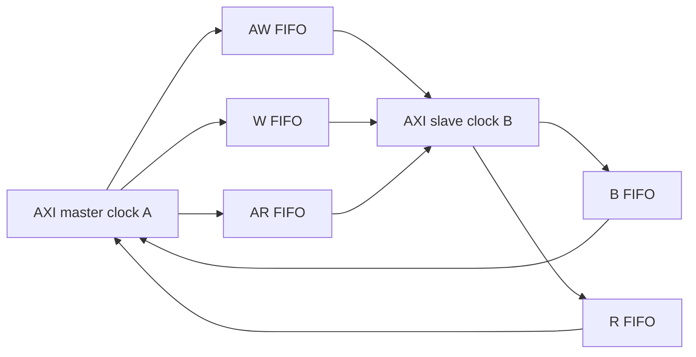

# M7 — CDC, clock gating, reset và safe domain

Ngày: 2026-09-13. Tiếp tục [plan microarchitecture](micro_00_plan_phan_tich_pulp.md).

## 1. Phương pháp: phân tích clock/reset như một protocol

Với mỗi state đã tìm ở M1–M6, bổ sung bốn cột: clock nào cập nhật, reset nào
xóa, ai vẫn chạy khi clock đó tắt, và reset có làm mất work đã nhận không.
Sau đó lần request lẫn response qua domain boundary. Tên `async` hoặc một
cặp synchronizer không đủ chứng minh protocol an toàn.

| Đường | State bên nguồn | State bên đích | Thứ thực sự qua clock boundary |
|---|---|---|---|
| AXI từng channel | storage + Gray write pointer | sync write ptr, read ptr, spill registers | payload array và Gray pointers |
| SoC→cluster event ID | event FIFO source | event FIFO destination + EU | ID cùng occupancy protocol |
| DMA event/IRQ pulse | pending level ở TX | sync + edge detector ở RX | level + acknowledge quay về |
| UART data | FIFO system/peripheral clock | FIFO clock còn lại | sample; không phải xung một clock |

Các kết luận static dưới đây dựa trên source S1–S10 và integration
[pulp.sv](../../../../rtl/pulp/pulp.sv),
[soc_domain.sv](../../../../rtl/pulp/soc_domain.sv),
[safe_domain.sv](../../../../rtl/pulp/safe_domain.sv).
Không nhận đây là CDC/RDC sign-off vật lý.

## 2. Gray FIFO: pointer đồng bộ, payload giữ tại source

[RTL:S1–S4] FIFO LOG_DEPTH=k có 2^k ô trong source domain. Binary pointer có
k+1 bit, chuyển sang Gray để truyền từng pointer; receiver dùng synchronizer
mỗi bit rồi đổi lại binary.

```text
write_accept = src_valid && src_ready
read_into_spill = internal_dst_valid && internal_dst_ready
src_ready = ((write_bin XOR synchronized_read_bin) != (1 << k))
internal_dst_valid = ((read_bin XOR synchronized_write_bin) != 0)
```

Storage chỉ thay khi write_accept; payload không đi qua synchronizer từng
bit. Nó ổn định trước khi pointer đã đồng bộ cho phép đọc. Read pointer tiến
khi **spill register nhận dữ liệu**, không nhất thiết khi consumer ngoài nhận.
Đầu ra có `spill_register_flushable` với hai ô A/B ở chế độ không bypass.

[SUY RA] Khi đầu nhận đứng lâu, FIFO 2^k ô cộng spill 2 ô có thể giữ tổng
2^k+2 payload đã được source chấp nhận nhưng consumer chưa lấy. Mức sẵn sàng
phục hồi trễ do read pointer quay về qua sync; source có thể thấy full dù
consumer vừa giải phóng ô. Đây là conservative backpressure, không phải mất ô.

Ví dụ lần theo một payload, giả sử write pointer mới tới trước cạnh D1:

| Mốc | Bên đích làm gì? |
|---|---|
| D1 | sync stage 1 nhận pointer |
| D2 | sync stage 2 nhận pointer; sau cạnh internal valid có thể lên |
| D3 | spill nhận payload, read pointer tiến; sau cạnh external valid có thể lên |
| D4 | consumer nhận nếu ready; thực tế phụ thuộc phase và downstream stall |

Đây là ví dụ pha clock lý tưởng của model RTL với hai FF sync. Không gán độ
trễ cố định “2 cycle CDC”: phải nêu cycle nguồn hay đích, phase, và extra buffer.
Mô phỏng số không mô hình metastability; phần physical constraints vẫn cần
đảm bảo skew/delay của Gray pointer và data như contract module mô tả.

### Một parameter dễ đọc nhầm

Trong wrapper `cdc_fifo_gray`, parameter SYNC_STAGES có khai báo, nhưng hai
instance src/dst **không truyền SYNC_STAGES xuống**. Half-module dùng default 2.
Các wrapper AXI instantiate halves với parameter riêng; phải đọc đúng instance.
Với cấu hình 2 hiện tại không tạo khác biệt; đổi wrapper lên 3 không tự chứng
minh synchronizer bên trong thành 3 FF.

[SIM mới] Test thực tế instantiate common-cells FIFO width 16, LOG_DEPTH=2,
clock nguồn 7 ns, đích 11 ns, reset POR, consumer ban đầu chặn rồi stall theo
pattern xác định. Kết quả: accept 6 khi consumer nhận 0; source ngừng phát thêm;
sau đó 64 phần tử về đúng thứ tự, không mất/lặp, max pending=6, 111 source
cycles valid nhưng chưa ready. Khoảng từ first accept tới first delivery 289 ns
**bao gồm cố ý chặn consumer**, không phải intrinsic CDC latency.

## 3. AXI CDC có năm queue độc lập

[S5–S6] AW, W, AR đi cùng hướng request; B và R đi ngược. Source/destination
halves chứa Gray FIFO cho từng channel. LOG_DEPTH=3 của integration cho tám
ô storage mỗi channel, cộng spill phía destination theo implementation.
Không quy đổi thành “bridge nhận tám transaction”: burst có nhiều W/R beat,
AW/W có thể tiến độc lập và ID/outstanding phía bridge khác còn giới hạn.



Nếu AW qua rồi W còn trong queue, reset nguồn không tự hủy write phía đích.
Nếu W/AR đã phục vụ, reset phần response có thể làm mất B/R mà producer còn
chờ. Đó là lý do audit reset phải đếm transaction ở cả hai chiều, không chỉ
kiểm FIFO empty một phía.

## 4. Event pulse và event ID là hai protocol khác nhau

[S7–S8] `edge_propagator_tx` giữ pending level:

```text
pending_next = valid_i || (pending && !ack_synchronized)
```

RX dùng synchronizer/edge detector, tạo pulse từ cạnh lên và trả level ack.
TX giữ level tới khi ack quay lại; không truyền trực tiếp một pulse ngắn qua
clock chậm. Tuy nhiên nhiều pulse tới khi pending còn 1 có thể gộp thành cùng
một level. Đây không phải FIFO đếm mọi event; producer/protocol phải chấp nhận
coalescing hoặc có queue trước nó.

Ngược lại, SoC→cluster event ID dùng Gray FIFO có payload ID. Destination FIFO
trong cluster chạy trên `clk_i` ungated và tạo `s_events_valid`; tín hiệu này
cũng tham gia wake clock gate. Khi phân tích wake, cần chỉ rõ event đó đến từ
pending FIFO hay edge propagator, không gọi chung là “interrupt CDC”.

## 5. Cluster gating: điều kiện đóng và đường mở lại

[RTL:S9–S10] `cluster_clock_gate` chạy trên clock chưa gate; có hai FF đồng bộ
event và shift register bốn bit `r_clockgate`:

```text
somebusy = cluster_int_busy || OR(cores_busy)
if !somebusy && !incoming_req && !synced_event:
    history_next = {history[2:0], cluster_cg_en}
else:
    history_next = {history[2:0], 0}
clock_enable = !AND(history)
```

Sau bốn cạnh đủ điều kiện idle/gating, cả bốn bit là 1 và clock_enable hạ.
Busy/incoming/event đưa 0 vào history, mở lại enable. Clock gating cell thật
có latch enable trong pha clock thấp, tránh tạo pulse tổ hợp từ enable thay
đổi ở pha cao. Đếm các cạnh clock ra, không chỉ đọc register enable.

[SIM mới] Bench clock gate với bốn core idle: ba mẫu đầu còn enable, mẫu thứ
tư đóng; ba chu kỳ sau không có cạnh clock ra; kích incoming request mở lại.
Nguồn incoming trong bench được drive rõ; test không dùng integration cluster.

### Các khác biệt integration phải giữ trong kết luận

- [RTL:S10 và M6] `s_cluster_int_busy` OR cả `s_hwpe_busy`. Khi HWPE_PRESENT=1,
  wrapper HWPE hiện nối busy=1 nên không đạt điều kiện gate tự động, dù job đã
  done. Runner full_system mặc định bật HWPE cluster; không kỳ vọng waveform
  cấu hình này giống bench idle gate.
- Trong `pulp_cluster.sv`, tìm `s_incoming_req` chỉ thấy declaration và kết nối
  vào clock gate, không thấy driver trong file. `s_isolate_cluster` chỉ được
  nhận từ gate, không thấy consumer. Đây là phát hiện tĩnh cần kiểm elaboration;
  không được khẳng định wake bởi incoming AXI đã được wiring đầy đủ.
- Gate gán `isolate_cluster_o = r_clockgate` (vector 4 bit sang output 1 bit),
  nhận bit thấp do truncation; không phải reduction AND dùng tạo clock_enable.
  Không lấy tín hiệu này làm bằng chứng có power isolation đúng trình tự.

Các điểm trên không sửa RTL trong lượt phân tích này. Test module chứng minh
logic module với input hợp lệ; integration thiếu driver hoặc busy hằng là
bài toán khác. Đặc biệt simulator hai trạng thái không thể thay cho kiểm X
của một tín hiệu chưa được drive.

## 6. Reset contract và reset khi còn giao dịch

[S1] Header Gray FIFO yêu cầu hai reset cùng assert bất đồng bộ; deassert
được đồng bộ về mỗi clock domain. Module không hỗ trợ warm reset độc lập;
muốn clear/warm reset phải dùng protocol/module phù hợp hoặc reset controller
sequencing các domain và gating đúng contract. Không phải chỉ thêm hai FF
vào reset là transaction tự an toàn.

| Tình huống | Kết luận tại mức protocol |
|---|---|
| POR toàn bộ endpoints/FIFOs | pointer/valid cùng về đầu; payload cũ không được coi valid |
| Reset một phía FIFO đang có data | pointer ownership bị phá; có thể mất/lặp/spurious transaction; không nằm trong contract |
| Reset core nhưng interconnect còn response | cần drain hoặc xác định rõ ai bỏ response và ai còn chờ |
| Gating khi queue có work | ngừng tiến triển nếu wake không còn chạy; phải giữ phần phát hiện wake ungated |
| Clear io_tx_fifo khi inflight>0 | data FIFO và counter inflight không reset đồng bộ; xem M4 |

Ví dụ AW đã accept ở B, W còn queued ở A: nếu chỉ reset A, trạng thái write
ở B không biến mất. Muốn nghiệm thu phải có scoreboard theo ID đếm accepted /
completed / explicitly aborted; một khoảng waveform không có X không đủ.

Safe domain trong [source](../../../../rtl/pulp/safe_domain.sv) có rstgen cho logic
ref-clock nhưng `rst_no` gán trực tiếp `s_rstn`, và `s_rstn=rst_ni`. Đừng suy
reset output đã được đồng bộ chỉ vì thấy instance rstgen trong file. Theo tiếp
rstgen ở SoC/cluster và đường bypass/test của từng domain. Bài
[safe domain](../architecture/deep_dive_01_platform_safe_domain.md) giữ bản đồ pad/clock nền.

## 7. Ranh giới kiểm chứng của M7

Đã phân tích state/handshake của FIFO/event/gate, phát hiện hai khác biệt
parameter/wiring và chạy FIFO hai clock cùng gate độc lập. Chưa chạy warm-reset
in-flight toàn AXI, clock-stop/resume với cluster thực, formal CDC/RDC hoặc STA.
Không chủ động đưa warm reset sai contract vào demo rồi nhận data loss là bug
của FIFO; trước hết phải chốt reset specification và cơ chế abort/drain.

Với source khác, vẽ **reset ownership** cạnh transaction ownership: một
register reset mất ID nào, trong khi khối đối diện còn nhớ ID đó không? Đây là
cách đi sâu hơn sơ đồ “domain A nối CDC sang domain B”.

## Bản đồ bằng chứng RTL

Các mã S bên dưới trỏ vào checkout hiện tại; hash và trạng thái dependency nằm trong
[report kiểm chứng](../../../../report/microarchitecture_20260913_remaining/README.md).

| Mã | Source / điểm bắt đầu đọc | Nội dung cần đối chiếu |
|---|---|---|
| S1 | [cdc_fifo_gray.sv](../../../../.bender/git/checkouts/common_cells-f18d75f6d6d026a5/src/cdc_fifo_gray.sv#L102) | storage, pointers, reset contract và wrapper parameter |
| S2 | [sync.sv](../../../../.bender/git/checkouts/common_cells-f18d75f6d6d026a5/src/sync.sv#L13) | synchronizer stages |
| S3 | [spill_register.sv](../../../../.bender/git/checkouts/common_cells-f18d75f6d6d026a5/src/spill_register.sv#L17) | output buffer wrapper |
| S4 | [spill_register_flushable.sv](../../../../.bender/git/checkouts/common_cells-f18d75f6d6d026a5/src/spill_register_flushable.sv#L17) | hai entry A/B và ready |
| S5 | [axi_cdc_src.sv](../../../../.bender/git/checkouts/axi-d42e23417b564294/src/axi_cdc_src.sv#L23) | năm channel CDC, source half |
| S6 | [axi_cdc_dst.sv](../../../../.bender/git/checkouts/axi-d42e23417b564294/src/axi_cdc_dst.sv#L23) | năm channel CDC, destination half |
| S7 | [edge_propagator_tx.sv](../../../../.bender/git/checkouts/common_cells-f18d75f6d6d026a5/src/edge_propagator_tx.sv#L13) | pending level và synchronized ack |
| S8 | [edge_propagator_rx.sv](../../../../.bender/git/checkouts/common_cells-f18d75f6d6d026a5/src/edge_propagator_rx.sv#L13) | sync wedge và edge pulse |
| S9 | [cluster_clock_gate.sv](../../../../.bender/git/checkouts/pulp_cluster-48721e3ce381c984/rtl/cluster_clock_gate.sv#L19) | history, event sync, incoming và isolate |
| S10 | [pulp_cluster.sv](../../../../.bender/git/checkouts/pulp_cluster-48721e3ce381c984/rtl/pulp_cluster.sv#L548) | busy aggregation; xem thêm event CDC và gate cuối file |
| S11 | [tc_clk.sv](../../../../.bender/git/checkouts/tech_cells_generic-6a4b27e0e56cbcda/src/rtl/tc_clk.sv#L31) | latch clock enable |
| S12 | [rstgen_bypass.sv](../../../../.bender/git/checkouts/common_cells-f18d75f6d6d026a5/src/rstgen_bypass.sv#L12) | reset sync và test bypass |
