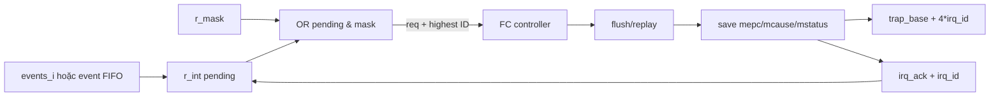

# Microarchitecture 09 — FC control plane, trap/debug/sleep và hardware loop

Phân tích bổ sung L3 ngày 2026-09-19. Bài này đóng phần còn thiếu của
[FC pipeline](micro_01_fc_pipeline.md): không lặp lại datapath integer/LSU mà
lần các chuyển trạng thái làm thay đổi luồng lệnh. Kết luận là **[RTL]** hoặc
**[SUY RA]**; chưa được coi là số chu kỳ đã đo nếu không có nhãn **[SIM]**.

## 1. Instance hiệu lực và biên lỗi thực tế

`fc_subsystem` chọn `riscv_core` (RI5CY/CV32E40P cũ trong checkout) vì
`CORE_TYPE_FC=0`; nhánh Ibex không hoạt động. Instance đặt `PULP_SECURE=1`,
`PULP_CLUSTER=0`, bật FPU/Zfinx theo top và nối IRQ với
`apb_interrupt_cntrl`.

Một khác biệt quan trọng giữa hai generate branch:

- RI5CY nhận `instr_req/gnt/rvalid` và `data_req/gnt/rvalid`, **không có cổng
  bus-error** từ `core_instr_err/core_data_err`.
- Nhánh Ibex không hoạt động mới nối `instr_err_i` và `data_err_i`.
- RI5CY vẫn có fault nội bộ do PMP. Với `PULP_SECURE=1`, 16 PMP entry mặc định
  được instantiate; request bị từ chối tạo `instr_err_pmp/data_err_pmp` đi vào
  controller.

Do đó “access fault do PMP” có đường trap, nhưng không được suy rằng lỗi trả về
từ interconnect cũng được core đang dùng tiêu thụ. Đây là ranh giới L3 cần ghi
rõ khi thiết kế test âm ở L4.

Nguồn chính:
[fc_subsystem.sv](../../../../.bender/git/checkouts/pulp_soc-c519334bd3ac5582/rtl/fc/fc_subsystem.sv),
[riscv_core.sv](../../../../.bender/git/checkouts/cv32e40p-0a3884e05ea5a482/rtl/riscv_core.sv),
[riscv_pmp.sv](../../../../.bender/git/checkouts/cv32e40p-0a3884e05ea5a482/rtl/riscv_pmp.sv).

## 2. Controller FSM và thứ tự ưu tiên

Controller có các nhóm state sau:

| Nhóm | State | Vai trò |
|---|---|---|
| Khởi động/ngủ | `RESET`, `BOOT_SET`, `FIRST_FETCH`, `WAIT_SLEEP`, `SLEEP` | chờ fetch-enable, nạp boot PC, dừng fetch và thức dậy |
| Chạy | `DECODE` | decode, hazard, branch/jump và chọn sự kiện điều khiển |
| Trap/return | `FLUSH_EX`, `FLUSH_WB`, `IRQ_FLUSH`, `IRQ_FLUSH_ELW`, `IRQ_TAKEN_ID`, `IRQ_TAKEN_IF`, `XRET_JUMP` | làm rỗng pipeline, lưu PC/cause, chuyển vector, restore PC |
| Load-event | `ELW_EXE` | giữ/replay `elw` quanh grant và IRQ/debug |
| Debug | `DBG_FLUSH`, `DBG_WAIT_BRANCH`, `DBG_TAKEN_ID`, `DBG_TAKEN_IF` | chọn DPC chính xác rồi vào debug ROM |

Trong `DECODE`, thứ tự `if/else` ở cấp ngoài là:

1. branch ở EX đã taken;
2. data fault do PMP;
3. instruction fetch fault do PMP;
4. nếu instruction hợp lệ: IRQ đủ điều kiện, rồi debug request, rồi decode
   exception/control (`illegal`, jump, `ebreak`, pipe flush/WFI, `ecall`,
   `fence.i`, xRET, CSR, ELW).

Đây là priority implementation, không chỉ là danh sách tính năng. Ví dụ một
branch đã quyết định ở EX thắng việc nhận IRQ trong chính lượt xét đó; IRQ sẽ
được controller xem lại sau redirect. Khi IRQ được chọn trong `DECODE`, IF/ID
bị halt, hardware-loop write bị mask và controller vào `IRQ_FLUSH`, chờ phần
cũ hơn không còn gây side effect rồi mới ack.

Nguồn:
[riscv_controller.sv](../../../../.bender/git/checkouts/cv32e40p-0a3884e05ea5a482/rtl/riscv_controller.sv).

## 3. Interrupt: event → pending/mask → trap vector → ack



### 3.1 Pending, mask, ID và FIFO

`apb_interrupt_cntrl` cung cấp các register:

| Offset | Register | Ý nghĩa |
|---:|---|---|
| `0x00/04/08` | `MASK`, `MASK_SET`, `MASK_CLEAR` | thay/set/clear enable mask |
| `0x0c/10/14` | `INT`, `INT_SET`, `INT_CLEAR` | thay/set/clear pending |
| `0x18/1c/20` | `ACK`, `ACK_SET`, `ACK_CLEAR` | lịch sử ack do core hoặc software điều khiển |
| `0x24` | `FIFO` | event ID gần nhất đã pop khỏi FIFO |

Event FIFO sâu 4, data 8 bit, được đưa vào pending bit 26. FIFO chỉ pop khi
core ack IRQ 26 hoặc software thực hiện thao tác clear tương ứng. IRQ request là
`|(r_int & r_mask)`. Vòng `for i=0..31` tiếp tục overwrite ID khi gặp bit mới,
nên **ID lớn nhất trong các pending bit đã enable thắng**.

`ACK` là dấu vết core đã nhận interrupt, không phải bằng chứng peripheral đã
hoàn tất hay software ISR đã xử lý xong nguồn. Với từng bit pending, nhánh
`core_irq_ack` đứng trước nhánh nhận event; vì vậy nếu ack và một pulse event
mới cùng bit xuất hiện cùng chu kỳ, next-state clear bit đó. Đây là hành vi tĩnh
thấy trực tiếp trong RTL và là một corner case cần stress-test ở L4.

### 3.2 Nhận IRQ trong core

IRQ chỉ được phục vụ khi enable nội bộ hợp lệ và core không ở debug; debug
request đồng thời được dùng để chặn nhánh IRQ. `IRQ_FLUSH` xử lý hai trường hợp:

- IRQ vẫn còn: vào `IRQ_TAKEN_ID`, lưu PC ở ID, cause và ack.
- IRQ đã biến mất: set replay-valid rồi quay lại `DECODE`, tránh làm mất lệnh
  đã bị speculative flush.

Nếu IRQ đến lúc `FIRST_FETCH/SLEEP`, controller vào `IRQ_TAKEN_IF` và lưu PC
theo IF. IF tạo địa chỉ vector:

```text
exception synchronous = {trap_base_addr, 8'h00}
interrupt vector       = {trap_base_addr, 1'b0, irq_id[4:0], 2'b00}
```

Tức vector IRQ là base + `4*irq_id`. CSR logic chọn exception PC từ IF/ID/EX,
lưu `mepc`, `mcause`, đẩy `MIE` sang `MPIE` rồi hạ `MIE`. `mret` restore
interrupt-enable và IF chọn `mepc` làm PC mới.

Nguồn:
[apb_interrupt_cntrl.sv](../../../../.bender/git/checkouts/apb_interrupt_cntrl-dd2e5ce27b208df0/apb_interrupt_cntrl.sv),
[riscv_if_stage.sv](../../../../.bender/git/checkouts/cv32e40p-0a3884e05ea5a482/rtl/riscv_if_stage.sv),
[riscv_cs_registers.sv](../../../../.bender/git/checkouts/cv32e40p-0a3884e05ea5a482/rtl/riscv_cs_registers.sv).

## 4. Exception, CSR và return

| Nguồn | PC được lưu | Cause/đích |
|---|---|---|
| illegal/ecall/ebreak thường | ID | synchronous exception base |
| PMP data fault | EX | load/store fault; qua `FLUSH_WB` |
| PMP fetch fault | IF | instruction fault; qua `FLUSH_WB` |
| IRQ khi đang chạy | ID | vectored IRQ |
| IRQ trước instruction đầu/sau sleep | IF | vectored IRQ |
| debug halt/ebreak/step | ID hoặc IF theo state | `DM_HaltAddress`, lưu `dpc/dcsr` |

CSR save-cause có priority riêng so với software CSR write. Khi save trap,
`mstatus/mepc/mcause` được cập nhật theo privilege; khi debug-save, PC đi vào
`dpc` và debug cause vào `dcsr`. `mret/uret/dret` trước hết đi qua flush để
không bỏ side effect cũ, sau đó `XRET_JUMP` mới chọn `mepc/uepc/dpc`.

Có một bất đối xứng tĩnh đáng chú ý: lúc nhận PMP data fault, `csr_cause_o`
chọn store-fault khi `data_we_ex_i=1`, nhưng assignment `exc_cause_o` sau đó ở
`FLUSH_WB` dùng ternary load/store ngược lại. Với synchronous exception hiện
tại, IF luôn nhảy về base và không dùng `exc_cause_o` để vector; `mcause` đã
được lưu từ `csr_cause_o`. Vì vậy chưa kết luận đây là lỗi kiến trúc, nhưng test
L4 phải đọc `mcause` cho cả PMP load/store thay vì chỉ nhìn handler PC.

Giới hạn cần giữ: bảng trên mô tả fault mà active core thật sự nhìn thấy. Lỗi
`r_opc` từ fabric được tạo ở wrapper nhưng không nối vào RI5CY branch, nên test
địa chỉ unmapped không được kỳ vọng tự động đi theo cùng PMP trap path.

## 5. Debug và single-step

Debug request khi đang decode vào `DBG_FLUSH`; nếu request đến trước lệnh đầu
thì vào `DBG_TAKEN_IF`. Controller chọn điểm lưu DPC theo nguyên nhân:

- halt request hoặc forced-debug `ebreak` ở ID: lưu PC lệnh hiện tại;
- single-step sau lệnh thường: lưu PC của lệnh kế ở IF;
- branch trong single-step: `DBG_WAIT_BRANCH` chờ biết branch target rồi mới
  flush, tránh lưu fall-through PC sai;
- `ebreak` không được DCSR cấu hình để vào debug vẫn là breakpoint exception.

`dret` restore privilege/debug state rồi IF lấy `dpc`. Phân tích này đóng đường
control và ownership PC; tính đúng giao thức JTAG Debug Module end-to-end đã
được mô tả ở bài boot/debug và vẫn cần waveform riêng nếu muốn L4.

## 6. WFI và ELW

### WFI/sleep

Decoder đưa WFI thành `pipe_flush`. Luồng là:

```text
DECODE -> FLUSH_EX -> FLUSH_WB -> WAIT_SLEEP -> SLEEP
```

`WAIT_SLEEP/SLEEP` hạ request instruction, halt IF/ID và hạ `ctrl_busy`.
`SLEEP` thức khi có IRQ, debug request, đang debug hoặc single-step, rồi về
`FIRST_FETCH`. Ở cấp core, clock enable của FC là
`irq_i | debug_req_i | core_busy_o`, do đó IRQ/debug là đường wake cho clock
nội bộ. Riêng `apb_interrupt_cntrl` hiện buộc `core_clock_en_o=1` và
`fetch_en_o=1`; chân clock-enable wrapper không thay đổi kết luận về gate nội
bộ nêu trên.

### Event load (`elw`)

ELW không được xử lý như load thường. `ELW_EXE` giữ IF/ID trong lúc lệnh đang
ở EX; khi EX/ID sẵn sàng nó đi qua `IRQ_FLUSH_ELW`. Nếu IRQ vẫn hợp lệ, trap
lưu PC ID; nếu IRQ rút, controller quay về decode. Comment RTL xác định mục
tiêu là replay ELW khi interrupt chen đúng lúc grant. Vì vậy completion ELW,
IRQ ack và instruction retirement là ba mốc khác nhau.

## 7. Hardware loop: state, priority và tương tác redirect

Cấu hình mặc định có hai bộ register loop. Mỗi bộ giữ `start`, `end`, `counter`,
reset về 0. Counter write từ instruction có priority hơn decrement. Decrement
chỉ commit khi `valid_i` và one-hot `hwlp_dec_cnt`; assertion kiểm không giảm
hơn một counter cùng lượt hợp lệ.

Controller so `current_pc` với từng `end`:

| Counter | Có jump khi PC=end? | Lý do |
|---:|---|---|
| `> 2` | có | còn ít nhất một vòng sau lần đang nhìn thấy |
| `2` | có nếu chưa có decrement cùng loop trong ID | tránh double-decrement vì loop instruction đang in-flight |
| `1` hoặc `0` | không | kết thúc loop |

Vòng scan bắt đầu từ slot 0 và `break` khi match, nên slot 0 thắng nếu hai end
address trùng nhau. Target/start và bit decrement đi vào IF; prefetch nhận
`hwloop_i/hwloop_target_i`, còn bit decrement được pipeline cùng instruction
qua IF/ID rồi hồi tiếp để chống decrement hai lần. Khi controller chuẩn bị
nhận IRQ, `hwloop_mask` chặn update register loop.

Như vậy L3 đã đóng được ownership state, điều kiện jump/decrement và priority.
Các tổ hợp compressed instruction ở halfword cao, response fetch cũ sau
redirect, nested loop cùng end, IRQ đúng biên loop vẫn thuộc L4 vì cần trace
theo cạnh clock để xác nhận không skip/duplicate instruction.

Nguồn:
[riscv_hwloop_controller.sv](../../../../.bender/git/checkouts/cv32e40p-0a3884e05ea5a482/rtl/riscv_hwloop_controller.sv),
[riscv_hwloop_regs.sv](../../../../.bender/git/checkouts/cv32e40p-0a3884e05ea5a482/rtl/riscv_hwloop_regs.sv).

## 8. Kết luận L3 và phép thử chuyển sang L4

Phần FC control plane đã đủ L3 cho cấu hình hiệu lực: biết state giữ thông tin,
priority, điểm acceptance/completion, nguồn PC redirect và đường ack. Không còn
coi IRQ/debug/WFI/ELW/hardware-loop là hộp đen trong mô hình pipeline.

Các phép thử chưa thực hiện, được chuyển rõ sang L4:

1. IRQ đồng thời branch, PMP fault, debug request và event mới cùng bit ack.
2. WFI rồi wake bằng IRQ/debug, kiểm fetch đầu tiên và clock gate.
3. ELW với grant/IRQ ở các cạnh lân cận, kiểm replay đúng một lần.
4. Hardware loop 16/32-bit, nested/same-end, stall và IRQ ở end PC.
5. Trap với PMP so với lỗi interconnect/unmapped để xác nhận khác biệt đường lỗi.

Revision nguồn đã đọc: `cv32e40p 8d58109ab61e`, `pulp_soc d878151e0e40`,
`apb_interrupt_cntrl 86d650f590a3`.
