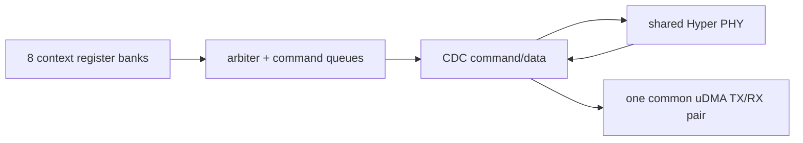

# Microarchitecture 10 — uDMA topology và các peripheral ngoài UART

Phân tích bổ sung L3 ngày 2026-09-19. Bài
[M4](micro_04_soc_udma_event.md) đã đi sâu credit, address generator, UART và
event path; bài này đóng phần topology/peripheral còn lại trong cấu hình hiệu
lực: SPI, I2C, SDIO, I2S, camera, filter và HyperBus.

Các mô tả FSM/handshake là **[RTL]**. Chưa có traffic pad-level cho từng
peripheral nên timing, protocol compliance và dữ liệu thực vẫn là L4.

## 1. Cấu hình được elaborate

Top `pulp.sv` đặt `N_UART=1`, `N_SPI=1`, `N_I2C=2`. `udma_subsystem` bổ sung
các hằng nội bộ sau:

| Khối | Số instance/context | Trạng thái |
|---|---:|---|
| UART | 1 | active; đã phân tích ở M4 |
| SPI master | 1 | active |
| I2C | 2 | active |
| SDIO | 1 | active |
| I2S | 1 | active |
| Camera | 1 | active |
| Filter | 1 | active, là stream accelerator nội bộ |
| HyperBus | 1 PHY, 8 context | active |
| CSI2, JTAG-uDMA, MRAM, FPGA | 0 | không elaborate |
| External training peripheral | 0 | `PULP_TRAINING` không được define trong compile thường |

Kết quả tham số là 16 RX linear slots, 18 TX linear slots và 17 logical
peripheral-select slots. Các số này là kích thước array, không đồng nghĩa mọi
slot là một pad peripheral độc lập.

Nguồn:
[pulp.sv](../../../../rtl/pulp/pulp.sv),
[udma_subsystem.sv](../../../../.bender/git/checkouts/pulp_soc-c519334bd3ac5582/rtl/udma_subsystem/udma_subsystem.sv).

## 2. Hai lớp đánh số: APB select khác peripheral ID

`udma_core` chèn một endpoint điều khiển chung ở APB select 0. Endpoint này giữ
clock-gate/reset/event-compare; các peripheral từ `udma_subsystem` được nối vào
slice `[N_REAL_PERIPHS-1:1]`. `PADDR[11:7]` chọn slot 128 byte, còn
`PADDR[6:2]` là word register bên trong slot.

| APB select từ software | Logical ID trong subsystem | Khối |
|---:|---:|---|
| 0 | — | uDMA common control |
| 1 | 0 | UART |
| 2 | 1 | SPI master |
| 3–4 | 2–3 | I2C0–1 |
| 5 | 4 | SDIO |
| 6 | 5 | I2S |
| 7 | 6 | Camera |
| 8 | 7 | Filter |
| 9–16 | 8–15 | Hyper context 0–7 register banks |
| 17 | 16 | Hyper common register bank |

`udma_apb_if` chỉ assert `periph_valid` và lấy `ready/data` khi select nằm
trong `0..17`. Nếu software truy cập select ngoài khoảng, `PREADY` giữ 0 và
`PSLVERR` vẫn 0; giao dịch APB sẽ chờ vô hạn thay vì nhận error response. Đây
là behavior RTL, cần đưa vào rule kiểm tra địa chỉ software.

Nguồn:
[udma_core.sv](../../../../.bender/git/checkouts/udma_core-25b62500cd51a5c6/rtl/core/udma_core.sv),
[udma_apb_if.sv](../../../../.bender/git/checkouts/udma_core-25b62500cd51a5c6/rtl/common/udma_apb_if.sv).

## 3. Data-channel map và completion chung

Các slot data thật sự được wrapper nối như sau:

| Khối | TX linear ID | RX linear ID | Event group 4 bit |
|---|---|---|---|
| UART | 0 | 0 | RX done, TX done, 0, 0 |
| SPI | data 1, command 2 | 1 | RX done, TX done, CMD done, EOT |
| I2C0/1 | data 3–4, command 5–6 | 2–3 | RX done, TX done, CMD done, EOT |
| SDIO | 7 | 4 | RX done, TX done, EOT, error |
| I2S | 8 | 5 | RX done, TX done, 0, 0 |
| Camera | — | 6 | RX done, 0, 0, 0 |
| Filter | 2 external-read channels | 1 external-write channel | EOT, activity, 0, 0 |
| Hyper | common TX 10 | common RX 7 | RX done, TX done, read EOT, write EOT |

TX slot 9 là vị trí tên `CH_ID_TX_CAM` nhưng camera không có TX; các slot TX
11–17 và RX 8–15 không được nối thành tám data port Hyper riêng trong wrapper.
Chúng xuất hiện trong kích thước array do `N_CH_HYPER=8`, còn tám context Hyper
được cấu hình qua APB và arbitrate vào **một** TX/RX uDMA common channel. Không
dùng các con số 18/16 để suy throughput 18 TX + 16 RX đồng thời.

Mỗi linear address generator giữ start address, byte count, enable/pending và
phát event khi buffer hoàn tất. Event “channel done” vì vậy là mốc uDMA đã
tiêu thụ/sản xuất buffer; EOT của protocol engine có thể đến ở mốc khác.
Phần event group chỉ được gán cho logical peripheral cơ sở; software phải dùng
event map hiệu lực, không lấy APB select nhân bốn một cách máy móc cho các
context Hyper.

## 4. SPI master: command/data tách rời

SPI dùng ba luồng độc lập:

```text
L2 --CMD channel--> command FIFO/control FSM
L2 --TX channel ---> TX FIFO --CDC--> serializer/pads
pads --deserializer--> RX FIFO --CDC--> RX channel --> L2
```

Command FSM giải mã word 32 bit và đi qua các state `IDLE`, `WAIT_DONE`,
`WAIT_CHECK`, `WAIT_EVENT`, `DO_REPEAT`, `WAIT_CYCLE`, `CLEAR_CS`. Command có
thể cấu hình clock/word size/lanes, phát TX/RX/duplex transfer, chờ event hoặc
cycle, lặp và điều khiển chip-select. EOT protocol có lựa chọn giữ hay nhả CS;
nó khác `CMD done`, vốn chỉ nói descriptor command buffer đã được uDMA đọc hết.

TX/RX engine có state riêng cho serialize/receive. Dữ liệu đi qua FIFO giữa
system clock và peripheral clock, vì vậy `TX channel done` không có nghĩa bit
cuối đã ra pad. Backpressure ở serializer truyền ngược qua FIFO `ready`, rồi
về uDMA TX credit; RX đầy truyền ngược để ngăn overwrite.

Nguồn:
[udma_spim_ctrl.sv](../../../../.bender/git/checkouts/udma_qspi-ad1b15dd0651b0f6/rtl/udma_spim_ctrl.sv),
[udma_spim_txrx.sv](../../../../.bender/git/checkouts/udma_qspi-ad1b15dd0651b0f6/rtl/udma_spim_txrx.sv).

## 5. I2C: command sequencer và open-drain bus

Mỗi I2C instance cũng có command, TX và RX channel. Command sequencer có các
state chờ command/event, read, write, write-byte, store/get data, repeat và
config. Bus controller triển khai các phase START/STOP/READ/WRITE/WAIT; SCL và
SDA output data luôn 0, output-enable quyết định kéo đường bus xuống thấp, đúng
mô hình open-drain.

Bus logic đồng bộ/lọc SCL/SDA, nhận biết clock stretching khi master thả SCL
nhưng input vẫn thấp, và có kiểm tra arbitration khi SDA quan sát khác giá trị
master muốn phát. Command `EOT` tạo event protocol riêng; RX/TX/CMD done vẫn là
completion của ba buffer uDMA.

Đường đầy đủ cần phân biệt:

```text
command accepted -> bus phase được phát -> ACK/NACK/read data
-> protocol EOT -> RX/TX/CMD buffer done -> event fabric
```

Các mốc có thể trùng trong case ngắn nhưng không tương đương về ngữ nghĩa.

Nguồn:
[udma_i2c_control.sv](../../../../.bender/git/checkouts/udma_i2c-86169ce0b4173d19/rtl/udma_i2c_control.sv),
[udma_i2c_bus_ctrl.sv](../../../../.bender/git/checkouts/udma_i2c-86169ce0b4173d19/rtl/udma_i2c_bus_ctrl.sv).

## 6. SDIO: command/data completion và CRC

SDIO có một TX, một RX và register interface điều khiển command. Command FSM
tạo/nhận command frame và CRC7; data FSM xử lý data block cùng CRC16. Wrapper
`sdio_txrx` có ba mode điều phối command-only, command+data và multi-block.

Ở data mode, EOT tổng chỉ được phát sau khi completion command và data đã được
latch; ở command-only, EOT command được chuyển trực tiếp. Top dùng
`edge_propagator` đưa EOT từ peripheral clock sang system clock. Status register
latch `eot/error`, và event group là:

```text
bit0 RX buffer done
bit1 TX buffer done
bit2 SDIO transaction EOT
bit3 SDIO error
```

Vì vậy software không nên dùng TX buffer-done thay cho “thẻ đã chấp nhận toàn
bộ transaction”. Error/EOT status còn có quy tắc clear trong register interface
và phải được test cùng interrupt masking ở L4.

Nguồn:
[sdio_txrx.sv](../../../../.bender/git/checkouts/udma_sdio-eb03ff2eeab7e6c0/rtl/sdio_txrx.sv),
[sdio_txrx_cmd.sv](../../../../.bender/git/checkouts/udma_sdio-eb03ff2eeab7e6c0/rtl/sdio_txrx_cmd.sv),
[sdio_txrx_data.sv](../../../../.bender/git/checkouts/udma_sdio-eb03ff2eeab7e6c0/rtl/sdio_txrx_data.sv).

## 7. I2S và camera

I2S có RX/TX linear channel, serial clock/word-select path và tùy chọn PDM/CIC
trong IP. Tại integration hiện tại, nhóm pad `slave_*` được nối; các output
`master_*` để hở và master WS input bị buộc 0. Vì vậy việc IP có logic master
không chứng minh board/top hiện dùng được mode đó. Event chỉ gồm RX/TX done.

Camera là RX-only. Interface lấy `cam_clk/data/hsync/vsync`, đóng gói data sang
uDMA; top đặt `DATA_WIDTH=8`, nối 16 bit thấp của output và buộc 16 bit cao của
word uDMA về 0. Event duy nhất là RX buffer done. Frame/line boundary trong
camera engine và buffer completion là các mốc riêng; không thể dùng event done
để suy trực tiếp một frame đã được capture nếu descriptor không khớp frame.

Nguồn:
[udma_i2s_top.sv](../../../../.bender/git/checkouts/udma_i2s-4c2d946afbfb2209/rtl/udma_i2s_top.sv),
[camera_if.sv](../../../../.bender/git/checkouts/udma_camera-86b8118519db0f98/rtl/camera_if.sv).

## 8. Filter: stream accelerator nằm trong uDMA

Filter không có pad protocol. Nó dùng hai external TX source để đọc operand từ
L2, một external RX sink để ghi kết quả, và một stream input. Register/control
FSM chuyển `IDLE -> SAMPLE -> BUSY`; data-fetch/data-out có state IDLE/RUNNING.
Datapath có arithmetic unit và binary counter để phối hợp cửa sổ/mẫu.

Backpressure phải được lần ở cả ba phía: thiếu một input giữ phép tính; output
không ready giữ kết quả; arbitration L2 giữ source request. Event `activity`
báo tiến triển theo control, còn `EOT` báo job; không thay chúng bằng event
done của một linear peripheral channel vì filter dùng external/stream channel.

Nguồn:
[udma_filter.sv](../../../../.bender/git/checkouts/udma_filter-a40516c05ed4bf59/rtl/udma_filter.sv),
[udma_filter_reg_if.sv](../../../../.bender/git/checkouts/udma_filter-a40516c05ed4bf59/rtl/udma_filter_reg_if.sv).

## 9. HyperBus: tám context, một datapath/PHY dùng chung

Hyper dùng 9 APB selects: tám context transaction và một common block. Từng
context tạo command record; arbiter chọn context, command/data qua CDC FIFO tới
PHY. Control transaction có các phase idle/setup/register write/read/write/end;
PHY có state command-address, latency wait, data read/write và end/error.



`evt_eot_hyper_o[7:0]` giữ ownership completion theo context. Subsystem OR các
EOT context rồi phân loại read/write bằng state hướng transfer được cập nhật từ
RX/TX channel events. Vì có hai lớp completion — buffer uDMA và PHY/context EOT
— software phải chờ event phù hợp với yêu cầu đồng bộ của nó.

Nguồn:
[udma_hyper_top.sv](../../../../.bender/git/checkouts/udma_hyper-0e2eefc5c5ed37ee/udma-hyperbus/src/udma_hyper_top.sv),
[udma_hyperbus_mulid.sv](../../../../.bender/git/checkouts/udma_hyper-0e2eefc5c5ed37ee/udma-hyperbus/src/udma_hyperbus_mulid.sv),
[hyperbus_phy.sv](../../../../.bender/git/checkouts/udma_hyper-0e2eefc5c5ed37ee/udma-hyperbus/src/hyperbus_phy.sv).

## 10. Kết luận L3 và checklist L4

L3 uDMA đã có inventory instance, APB/data/event map, FSM chủ đạo,
backpressure và semantic completion cho mọi peripheral active. Những phần sau
không còn là thiếu phân tích module, mà là kiểm chứng cycle/protocol ở L4:

1. SPI TX/RX/duplex với CS retain, command wait/repeat và FIFO stall.
2. I2C ACK/NACK, clock stretching, arbitration loss và hai instance đồng thời.
3. SDIO command-only/data/multi-block, CRC error, EOT/error clear.
4. I2S slave traffic và xác nhận mode master bị bỏ nối không được software dùng.
5. Camera frame/line boundary với RX backpressure và descriptor không khớp frame.
6. Filter hai input lệch nhịp, output stall và event activity/EOT.
7. Hyper tám context tranh chấp, CDC/reset, read/write EOT classification.
8. APB select ngoài range và các slot data array không được wrapper dùng: lint,
   X-propagation và bus-timeout test.

Revision nguồn đã đọc: `pulp_soc d878151e0e40`, `udma_core 7af2db5ea8ce`,
`udma_qspi ddbe8a2e530a`, `udma_i2c 7b84fdb22b9c`,
`udma_sdio e768162ef48a`, `udma_i2s f63cb528dbff`,
`udma_camera cfcd80416ef1`, `udma_filter a11e2057e7b2`,
`udma_hyper 83ab704f9d1c`.
