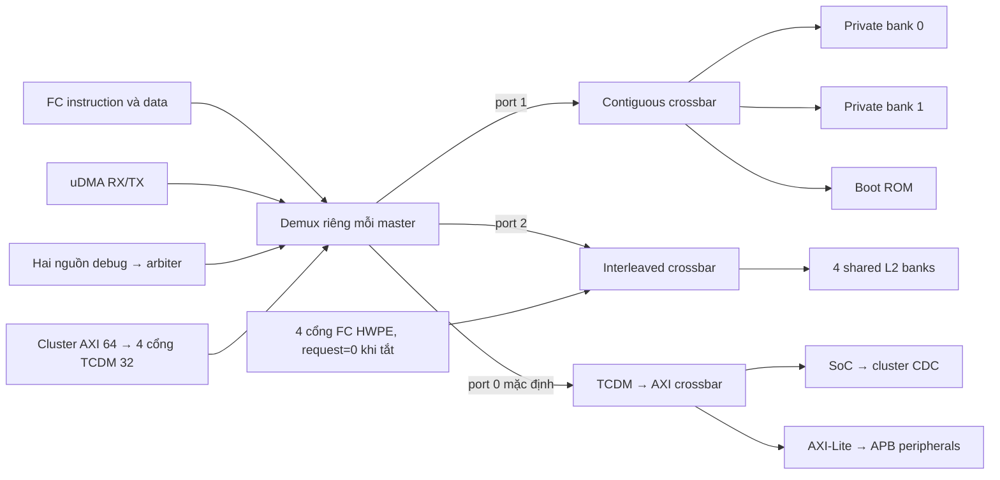

# SoC RTL 01 — FC truy cập ROM và L2 từ request tới response

Bài áp dụng [phương pháp phân tích theo giao dịch](soc_00_phuong_phap_phan_tich_rtl.md).
Phạm vi: core FC loại 0 trong RTL Questa, không chạy simulator mới. Các kết luận
logic là **[RTL]**; bảng chu kỳ là **[SUY RA]** với giả định được ghi rõ.

## 1. Dựng topology từ port binding

Mở [pulp_soc.sv](../../../../.bender/git/checkouts/pulp_soc-c519334bd3ac5582/rtl/pulp_soc/pulp_soc.sv#L759),
lấy tên net tại FC rồi tìm chính net đó ở instance interconnect. Kết quả:



Từ [soc_interconnect_wrap](../../../../.bender/git/checkouts/pulp_soc-c519334bd3ac5582/rtl/pulp_soc/soc_interconnect_wrap.sv#L153):

| Master index | Net/input | Vai trò |
|---:|---|---|
| 0 | `tcdm_fc_data_addr_remapped` | FC load/store sau remap |
| 1 | `tcdm_fc_instr` | FC instruction, không qua remap data |
| 2 | `tcdm_udma_tx` | uDMA đọc nguồn TX |
| 3 | `tcdm_udma_rx` | uDMA ghi đích RX |
| 4 | `tcdm_debug` | PULP TAP hoặc debug module sau arbiter |
| 5–8 | `axi_bridge_2_interconnect[0..3]` | chuyển AXI cluster 64 bit sang TCDM 32 bit |

Có 9 master tổng quát. Interleaved xbar còn nhận 4 cổng FC HWPE, tổng 13 input
trong cấu trúc tham số; FC HWPE tắt khiến request các cổng này bằng 0. Không
nhầm 4 cổng của bridge AXI với bốn DMA engine; đó là số cổng chuyển đổi bus.

Clock của FC, interconnect, L2, ROM đều là `s_soc_clk`, reset `s_soc_rstn`.
Ngoại vi APB cũng dùng clock SoC; uDMA và cluster có thêm miền clock khác. Reset
đến lệnh ROM đầu được trình bày riêng ở [bài boot](../architecture/deep_dive_04_boot_debug_testbench.md).

## 2. Contract của cổng FC: đọc assignment thay vì comment

Trong [fc_subsystem](../../../../.bender/git/checkouts/pulp_soc-c519334bd3ac5582/rtl/fc/fc_subsystem.sv#L85):

| Tín hiệu | Cơ chế |
|---|---|
| `l2_data_master.req/add` | lấy trực tiếp từ `core_data_req/addr` |
| `l2_data_master.wen` | `~core_data_we`: **0 là write, 1 là read** |
| `be[3:0]` | byte-enable, mỗi bit cho một lane 8 bit |
| `gnt` | consumer chấp nhận request tại cạnh clock |
| `r_valid` | response load hoặc write completion |
| `r_rdata`, `r_opc` | data và cờ lỗi bus, có ý nghĩa theo response |
| instruction port | `wen=1`, `be=1111`, `wdata=0` |

Với data transaction từ LSU đang xét, khi `req=1` chưa có grant, upstream giữ
request/payload ổn định. `tcdm_demux` chưa buffer address/data, bridge AXI cũng có thể đã
nhận riêng AW hoặc W; đổi payload trước grant làm mất tính nhất quán giao dịch.
Sau grant, request có thể chuyển sang giao dịch kế tiếp; response không có
`ready` để FC tùy ý giữ lại nên consumer phải tiếp nhận khi `r_valid` xuất hiện.
Riêng instruction prefetch của core này có thể đổi target khi redirect trong
WAIT_GNT, trước acceptance. Không áp giả định giữ payload trên cho mọi tình
huống instruction port; xem [phân tích IF/redirect](../microarchitecture/micro_01_fc_pipeline.md#7-redirectflush-và-giới-hạn-của-contract-trước-grant).

Lưu ý trong `xbar.sv` có comment polarity khác contract này. `WriteRespOn=1`
làm valid được tạo cho cả read/write; payload `wen` được chuyển nguyên qua pack
và SRAM dùng `we_i=~wen`. Vì thế assignment tại endpoint quyết định hành vi thực.

## 3. Decode gồm hai cấp và một remap riêng

### 3.1. Remap FC data

```systemverilog
if (tcdm_fc_data.add[31:20] == 12'h000)
    tcdm_fc_data_addr_remapped.add[31:20] = 12'h1c0;
```

`0x00010014 → 0x1C010014`. Logic wrapper thực hiện trực tiếp; không kiểm tra
macro `FC_ALIAS` trong đoạn này. Không áp dụng remap đó cho instruction, debug
hay uDMA chỉ vì chúng cũng đi vào interconnect.

### 3.2. Demux theo vùng

[soc_interconnect_wrap:rules](../../../../.bender/git/checkouts/pulp_soc-c519334bd3ac5582/rtl/pulp_soc/soc_interconnect_wrap.sv#L94)
cấp rule cho [tcdm_demux](../../../../.bender/git/checkouts/pulp_soc-c519334bd3ac5582/rtl/pulp_soc/tcdm_demux.sv).
`addr_decode` trong common_cells so `start <= address < end`; no match chọn
index 0 do `en_default_idx_i=1`.

| Địa chỉ | Demux output | Decode tiếp |
|---|---:|---|
| `0x1C000000 ≤ A < 0x1C010000` | 1 | contiguous chọn private 0/1 |
| `0x1A000000 ≤ A < 0x1A040000` | 1 | contiguous chọn ROM |
| `0x1C010000 ≤ A < 0x1C090000` | 2 | interleaved chọn bank bằng bit địa chỉ |
| còn lại | 0 | bridge AXI rồi AXI xbar chọn cluster/APB hoặc decode error |

Contiguous output 0 là private 0, 1 là private 1, 2 là ROM, output bổ sung là
error slave. Các range hiện khớp rule demux; error slave này không đồng nghĩa
mọi địa chỉ sai từ FC đều đi qua nó.

### 3.3. Từ bank tới SRAM row

Trong [interleaved_crossbar](../../../../.bender/git/checkouts/pulp_soc-c519334bd3ac5582/rtl/pulp_soc/interleaved_crossbar.sv),
`PORT_SEL_WIDTH=clog2(4)=2`, selector là `add[3:2]`. Crossbar **chuyển cả địa chỉ
32 bit**, không tự cắt bit bank ra khỏi address payload.
[l2_ram_multi_bank](../../../../.bender/git/checkouts/pulp_soc-c519334bd3ac5582/rtl/pulp_soc/l2_ram_multi_bank.sv)
trừ base và cắt bit khi đưa vào SRAM:

```text
shared:  offset=A-0x1C010000; bank=(offset>>2)&3; row=offset>>4
private: offset=A-base_private; row=offset>>2
ROM:     word=((A-0x1A000000)>>2)&0x7FF
```

| Địa chỉ ví dụ | Đích | Word/row |
|---|---|---:|
| `0x1A000080` | ROM | 32 |
| `0x1C008080` | private 1 | 32 |
| `0x1C010000` | shared bank 0 | 0 |
| `0x1C010004` | shared bank 1 | 0 |
| `0x1C010014` | shared bank 1 | 1 |
| `0x1C010024` | shared bank 1 | 2 |
| `0x1C010018` | shared bank 2 | 1 |
| `0x1C08FFFC` | shared bank 3 | 32767 |
| `0x1C090000` | ngoài shared L2 | đi AXI default, không phải row 32768 |

ROM có address width 13 byte, tức 8 KiB thực, trong cửa sổ 256 KiB. **[SUY RA]**
địa chỉ ROM cách nhau `0x2000` có cùng index vật lý do cắt address; cửa sổ decode
không phải bằng chứng ROM lớn 256 KiB. ROM không có write enable: write có thể
được handshake/response mà không thay nội dung; không dùng “write không lỗi”
để suy memory writable.

## 4. FSM demux: nhớ nhánh response, không giữ toàn payload

Chỉ có state `IDLE/PENDING` và `active_slave_q`:

| State + điều kiện | Request/grant | Response | State sau cạnh |
|---|---|---|---|
| IDLE, không req | không phát | không valid | IDLE |
| IDLE, req nhưng không grant | phát tới `port_sel`; FC gnt=0 | không valid | IDLE |
| IDLE, req được grant | FC gnt=1, nhớ `port_sel` | chưa trả response mới | PENDING |
| PENDING, response chưa tới | chặn request mới | chờ `active_slave_q` | PENDING |
| PENDING, response tới, không req mới | không phát | data/opc từ nhánh đã nhớ | IDLE |
| PENDING, response tới, req mới được grant | phát theo `port_sel` hiện tại | vẫn trả response nhánh cũ | PENDING, nhớ nhánh mới |
| PENDING, response tới, req mới chưa grant | FC gnt=0 | response cũ vẫn valid | IDLE |

`active_slave_d` có thể được cập nhật cả khi request chưa grant, nhưng nó chỉ
được dùng để trả response khi state PENDING. Không diễn giải “register đổi”
thành “transaction đã được nhận”. Bằng chứng acceptance là grant tại cạnh.

## 5. Crossbar: arbitration và response tracking

Hai wrapper pack request `{wen,be,address,wdata}` thành **69 bit**, pack response
`{r_rdata,r_opc}` thành **33 bit**, rồi dùng
[xbar](../../../../.bender/git/checkouts/cluster_interconnect-abcda71a83f4333c/rtl/tcdm_interconnect/xbar.sv).
Cách pack này tái sử dụng xbar tổng quát; field tên `wdata` trong xbar mang cả
address/control, không chỉ data cần ghi SRAM.

Mỗi output bank có một `rr_arb_tree`. Nhánh mặc định ở đây:
`ExtPrio=0`, `FairArb=1`, `LockIn=0`, `AxiVldRdy=0`. Do ExtPrio=0, việc nối
`rr_i='0` **không làm arbiter thành fixed priority**. `rr_q` cập nhật khi
`gnt_i && req_o`, không quay tự do mỗi clock như một cách đọc comment có thể gợi ý.
Nếu output không grant, chưa có acceptance; với LockIn=0, không suy lựa chọn
arbiter đã khóa bất biến trước handshake khi tập request thay đổi.

Cùng bank: một input được grant tại một cạnh. Khác bank: các arbiter độc lập
có thể grant song song. Không từ đó kết luận mọi chương trình đạt 4 word/clock:
master, demux, core và các bridge còn giới hạn request.

**Chi tiết quan trọng ở response:**
[addr_dec_resp_mux](../../../../.bender/git/checkouts/cluster_interconnect-abcda71a83f4333c/rtl/tcdm_interconnect/addr_dec_resp_mux.sv)
được cấu hình `RespLat=1`, `WriteRespOn=1`:

```text
vld_d = gnt_o & (~wen_i | WriteRespOn) = gnt_o
bank_sel_d = add_i
rdata_o = rdata_i[bank_sel_q]
vld_o = vld_q
```

Selector được register mỗi cạnh, nhưng chỉ có ý nghĩa transaction khi valid.
Wrapper không dùng `slave_ports_r_valid` để sinh valid quay về master; nó **giả
định memory có latency cố định**. SRAM data/ROM data một chu kỳ khớp giả định này.
Đối chiếu ở [tc_sram](../../../../.bender/git/checkouts/tech_cells_generic-6a4b27e0e56cbcda/src/rtl/tc_sram.sv#L58)
với `Latency=1`, và [generic_rom](../../../../.bender/git/checkouts/tech_cells_generic-6a4b27e0e56cbcda/src/deprecated/generic_rom.sv#L35)
latch address rồi chọn `MEM[A_Q]`.
Nếu thay memory bằng IP response nhiều chu kỳ mà chỉ giữ nguyên tên cổng, hệ
thống có thể trả valid quá sớm. Cần sửa cả contract crossbar/response tracking.

## 6. Ba giao dịch được lần hoàn chỉnh

### A. Instruction đầu từ ROM

`core_instr_req → l2_instr_master → s_lint_fc_instr_bus → master[1] → demux[1]
port 1 → contiguous output 2 → boot_rom_i → generic_rom`.

Word `0x4EC0006F` tại ROM index 32 là `jal x0,+0x4EC`, đích `0x1A00056C`.
Word lấy từ [boot_code.cde](../../../../sim/boot/boot_code.cde#L33), qua
[boot_rom.sv](../../../../.bender/git/checkouts/pulp_soc-c519334bd3ac5582/rtl/pulp_soc/boot_rom.sv).
Response qua bank selector của xbar rồi active slave của demux trở lại IF.
Để chứng minh thực thi cần instruction valid/decode/trace, không chỉ bus read.

### B. Instruction ứng dụng từ private 1

Sau JTAG halt, ghi DPC và nạp image, resume khiến fetch tại `0x1C008080`.
Cùng instruction master nhưng contiguous chọn output 1, SRAM row 32.
Nội dung word phải lấy từ **ELF/stimuli của lượt chạy**, không lấy word ROM hay
hardcode instruction ứng dụng. Grant/response mechanism giống ROM vì cùng
contract fixed latency, nhưng producer dữ liệu là SRAM đã được loader ghi.

### C. FC ghi rồi đọc shared bank 1

Ví dụ store full word `0x11223344` ở `0x1C010014`: `wen=0`, `be=1111`, bank 1,
row 1. `tc_sram.we_i=~wen=1`, các lane được ghi ở cạnh nhận request. Write cũng
có response do `WriteRespOn=1`; data trả ở response write không dùng làm kết quả.
Load tiếp theo với `wen=1` phải trả word đã ghi nếu không có master khác sửa nó.

**[SUY RA, byte write]** Nếu word cũ `0xAAAAAAAA`, `wdata=0x11223344`, `be=0101`,
thì lane 0 và 2 được cập nhật, readback là `0xAA22AA44`. Đây là ví dụ memory
byte-enable; không tự chuyển kết luận sang peripheral APB vì APB strobe đang
không được nối ở wrapper (bài timer).

### Bảng chu kỳ không stall

Giả định request ổn định, demux IDLE, không có cạnh tranh, SRAM latency 1.
C0 là khoảng trước cạnh E1; C1 là khoảng E1→E2.

| Khoảng | Master/demux | Crossbar/memory | Cạnh cuối |
|---|---|---|---|
| C0 | request A, grant=1 | chọn đích A, memory req=1 | E1 nhận A; latch active slave, bank selector, memory address/data |
| C1 | PENDING, `r_valid(A)=1`; có thể request B | data A; có thể grant B | E2 FC nhận A, memory nhận B nếu grant |
| C2 | trả B nếu B được nhận E2 | data B | E3 FC nhận B |

Nếu C0 bank grant cho DMA thay vì FC, FC gnt=0, demux ở IDLE; đếm latency FC
bắt đầu từ **cạnh grant FC thực tế**, không từ cạnh DMA được grant. Không thêm
một chu kỳ cho mỗi wrapper chỉ vì đi qua nhiều tên module: nhiều chặng là
combinational trong cùng chu kỳ.

## 7. Lỗi và giới hạn của bảo đảm

| Trường hợp | RTL phản ứng | Điều chưa được phép suy |
|---|---|---|
| ngoài tất cả vùng AXI, ví dụ `0x20000000` | demux default → AXI decode error, bridge lấy RESP[1] làm r_opc | FC loại 0 nhất định trap |
| lỗi contiguous nội bộ | error slave `0xBADACCE5`, r_opc=1 | mọi FC invalid address dùng slave này |
| FC HWPE-only port ra ngoài shared L2 | error checker riêng | có master này đang hoạt động khi USE_HWPE=0 |
| địa chỉ APB thuộc cửa sổ lớn nhưng không có peripheral | APB node không grant completion | mọi invalid access đều trả lỗi hữu hạn |

[FC subsystem](../../../../.bender/git/checkouts/pulp_soc-c519334bd3ac5582/rtl/fc/fc_subsystem.sv)
tạo `core_instr_err/core_data_err`, nhưng **nhánh core loại 0 không nối chúng
vào `riscv_core`**; nhánh Ibex có `.instr_err_i/.data_err_i`. Do đó bus báo lỗi
chưa chứng minh core loại 0 nhận access-fault exception. Đây là quan sát wiring,
không phải kết quả tiêm lỗi mới.
Core FC vẫn instantiate PMP nội bộ (PULP_SECURE=1, USE_PMP=1), có đường tạo
fetch/data fault riêng khi kiểm quyền; không suy việc thiếu bus-error wiring
thành core không có cơ chế access-fault nào. Xem [cấu hình FC](../microarchitecture/micro_01_fc_pipeline.md).

## 8. Cách kiểm chứng và áp dụng lại phương pháp

- Thu cả master req/gnt/addr/wen/be, state demux/active slave, arbiter grant,
  SRAM row/we, response mux valid/data; mỗi tên giải quyết một câu hỏi ở trên.
- Test same-bank/different-bank bằng vùng cấp phát riêng, cùng lượng việc;
  đối chiếu data trước khi đo stall. Giữ clock và warm-up như nhau.
- Thử back-to-back đổi từ shared sang private để kiểm tra response thuộc
  **request cũ**, không theo address mới.
- Thử partial write trên SRAM, invalid address và timeout APB trong test có
  watchdog. Không ghi vào code/stack đang chạy.

**Bài học tái sử dụng:** bắt đầu từ address cụ thể, tính selector, đọc arbiter,
tìm register nhớ đích response và xác định ai tạo valid. Chỉ khi hoàn thành cả
vòng request/response mới viết kết luận về latency, correctness hoặc error.
