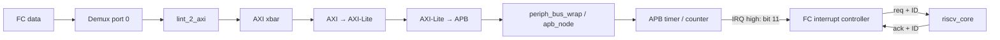

# SoC RTL 02 — Từ FC store qua APB tới timer interrupt

Áp dụng [phương pháp phân tích theo giao dịch](soc_00_phuong_phap_phan_tich_rtl.md).
Đây là phân tích tĩnh cấu hình FC loại 0/Questa; chưa chạy simulator mới.
Ta chọn hai câu hỏi: **store START_HI hoàn tất bằng đường nào?** và **timer
compare trở thành một lần vào handler như thế nào?** Hai câu hỏi nối với nhau
qua timer register, nhưng completion của store không đồng nghĩa interrupt đã xảy ra.

## 1. Chốt implementation và lập đường đi

[compile.tcl](../../../../sim/compile.tcl#L1170) chọn
[timer_unit/rtl/apb_timer_unit.sv](../../../../.bender/git/checkouts/timer_unit-7ee4cd321dafe5e2/rtl/apb_timer_unit.sv).
File cùng tên trong `pulp_soc/rtl/components` không phải bản được compile ở đây.
Bản được chọn có gating input event bằng `IEM_BIT`; không lấy logic từ bản kia
để giải thích event-start, reference clock hoặc mode 64 bit.



Net response đi ngược từng bridge. Timer, các bridge và interrupt controller
dùng clock SoC; `ref_clk_i` là input tạo tick sau đồng bộ, không biến bus APB
thành bus chạy trực tiếp theo clock chậm.

## 2. Theo một store cụ thể qua bridge TCDM → AXI

**[SW]** Trong [phase 2](../../../../sw/full_system/full_system.c#L42),
`timer_base_fc(0,1)` trả `0x1A10B004`; helper START_LO cộng `0x18`, nên địa chỉ
thực là **`0x1A10B01C` = START_HI**. Khi compiler phát aligned word store,
FC data port có `req=1`, `wen=0`, `be=1111`.

Địa chỉ này không thuộc L2/ROM nên demux chọn default port 0. Trong
[lint_2_axi_wrap](../../../../.bender/git/checkouts/pulp_soc-c519334bd3ac5582/rtl/pulp_soc/lint_2_axi_wrap.sv),
`data_we_i=~wen` khôi phục active-high write. Wrapper chọn
`REGISTERED_GRANT="FALSE"` cho
[lint_2_axi](../../../../.bender/git/checkouts/l2_tcdm_hybrid_interco-f03a86a7ac111e77/RTL/lint_2_axi.sv).

| State/điều kiện | Hành vi | Chuyển state |
|---|---|---|
| IDLE, write, AWREADY và WREADY | phát AWVALID/WVALID; grant FC | WRITE_WAIT |
| IDLE, chỉ AW được nhận | address đã đi; chưa grant FC | WRITE_DATA |
| IDLE, chỉ W được nhận | data đã đi; chưa grant FC | WRITE_ADDR |
| WRITE_DATA | giữ WVALID tới WREADY; khi đó grant FC | WRITE_WAIT |
| WRITE_ADDR | giữ AWVALID tới AWREADY; khi đó grant FC | WRITE_WAIT |
| WRITE_WAIT | BREADY=1; BVALID tạo `data_r_valid_o` | IDLE sau response |
| IDLE, read | ARVALID; ARREADY tạo grant FC | READ_WAIT |
| READ_WAIT | RVALID tạo RREADY và `data_r_valid_o` | IDLE sau response |

AW và W là hai handshake độc lập; nhận một trong hai **chưa đủ grant request
TCDM**. Bridge dùng address/data upstream còn sống, không buffer toàn bộ payload
riêng cho trường hợp nhận một nửa. Vì vậy producer phải giữ request tới grant.

Transaction là single beat: LEN=0, SIZE=`010` (4 byte), WLAST=1, ID=0;
WSTRB lấy từ byte-enable, AW_ATOP được wrapper buộc 0. Khi response về,
`data_r_opc_o=BRESP[1]` hoặc `RRESP[1]`. Đây là bus completion, không phải
chứng minh lệnh đã retire trong pipeline FC.

**Cách đọc:** tìm `CS/NS`, rồi lập bảng cho đủ bốn tổ hợp ready của AW/W.
Chỉ nhìn nhánh cả hai ready sẽ bỏ sót yêu cầu giữ payload và hai state trung gian.

## 3. AXI → AXI-Lite → APB: nơi giao dịch thực sự ghi timer

[soc_interconnect_wrap](../../../../.bender/git/checkouts/pulp_soc-c519334bd3ac5582/rtl/pulp_soc/soc_interconnect_wrap.sv)
đặt AXI-to-Lite tối đa một read/một write, `FALL_THROUGH=1`; APB bridge có
một output tới toàn bộ peripheral subsystem, `PipelineRequest=0`,
`PipelineResponse=0`. Trong
[axi_lite_to_apb](../../../../.bender/git/checkouts/axi-d42e23417b564294/src/axi_lite_to_apb.sv),
các nhánh parameter bằng 0 vẫn có **fall-through register**. Không suy chúng
thành “không có storage” hay “mọi tín hiệu đi combinational vô điều kiện”.

Read request và write request được arbiter hai input chọn; write chỉ valid
khi cả AWVALID và WVALID có mặt. FSM APB:

| State | Điều kiện/hành vi | Kết quả |
|---|---|---|
| Setup, chưa có request hoặc response buffer chưa sẵn sàng | PSEL=0 | chờ |
| Setup, request hợp lệ, decode hit, cả hai response buffer ready | PSEL=1, PENABLE=0 | vào Access |
| Access, PREADY=0 | PSEL=1, PENABLE=1, giữ address/write/data | tiếp tục Access |
| Access, PREADY=1 | chấp nhận APB; tạo R/B response | quay Setup |
| Setup, decode miss ở bridge | không phát APB | tạo DECERR |

`PSLVERR=1` được đổi thành SLVERR, ngược lại OKAY. Wrapper không nối `pstrb_o`
vào APB bus đang dùng; vì vậy bài này dùng MMIO 32 bit và không suy semantics
partial write SRAM sang timer register.

**[SUY RA]** Một transfer APB thành công có ít nhất pha Setup và Access riêng
nhau. Tổng FC req→response còn phụ thuộc bridge/buffer/arbitration; không gán
hai chu kỳ APB thành hai chu kỳ cho toàn đường FC.

## 4. Hai cấp decode APB và ba kiểu địa chỉ không hợp lệ

[periph_bus_wrap](../../../../.bender/git/checkouts/pulp_soc-c519334bd3ac5582/rtl/pulp_soc/periph_bus_wrap.sv)
nối APB output timer vào port 7. Map ở
[periph_bus_defines.sv](../../../../rtl/includes/periph_bus_defines.sv#L44):

| Vùng, end inclusive | Đích |
|---|---|
| `0x1A109000–0x1A10AFFF` | FC interrupt controller/EU |
| `0x1A10B000–0x1A10BFFF` | timer |
| `0x1A10C000–0x1A10CFFF` | FC HWPE |

[apb_node](../../../../.bender/git/checkouts/apb_node-38396597780c7975/src/apb_node.sv)
so `start <= address <= end`, khác `addr_decode` dùng end exclusive ở memory.
Node không có FSM; defaults `PREADY=0`, `PSLVERR=0`, chỉ mux response khi có
slave được chọn.

| Ví dụ | Kết quả từ source |
|---|---|
| `0x20000000`, ngoài các vùng AXI | AXI decode error trả response lỗi |
| `0x1A107000`, trong cửa sổ peripheral lớn nhưng không có APB slave | không PSEL nào active, PREADY=0; access chờ không thời hạn nếu không có cơ chế ngoài giải cứu |
| offset không có register trong timer, ví dụ `0x1A10B028` | timer vẫn ready; read 0, write không đổi register, PSLVERR=0 |

Khi FC HWPE tắt, wrapper còn buộc APB HWPE `pready=0`: một vùng **có decode**
cũng có thể không hoàn tất. Những quan sát này chưa phải kết quả tiêm lỗi.
Ở FC core loại 0, bus error không được nối vào core như nhánh Ibex; xem
[bài memory](soc_01_fc_memory_rtl.md#7-lỗi-và-giới-hạn-của-bảo-đảm).

## 5. Timer register: lần từ address tới next-state

**[RTL]** Timer decode `PADDR[5:0]`; cửa sổ 4 KiB lặp register mỗi 64 byte.
Write xảy ra khi `PSEL && PENABLE && PWRITE`; read khi cùng hai tín hiệu chọn
và `!PWRITE`. `PREADY=PSEL & PENABLE`, `PSLVERR=0`.

| Register | Offset low | Offset high | Ý nghĩa |
|---|---:|---:|---|
| CFG | 0x00 | 0x04 | mode, enable, IRQ |
| COUNT | 0x08 | 0x0C | read/write giá trị counter |
| COMPARE | 0x10 | 0x14 | ngưỡng comparator |
| START | 0x18 | 0x1C | write tạo start, đặt enable |
| RESET | 0x20 | 0x24 | write tạo reset counter |

CFG: enable bit 0, reset bit 1, IRQ-enable bit 2, input-event-enable bit 3,
compare-clear bit 4, one-shot bit 5, prescaler-enable bit 6, ref-clock-enable
bit 7, divider bits 15:8; mode 64 bit được điều khiển ở low configuration.
Bài chu kỳ bên dưới chọn hai counter 32 bit, prescaler/ref clock tắt.

Sau APB case, logic event/start có thể ghi đè `ENABLE_BIT`; sau đó logic reset
xóa bit reset khi đã tạo yêu cầu reset. Đây là thứ tự priority trong một khối
combinational, không phải nhiều lần ghi register ở nhiều chu kỳ.

[timer_unit_counter](../../../../.bender/git/checkouts/timer_unit-7ee4cd321dafe5e2/rtl/timer_unit_counter.sv)
có mô hình:

```text
next_count = reset ? 0 : write ? write_value : tick_enable ? count+1 : count
tại cạnh: count <= next_count
          target_reached <= (next_count == compare)
```

Với mode 32 bit, `irq_hi = target_reached_hi & CFG_HI.IRQ_EN`, tương tự low.
IRQ không được AND trực tiếp với counter enable. Nếu counter đang giữ bằng
compare, comparator có thể tiếp tục active; không dùng việc “stop timer” hay
“ack IRQ” làm bằng chứng nguồn IRQ đã được gỡ. Trong mode one-shot, enable
được xóa từ target đã đăng ký, cần lần cả tick tại cạnh xóa enable trước khi
kết luận count cuối. Bài này không suy công thức period cho mọi mode 64 bit,
prescaler và event-start từ ví dụ không prescaler.

### Mô hình thời điểm từ compare tới pending

Giả định CMP_HI=N>0, counter đang N−1, tick=1, IRQ-enable=1, FC mask bit 11=1;
pending cũ bằng 0, không có APB clear/core ack đồng thời.

| Khoảng/cạnh | Counter và IRQ | Interrupt controller |
|---|---|---|
| C0, trước E1 | next_count=N; target cũ=0 | chưa thấy nguồn IRQ |
| E1 → C1 | count=N, target=1 nên IRQ high=1 | tính next pending[11]=1 |
| E2 → C2 | counter có thể đã tiến tiếp | pending[11]=1, req=1, ID=11 nếu không có ID lớn hơn được mở |
| cạnh core nhận IRQ sau đó | phụ thuộc state pipeline/interrupt-enable/debug | IRQ_TAKEN phát ack+ID; ITC xóa pending tương ứng |

Đây là **[SUY RA]**, không phải latency đo. Nếu nguồn vẫn high sau cạnh ack,
chu kỳ sau controller có thể set pending lại.

## 6. Interrupt controller: pending, mask, priority và ack

[soc_peripherals](../../../../.bender/git/checkouts/pulp_soc-c519334bd3ac5582/rtl/pulp_soc/soc_peripherals.sv)
nối IRQ timer low/high vào `fc_events_o[10]/[11]`; FC chuyển sang
[apb_interrupt_cntrl](../../../../.bender/git/checkouts/apb_interrupt_cntrl-dd2e5ce27b208df0/apb_interrupt_cntrl.sv).
Đây là **direct IRQ**, không qua event generator/FIFO.

Runtime dùng FC ITC base `0x1A109800`. RTL decode `paddr[5:2]`:

| Register | Offset | Thao tác cần hiểu |
|---|---:|---|
| MASK / MASK_SET / MASK_CLEAR | 0x00 / 0x04 / 0x08 | **1 là cho phép IRQ** |
| INT / INT_SET / INT_CLEAR | 0x0C / 0x10 / 0x14 | pending sticky và software update |
| ACK / ACK_SET / ACK_CLEAR | 0x18 / 0x1C / 0x20 | lịch sử đã acknowledge |
| FIFO | 0x24 | mã event được latch ở lần pop gần nhất |

`core_irq_req_o=|(r_int & r_mask)`. Cả mask, pending, ack reset về 0.
Vòng `for i=0..31` ghi đè `core_irq_id_o` ở mỗi bit active nên **ID lớn nhất
có priority cao nhất**, không phải ID thấp nhất.

Priority cập nhật mỗi pending bit:

1. Core ack đúng ID: xóa bit, thắng cả nguồn event và APB write cùng chu kỳ.
2. Nếu APB write INT: thay bằng bit trong PWDATA.
3. INT_SET: `(old_pending | event) | PWDATA`.
4. INT_CLEAR: `(old_pending | event) & ~PWDATA`.
5. Các trường hợp còn lại: event set sticky pending; không có event thì giữ.

`r_ack` là trạng thái riêng, core ack đặt bit ACK. Xóa ACK không có nghĩa xóa
nguồn timer. `core_clock_en_o` và `fetch_en_o` của controller được buộc 1;
cơ chế sleep của core phải đọc trong core, không suy từ tên interrupt controller.

Trong [riscv_controller](../../../../.bender/git/checkouts/cv32e40p-0a3884e05ea5a482/rtl/riscv_controller.sv#L335),
SLEEP có thể thức vì IRQ hoặc debug; quyết định nhận trap còn cần interrupt
enable theo privilege và state pipeline. **WFI thoát không tự chứng minh ISR
đã chạy.** Các state IRQ_TAKEN lưu PC/cause, chọn exception PC và phát irq_ack.
[riscv_if_stage](../../../../.bender/git/checkouts/cv32e40p-0a3884e05ea5a482/rtl/riscv_if_stage.sv)
tạo IRQ PC bằng trap base và `irq_id << 2`. Runtime
[rt_irq_set_handler](../../../../pulp-runtime/kernel/irq.c#L49) ghi instruction JAL
vào entry `base + 4*irq`; không ghi trực tiếp một function pointer vào vector.

## 7. Event FIFO: một đường vào FC khác timer direct IRQ

Luồng uDMA là `event ID → soc_event_generator → FIFO FC → IRQ 26`.
Controller chèn `s_event_fifo_valid` vào bit 26, thay input events_i[26].
FIFO chứa bốn ID, mỗi ID 8 bit.

Điểm dễ đọc sai: **đọc REG_FIFO không pop FIFO**. Pop xảy ra khi core ack IRQ
26, hoặc software ghi INT_CLEAR với bit 26=1, hoặc ghi INT với bit 26=0.
Khi valid và pop, head được latch vào `r_fifo_event`; đọc FIFO trả latch này.
Trong ISR thông thường, core đã ack để vào handler rồi handler đọc ID vừa pop.
Nếu dùng polling, phải thiết kế thao tác pop/read theo semantics đó. Cần tránh
đồng thời có ISR khác pop làm thay latch trước khi người đọc sử dụng.

Event generator dùng mask **1 là chặn**, trái dấu với FC ITC mask **1 là mở**.
Chi tiết queue, backpressure và event UART nằm ở [bài 03](soc_03_udma_debug_cluster_rtl.md).

## 8. Đối chiếu demo và cách kiểm chứng tiếp

Phase 2 hiện reset/start/read timer high để thấy count tăng. Nó chưa cấu hình
compare+IRQ, chưa kiểm handler. Trình tự thử bổ sung dưới đây là **[CẦN ĐO]**,
không phải code đã được thêm vào demo:

1. Chọn mode 32 bit high, disable counter và IRQ source; mask FC bit 11.
2. Cài handler theo ABI interrupt của runtime; reset/write count, chọn compare
   đủ xa để thao tác cấu hình hoàn tất trước ngưỡng.
3. Gỡ nguồn cũ, clear pending/ACK bit 11, enable IRQ timer và mask FC bit 11,
   bật interrupt trong core; start counter.
4. Trong handler ghi marker/số lần chạy, xử lý nguồn timer theo mode rồi xử lý
   pending còn lại. Không dùng `printf` trong ISR làm mốc latency chính.
5. Đối chiếu address store, APB access, count/target/IRQ, pending/mask, core
   ack/ID, PC vector và marker. Kiểm thêm mask tắt, IRQ đồng thời khác priority,
   nguồn kéo dài qua ack; mọi phép chờ đều có watchdog của testbench.

Runtime `pos_irq_init()` clear mask và đặt vector base; việc driver mở mask
event không tự chứng minh đã cài handler. Trong
[soc_event.c](../../../../pulp-runtime/kernel/soc_event.c), các dòng cài handler/mask
trong phần init đang bị comment; cần kiểm đường init thực tế khi viết phép thử.

**Bài học tái sử dụng:** tách acceptance/completion của bus khỏi side effect
register, rồi tách side effect khỏi tín hiệu interrupt và khỏi việc core thực
thi handler. Mỗi bước có điều kiện enable, state và bằng chứng riêng.
