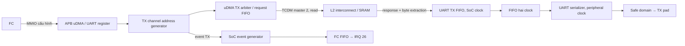

# SoC RTL 03 — uDMA/UART, debug và giao dịch điều khiển cluster

Bài tiếp tục [phương pháp phân tích theo giao dịch](soc_00_phuong_phap_phan_tich_rtl.md):
chọn một buffer UART TX, lần control/data/completion riêng rồi nối lại; sau đó
dùng cùng cách làm cho debug master và một store tới cluster. Các kết luận
source là **[RTL]/[SW]**; chưa có lượt mô phỏng mới cho những luồng này.

## 1. UART TX có ba luồng phải chứng minh



MMIO được FC phát ra để cấu hình. Memory request TX được **uDMA tự phát**, nên
không đi qua data port của FC. Event kết thúc channel đến từ address generator,
còn bit serial cuối đến từ serializer; đó là hai mốc khác nhau.

Nguồn nối ba luồng:
[udma_subsystem](../../../../.bender/git/checkouts/pulp_soc-c519334bd3ac5582/rtl/udma_subsystem/udma_subsystem.sv#L433),
[udma_core](../../../../.bender/git/checkouts/udma_core-25b62500cd51a5c6/rtl/core/udma_core.sv),
[udma_uart_top](../../../../.bender/git/checkouts/udma_uart-987a5c3aaae1cf57/rtl/udma_uart_top.sv).
Cấu hình đang xét có một UART: peripheral ID 0, TX channel 0, RX channel 0
trong hai mảng TX/RX riêng. Không gộp TX0 và RX0 thành một channel hai chiều.

## 2. Tính địa chỉ register từ decoder, rồi đối chiếu HAL

[udma_apb_if](../../../../.bender/git/checkouts/udma_core-25b62500cd51a5c6/rtl/common/udma_apb_if.sv)
tách `PADDR[11:7]` làm index peripheral nội bộ, `PADDR[6:2]` làm register word.
Index nội bộ 0 dành cho global control; `udma_core` chuyển các index còn lại
sang peripheral array bắt đầu từ UART ID 0. Vì thế:

```text
uDMA global base = 0x1A102000
UART0 base      = global + 0x80 = 0x1A102080
```

Trong [udma_uart_reg_if](../../../../.bender/git/checkouts/udma_uart-987a5c3aaae1cf57/rtl/udma_uart_reg_if.sv):

| Register UART0 | Offset từ UART0 | Địa chỉ |
|---|---:|---:|
| RX_SADDR / RX_SIZE / RX_CFG | 0x00 / 0x04 / 0x08 | 0x1A102080 / 0x1A102084 / 0x1A102088 |
| TX_SADDR | 0x10 | 0x1A102090 |
| TX_SIZE | 0x14 | 0x1A102094 |
| TX_CFG | 0x18 | 0x1A102098 |
| STATUS | 0x20 | 0x1A1020A0 |
| UART_SETUP | 0x24 | 0x1A1020A4 |

TX_CFG write: bit 4 enable channel, bit 0 continuous, bit 6 clear channel.
Readback bit 4 là enabled, bit 5 là pending. UART_SETUP: divider [31:16], RX/TX
enable bits 9/8, stop bit 3, số data bit [2:1] (3 chọn 8 bit), parity bit 0;
còn có RX polling/clean FIFO ở bits 4/5. Đây là semantics của bản RTL đang compile.

Global clock-gating register tại `0x1A102000`,
[udma_ctrl](../../../../.bender/git/checkouts/udma_core-25b62500cd51a5c6/rtl/common/udma_ctrl.sv)
reset `r_cg=0`. Bit 0 mở clock UART0 ở cả phần system/peripheral. Nếu chỉ viết
descriptor mà chưa mở clock, không thể mong channel/serializer tiến triển.

**Cách làm:** tính địa chỉ tuyệt đối bằng hai cấp decode trước, sau đó mở
[drivers/uart.c](../../../../pulp-runtime/drivers/uart.c) và HAL được include để kiểm
phép cộng. Một tên macro giống phần cứng không đủ bảo đảm offset/bit còn khớp.
Ví dụ [header uDMA v3](../../../../pulp-runtime/include/archi/udma/udma_v3.h#L102)
định nghĩa CLEAR_BIT=5, trong khi UART reg_if này dùng bit 6. Đây là khác biệt
source cần xử lý khi dùng API clear; đường `uart_write()` đang xét chỉ enqueue
EN/SIZE_8, nên chưa có bằng chứng demo gặp lỗi clear. Không lấy bit readback
pending làm bit write clear.

## 3. Từ enqueue tới request L2 và response byte

**[SW]** `uart_open()` mở CG bit 0, mở event RX/TX ở event generator và cấu hình
UART. `uart_write()` gọi `plp_udma_enqueue(base, buffer, size, EN|SIZE_8)` rồi
chờ trạng thái. Enqueue cung cấp start address/size trước khi ghi enable.
Đây là luồng driver có sẵn, chưa được thêm vào `full_system.c` trong đợt này.

[udma_ch_addrgen](../../../../.bender/git/checkouts/udma_core-25b62500cd51a5c6/rtl/core/udma_ch_addrgen.sv)
giữ current address, bytes left, enable, pending và event:

| Điều kiện | Chuyển trạng thái dữ liệu |
|---|---|
| cfg enable khi idle | latch start address/size, đặt enable |
| channel được grant và `int_not_stall_i` | tiêu thụ một phần transfer |
| còn nhiều byte hơn bước transfer | address tăng, bytes left giảm |
| lượt cuối, `bytes_left <= step` | tạo event; dừng hoặc reload descriptor pending/continuous |
| clear theo nhánh logic | xóa state channel |

Với datasize `00`, step=1 byte. Điều kiện grant ở đây đến từ **lịch cấp request
vào đường TX**, không phải chân UART đã phát xong byte. Đọc cả điều kiện
`int_not_stall_i`, không chỉ thấy `int_ch_grant_i=1` rồi cập nhật bảng bằng tay.

[udma_tx_channels](../../../../.bender/git/checkouts/udma_core-25b62500cd51a5c6/rtl/core/udma_tx_channels.sv)
chọn channel, giữ metadata address/datasize/channel ID/destination trong đường
FIFO request. UART destination được top buộc 0, nhánh này dựng prefix address
`0x1C` để đọc L2. Start address register chỉ giữ phần address theo parameter;
không suy uDMA UART có thể DMA tới mọi địa chỉ 32 bit CPU truy cập được.

TX read đi vào `tcdm_udma_tx` → general master 2, dùng cùng decode/xbar L2 đã
phân tích ở [bài memory](soc_01_fc_memory_rtl.md). Bus memory đọc word aligned;
phần byte offset được giữ để chọn lane của response. Channel ID được giữ để
response về đúng peripheral, không chọn lại theo arbiter của request hiện tại.

**[SUY RA, ví dụ 8 bit]** Buffer bắt đầu `A=0x1C010015`, chứa bytes `41 42`:

| Byte yêu cầu | Word address trên L2 | Bank/row | Lane trả cho UART |
|---|---|---|---|
| A, byte 0x41 | 0x1C010014 | bank 1, row 1 | rdata[15:8] |
| A+1, byte 0x42 | 0x1C010014 | bank 1, row 1 | rdata[23:16] |

Đây là ví dụ giải thích lane extraction, không phải địa chỉ buffer được cấp
phát sẵn. Không suy “hai byte cùng word” thành một lần đọc được cache tự động;
phải kiểm đường request thực nếu muốn đếm số L2 access.

**[Hiệu chỉnh 2026-09-13]** Response được chốt data/ID, nhưng không thể suy
valid luôn được giữ đến khi consumer nhận: `r_valid` được cập nhật từ
`l2_rvalid_i` mỗi clock. Ngoài ra `r_resp` là ID nhị phân, còn biểu thức
`s_stall = |(~s_ch_ready & r_resp) & r_valid` dùng phép AND kiểu mask;
riêng ID 0 làm stall bằng 0. Đường UART TX dự phòng chỗ cho response bằng
counter inflight của `io_tx_fifo`; cần xét toàn bộ credit/handshake để kết luận
không mất dữ liệu. Xem [M4: credit và giới hạn kết luận](../microarchitecture/micro_04_soc_udma_event.md).
Test credit mới chưa instantiate toàn bộ TX channels, nên chưa xác nhận hoặc
bác bỏ lỗi data loss trong integration UART.

## 4. Qua hai clock: data FIFO và configuration không cùng cơ chế

Trong UART top, data TX đi qua `io_tx_fifo` rộng 8 bit, depth 2 ở system clock,
sau đó `udma_dc_fifo #(8,4)` sang peripheral clock. FIFO hai clock chuyển
data/valid/ready giữa hai phía; không mô hình nó như một register độ trễ cố định.

Configuration dùng cơ chế khác: enable TX/RX được shift qua ba FF ở peripheral
clock. `s_uart_tx_sample = sync[1] & !sync[2]` phát hiện cạnh lên enable;
divider/data bits/parity/stop được latch khi có sample TX hoặc RX.

**[SUY RA]** Ghi UART_SETUP thay divider trong lúc cả enable vẫn 1 không tự tạo
cạnh sample mới. Để đổi format/baud, trước hết chờ truyền xong, disable và cho
phía peripheral quan sát disable, rồi cấu hình/enable lại theo timing đồng bộ.
Không chỉ kiểm APB readback và kết luận serializer đã nhận config mới.

[udma_uart_tx](../../../../.bender/git/checkouts/udma_uart-987a5c3aaae1cf57/rtl/udma_uart_tx.sv)
có FSM:

```text
IDLE (TX=1, nhận data khi enable)
  → START_BIT (TX=0)
  → DATA (5..8 bit, LSB trước)
  → PARITY nếu bật
  → STOP_BIT_FIRST (TX=1)
  → STOP_BIT_LAST nếu chọn hai stop
  → IDLE
```

`cfg_en_i=0` ép state về IDLE tại cạnh clock. Counter baud so với `cfg_div_i`;
trong pha chạy đều, khoảng bit tương ứng `div+1` peripheral cycles. Runtime
tính gần `f_periph/baud`, rồi truyền `div-1` vào HAL, phù hợp cơ chế này.
Không đưa hệ số 16 từ comment HAL vào TX nếu RTL không có prescaler đó.
Mốc nhận byte đầu/đổi state còn chịu FF bit_done và pha clock: cần waveform để
đo latency từ enqueue tới start bit, không chỉ dùng công thức baud.

Output `uart_tx_o` còn qua safe-domain pad mux/OE trước khi thành tín hiệu pad;
xem [bài safe domain](../architecture/deep_dive_01_platform_safe_domain.md). Đo serializer output
đúng chưa đủ chứng minh pad đang được route sang UART.

## 5. Completion: ghi rõ đang nói tới mốc nào

| Mốc | Tín hiệu/quan sát | Chứng minh được |
|---|---|---|
| descriptor nhận enable | cfg enable/addressgen state | có yêu cầu transfer |
| request cuối của channel được cấp | addressgen `r_event`, enabled/bytes left | channel đã cấp hết request theo cơ chế của nó |
| response cuối vào UART FIFO | data valid && ready tại UART input | byte đã tới buffer UART system-clock |
| serializer idle sau dữ liệu cuối | UART STATUS TX busy, FIFO/CDC state liên quan | tiến triển của bộ phát; phải xét dữ liệu còn trong queue |
| stop bit cuối tại pad | monitor giải mã frame và timestamp | chuỗi serial thực đã ra ngoài |

`uart_wait_tx_done()` trong runtime poll uDMA busy rồi UART TX busy. Điều này
cho thấy tác giả driver cũng phân biệt DMA và serializer. Tuy nhiên chỉ đọc
hai vòng poll chưa chứng minh không có khoảng idle tạm khi dữ liệu còn trong
CDC/FIFO; tiêu chí xác nhận toàn luồng vẫn là monitor nhận đủ byte/stop bit.
Không tắt clock hoặc tái sử dụng buffer chỉ dựa vào event request cuối khi chưa
xác định memory response cuối đã tiêu thụ xong.

## 6. Event UART trở lại FC qua queue, arbiter và FIFO

Top nối UART0 RX event→`s_events[0]`, TX event→`s_events[1]`, vị trí 2/3 buộc 0.
Đây là event channel từ uDMA; không gọi mọi event UART là “serial end-of-frame”
hay giả định các output error/character của UART module đều được top route.

[soc_event_generator](../../../../.bender/git/checkouts/pulp_soc-c519334bd3ac5582/rtl/pulp_soc/soc_event_generator.sv)
thực hiện:

1. Mỗi source vào [soc_event_queue](../../../../.bender/git/checkouts/pulp_soc-c519334bd3ac5582/rtl/pulp_soc/soc_event_queue.sv).
   Implementation giữ **counter 2 bit, từ 0 tới 3**; `QUEUE_SIZE=2` khai báo
   nhưng không quyết định độ rộng counter. Đây không phải FIFO lưu hai ID.
2. `event_o=(count!=0)`; event không ack làm tăng tới bão hòa; ack không event
   làm giảm nếu khác 0; event+ack cùng cạnh giữ count. `err_o=event_i && count==3`,
   kể cả trường hợp có ack cùng lúc, nên diễn giải error theo đúng phương trình.
3. Arbiter chọn một source pending, encoder tạo ID 8 bit. FC/cluster/peripheral
   có mask riêng; mask reset toàn 1 và **0 là cho phép nhận**.
4. `valid_fc = |(grant & ~fc_mask)`; destination được mở phải ready để aggregate
   ready thành 1 và `ack=grant & aggregate_ready` quay lại source queue.
5. FC nhận ID vào FIFO bốn entry trong interrupt controller, tạo IRQ 26;
   core ack pop ID, handler đọc latch FIFO như [bài timer](soc_02_timer_irq_rtl.md#7-event-fifo-một-đường-vào-fc-khác-timer-direct-irq).

**[RTL]** Một destination được mở nhưng chưa ready có thể giữ global ack của
source đang chọn. Không kết luận các destination luôn tiến triển độc lập.
Nếu mở multicast, cần kiểm valid/ready từng output trong lúc một nơi bị chặn:
RTL trên chưa đủ để gọi cơ chế này là “mỗi nơi nhận đúng một lần” mà không lần
thêm handshake downstream. Phép thử phải đếm ID nhận ở từng nơi và overflow;
đây là điểm cần kiểm chứng, chưa phải bug đã xác nhận bằng simulator.

**Cách làm:** theo event ngược từ nơi phát `r_event`, không theo tên API wait.
Sau đó đếm dung lượng **thực của state register** và đọc phương trình mask,
thay vì mặc định parameter/tên queue mô tả đúng sức chứa và polarity.

## 7. Debug là master thực sự của SoC

Trong [pulp_soc](../../../../.bender/git/checkouts/pulp_soc-c519334bd3ac5582/rtl/pulp_soc/pulp_soc.sv#L896)
có hai nguồn:

```text
PULP TAP → lint_jtag_wrap → s_lint_pulp_jtag_bus ─┐
                                               ├→ tcdm_arbiter_2x1
RISC-V DMI → dm_top system-bus master ───────────┘
   → s_lint_debug_bus → general master 4 → demux/xbar → L2 hoặc AXI
```

DM master write-enable được đảo sang TCDM `wen`; grant/read response đi ngược
về DM. Cổng slave của DM qua `apb2per_newdebug_i` phục vụ truy cập debug memory,
khác với cổng **master** DM tự phát system-bus access. `debug_req` halt core
cũng là đường điều khiển khác với giao dịch đọc/ghi memory.

[tcdm_arbiter_2x1](../../../../.bender/git/checkouts/pulp_soc-c519334bd3ac5582/rtl/components/tcdm_arbiter_2x1.sv)
chọn bus 0=PULP TAP trước bus 1=DM khi IDLE. Có biến tên `RR_FLAG` nhưng không
dùng để luân phiên; đây là **fixed priority ở thời điểm chọn**, không phải
round-robin như các arbiter bank L2.

| State | Chủ sở hữu đường bus |
|---|---|
| IDLE | chọn bus 0 nếu req; nếu không mới xét bus 1 |
| WAIT_GNT_0/1 | giữ nguồn đã chọn tới grant |
| WAIT_VALID_0/1 | route response cho nguồn đã chọn tới r_valid, rồi về IDLE |

Các nhánh WAIT vẫn forward payload/request của owner; đây không phải FIFO giữ
bản sao mọi request. Phân tích này áp dụng cho debug transaction tuần tự như
TB hiện dùng. Không suy module hỗ trợ mọi kiểu pipelining/burst của master mới
chỉ từ việc nó có hai input TCDM. Bus 0 liên tục yêu cầu có thể trì hoãn bus 1;
không có bảo đảm công bằng từ `RR_FLAG` chưa được dùng.

Trong TB, PULP TAP nạp image L2; RISC-V debug halt/chỉnh DPC/resume FC. Các write
nạp code dùng đường interconnect thực; debug và FC/uDMA có thể cạnh tranh cùng
bank nếu chạy đồng thời. Ngược lại, thấy image có trong SRAM chưa chứng minh
FC đã fetch/execute word đó: phải nối tiếp PC/instruction response/trace.

`dm_top.ndmreset_o` và `dmactive_o` đang để hở ở instance này. Vì vậy không
khẳng định ghi bit ndmreset của DM sẽ reset toàn chip. Reset testbench/SoC và
debug request phải lần theo net thực tế. Luồng boot chi tiết ở
[bài reset/boot](../architecture/deep_dive_04_boot_debug_testbench.md).

## 8. FC store khởi chạy cluster: vượt ranh giới SoC ở đâu?

**[SW]** Runtime `cluster_start()` chuẩn bị clock/cache/stack, ghi boot address
mỗi core tại `0x10200040 + 4*core_id`, rồi fetch mask tại `0x10200008`.
Đây là cluster control register; không phải FC boot/fetch register ở
`0x1A104004/0x1A104008`.

Lần store fetch mask cho thấy:

```text
FC data → demux default → lint_2_axi → AXI xbar chọn cluster window
→ s_data_out_bus → axi_cdc_src (SoC clock)
→ đường CDC tới cluster → AXI slave cluster / peripheral decode
→ fetch-enable register → fetch enable từng core
```

Response B đi ngược qua CDC rồi bridge, cuối cùng thành FC TCDM r_valid.
Trong [pulp_soc.sv](../../../../.bender/git/checkouts/pulp_soc-c519334bd3ac5582/rtl/pulp_soc/pulp_soc.sv#L448),
`axi_cdc_src` là phía source của SoC→cluster; `axi_cdc_dst` trên SoC xử lý
**chiều cluster→SoC** vào `s_data_in_bus`. Chiều sau qua bridge AXI 64 bit tới
bốn TCDM 32 bit rồi L2. Đọc suffix src/dst theo từng giao diện, không coi tên
module là “SoC luôn là source” cho mọi giao dịch.

Các kênh AW/W/B/AR/R và FIFO CDC không được gộp thành một chu kỳ bắt tay chung.
Thời điểm FC nhận B chỉ xác nhận write completion theo slave/bridge, không phải
mọi cluster core đã thực thi instruction đầu hay đã hoàn tất tác vụ. Để xác
nhận khởi chạy phải theo register fetch→core fetch→PC; để xác nhận tác vụ phải
theo protocol runtime.

Runtime hiện `cluster_wait()` poll biến `cluster_running`; core 0 ghi retval
và trạng thái khi entry return. Không có kết luận bắt buộc phải có event trả
FC để wait thoát. Chi tiết phần trong cluster và đường completion có ở
[bài cluster](../architecture/deep_dive_03_cluster_and_interconnect.md) và
[bài giao dịch xuyên domain](../architecture/deep_dive_05_domain_transactions.md).

Đối với clock gating/reset, cần xác nhận clock đích chạy và reset đã nhả trước
khi chờ response. Muốn phân tích reset giữa giao dịch phải đọc contract CDC và
test riêng; không coi FIFO hai clock tự bảo đảm xử lý mọi reset không đồng thời.

## 9. Điểm dừng phân tích và bộ quan sát đề xuất

| Luồng | Đã truy source tới | Phép xác nhận động còn thiếu |
|---|---|---|
| UART TX | MMIO → addressgen → L2 → lane → FIFO/CDC → serializer → pad route | chuỗi byte thực, stop bit cuối, busy/event trước-sau |
| Event TX | addressgen → source counter → mask/arbiter → FC FIFO/IRQ26 | mask polarity, queue full, ID đúng, multicast stall |
| Debug | hai producer → fixed-priority arbiter → master4 → memory/response | readback, cạnh tranh hai nguồn, PC sau resume |
| Cluster control | FC store → AXI/CDC → control register; liên kết bài cluster | B response, fetch từng core, completion runtime |

UART test nên dùng buffer do linker/allocator cấp, pattern có byte khác nhau
trên các lane và qua ranh giới word/bank; giữ buffer tới khi read cuối hoàn tất.
Quan sát đồng thời clock/CG/reset, TX_CFG, channel address/count/event, L2
req/gnt/response, FIFO valid/ready, UART state/busy và TX pad. Với UART RX, chiều
data đảo lại qua RX master ghi L2; cần đối chiếu buffer và guard ngoài vùng
transfer, không suy RX đã được kiểm vì TX hoạt động.

**Bài học tái sử dụng:** các từ “done”, “event”, “grant” chỉ có nghĩa tại một
ranh giới cụ thể. Để giải thích toàn hệ thống, phải chỉ ra dữ liệu ở đâu tại
mỗi mốc, state nào giữ nó, và điều kiện nào chứng minh đích cuối đã nhận đủ.
